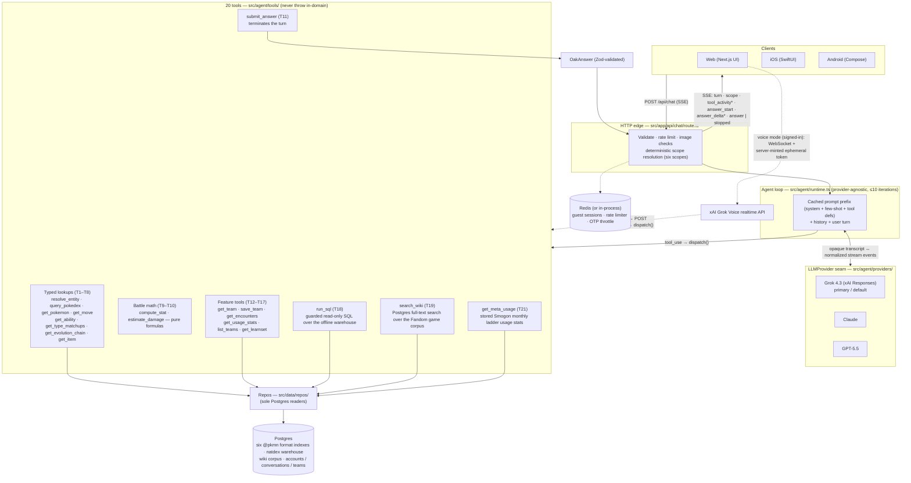

# Oak

A chat agent for the Pokémon **games** — mainline titles across every
generation, **Pokémon Champions**, and spin-offs like Pokémon Mystery Dungeon.
It answers natural-language questions about the games: lookups and filter
queries, mechanics reasoning, battle math, and in-game locations, events, and
glitches. It is a **games** assistant, not a whole-franchise one — the anime,
movies, TV, and manga are out of scope and gracefully declined. Its defining
trait is that it **reasons on top of data**: tools supply the raw building
blocks (move priority values, ability effect text, type charts, base stats),
and the agent deduces how those pieces interact.

> Example: _"does Fake Out work on Farigiraf?"_ → "Fake Out is a +3 priority
> move; Armor Tail negates priority moves; if Farigiraf has Armor Tail, Fake Out
> fails." Every answer carries its reasoning, the cited data, an explicit
> inference/uncertainty flag, and the generation/format it's based on.

It serves two blended use cases: **competitive team-building** (filter queries,
mechanics reasoning, battle math across six data scopes) and **whole-games
curiosity** (lookups, evolutions, matchups, where-to-catch, in-game trivia,
glitches, Mystery Dungeon).

## Status

✅ **Implemented and deployed.** Runs in production on [Fly.io](https://fly.io)
(app `oak-gowtam`). The codebase is the source of truth; the docs below describe
the design intent.

## Features

- **Reasoned, cited answers.** Each response is a Zod-validated `OakAnswer`
  rendered field-by-field: the answer, the reasoning, cited sources, explicit
  inference/uncertainty flags, and the generation/format it's based on.
- **Whole-games coverage** — beyond the typed competitive tools, the agent can
  write **guarded read-only SQL** (`run_sql`) against an offline national-dex
  warehouse for aggregations the typed tools can't express ("which species'
  dex number equals its base-stat total?"), and do **full-text retrieval**
  (`search_wiki`) over a self-built, games-only Fandom wiki corpus for in-game
  locations, events, glitches, walkthrough prose, and Mystery Dungeon. Oak has
  **no live web tool** — time-sensitive facts degrade honestly instead of
  guessing.
- **Accounts are optional.** Anyone can use Oak as a **guest** (in-memory,
  per-session multi-turn). Signing in with an **email one-time code** unlocks the
  durable, per-account features below. Guests and signed-in users get separate,
  tiered rate limits.
- **Durable chat history** (signed-in) — conversations persist in Postgres, with
  search, format filter, pin, rename, and delete. A guest thread is imported into
  the account on first sign-in.
- **Team builder** (signed-in) — create, edit, import, and export teams (Showdown
  paste format). A team can be set **active** for a conversation, scoping the
  agent's answers to that team.
- **Competitive usage reference** — a public, web-only [`/meta`](web/src/app/(reference)/meta/)
  section (no sign-in needed, like `/pokedex`): a leaderboard plus a per-species
  drill-in with a usage-derived representative set, a Showdown-paste copy
  affordance, and an "Ask Oak" deep link into chat. Backed by stored Smogon
  monthly ladder usage stats (v1: Gen 9 OU) and the agent's matching
  `get_meta_usage` tool (see [Data](#data)).
- **Voice mode** (signed-in) — real-time spoken conversation with Oak (a Pokédex
  persona). The browser talks directly to xAI's Grok Voice realtime API over
  WebSocket with a server-minted ephemeral token; the voice model calls Oak's
  same tool layer and the finished turns land in the same conversation history
  (see [Voice mode](#voice-mode)).
- **Artifact viewer** — answers can open rich, interactive side-panel artifacts
  (Pokémon, moves, abilities, items, teams, comparisons, damage calcs, type
  matchups) with clickable entity links and citations.
- **Image input (vision)** — attach up to 4 images per turn ("what is this?",
  "rate this team sheet"); all three models are vision-capable.
- **Multi-generation scope** — the typed competitive tools read one of **six
  data scopes**: **Pokémon Champions**, Gen 9 / Scarlet-Violet, and mainline
  **Gens 5–8** (Sword/Shield, Sun/Moon–USUM, XY/ORAS, Black/White). New
  conversations default to **Champions**. The scope is **resolved per turn on
  the server** — an explicit mention ("analyze my **gen 7** team", "in
  **Scarlet and Violet**…") switches it; otherwise the conversation stays in its
  current scope. The header **scope chip** is interactive: tap it to pick any of
  the six scopes (seeding the next message), and it always shows which game the
  current answer is based on, so a wrong guess is a one-tap correction rather
  than a silently mis-scoped answer. In Champions scope, if you ask about
  something that only exists in mainline Gen 9, Oak says so and points you at
  the scope chip. Gens 1–4 have no dedicated typed-tool index — those questions
  proceed in the standard data scope and are answered honestly from the global
  warehouse and wiki corpus, with the basis flagged.
- **Admin panel** (operator-only) — a private, **read-only** `/admin` dashboard
  for the single owner: usage/growth, estimated cost by model, error rollups,
  per-turn drill-down, a live view, and read-only account/conversation/team
  browsers. It is gated by an `ADMIN_EMAILS` allowlist on top of the existing
  email-OTP auth (see [Admin panel](#admin-panel)).

## Agent architecture

One provider-agnostic tool-loop serves every question. A chat turn arrives at
`POST /api/chat` (SSE), which rate-limits, validates any attached images, and
**deterministically resolves the turn's scope** (an in-message signal beats a
chip pick beats the conversation's sticky scope) — scope and model are
server-controlled context, never LLM-visible tool inputs. The runtime then
assembles a byte-stable, prompt-cached prefix (one canonical system prompt for
all three providers, with the active scope's facts injected), and loops up to
10 iterations: the model calls tools, tools return structured facts (they
**never throw in-domain** — misses come back as documented shapes like
`{ found: false, suggestions }`), and the turn ends when the model calls
`submit_answer`, whose payload is validated against the `OakAnswer` Zod schema.
In-domain failures still produce a valid `OakAnswer`; only transport faults
surface as SSE errors.



The client sees the loop as an SSE stream: one `turn` event first (the
server-minted `turn_id`), one `scope` event (which game this turn is answered
from and why), a `tool_activity` event per tool call, then `answer_start` /
`answer_delta`\* (token-by-token markdown) and exactly one terminal `answer` —
or `stopped`, if the user explicitly stopped the turn.

**Turns are durable server-side** (`docs/features/background-turns/design.md`):
the SSE connection is only a *subscription*. If the phone sleeps, the tab
hides, or the user switches conversations, the turn keeps generating and
persists on completion; clients reattach with
`GET /api/chat/turns/:id/stream` (the server replays the turn's buffered
events, then tails live), check `GET /api/chat/turns/:id` for a finished
answer, and stop generation only via the explicit
`POST /api/chat/turns/:id/stop`. One turn may run per conversation (a
duplicate send gets `409` + the running `turn_id` to reattach), up to three
per account. Voice mode bypasses the text loop entirely — the
`grok-voice` model is its own brain, calling the same tool layer per-call over
`POST /api/voice/tool` and speaking its answers instead of emitting an
`OakAnswer`.

## Stack

A single **TypeScript / Next.js (App Router) monolith** — one language across
frontend, API, agent loop, and the ingest CLI.

- **Data** — **Postgres + Drizzle ORM** (node-postgres). Six format indexes
  (`scarlet-violet`, `champions`, mainline `gen-5`…`gen-8`) built offline from
  the [`@pkmn`](https://github.com/pkmn) ecosystem (`@pkmn/dex`, `@pkmn/data`,
  `@pkmn/mods`), plus a global **national-dex warehouse** and a **wiki prose
  corpus** built from committed/crawled snapshots — see [Data](#data).
- **Agent** — a provider-agnostic tool-loop over **20 tools** that return
  structured facts; the model reasons on top and emits a Zod-validated
  `OakAnswer`.
- **Models** — **xAI Grok 4.3** (native Responses API) is the primary/default,
  with **Claude** and **GPT-5.5** selectable. The active model is **operator-
  controlled** via the `ACTIVE_MODEL` secret — there is no in-app model picker.
- **Transport** — **Server-Sent Events** stream scope, tool activity, then a
  token-by-token answer. Voice mode is a direct browser ↔ xAI **WebSocket**
  (server-minted ephemeral token; no WS proxy through Oak).
- **Validation** — **Zod** is the single source of truth (runtime validation,
  inferred types, and the provider tool / `submit_answer` JSON Schemas).
- **Auth** — email + one-time-code (OTP) sessions; OTP email sent via
  [Resend](https://resend.com) (a console transport logs the code in local dev).
- **Tests** — **Vitest**, two projects (a Node project backed by ephemeral
  Testcontainers Postgres + Redis, and a jsdom project for components).

## Data

Everything the agent reads lives in Postgres, built by `npm run ingest` — which
is **fully offline and deterministic** (it reads local packages and committed
snapshot files, never the network). Four sources feed it, plus one separately-run
exception:

1. **`@pkmn` format indexes** — Pokémon, moves, abilities, items, types, and
   learnsets for the six data scopes, from the local `@pkmn` npm packages
   (the gen scopes come from `Dex.forGen(n)`).
2. **The national-dex warehouse** (backing `run_sql`) — committed snapshots in
   `web/src/ingest/data/`, rebuilt manually and rarely via `npm run fetch:natdex`
   (PokeAPI's veekun-derived CSVs plus a Mystery Dungeon dataset):
   `natdex.json` (one row per species: dex number, gen, color/shape, capture
   rate, BST, evolution, types), `machines.json` (TM/HM/TR per version group),
   `natdex-moves.json` (every move's gen/type/class), `classic-encounters.json.gz`
   (wild encounter tables, **Gens 1–7 only**, best-effort), and `pmd.json`
   (Mystery Dungeon recruit locations/rates). These tables are global — no
   format column.
3. **Catch-location data** (backing `get_encounters`) — a committed snapshot at
   `web/src/ingest/data/encounters.json`, crawled manually via
   `npm run fetch:encounters`. Coverage is **Gen 1 → Sword/Shield + Let's Go**
   — PokeAPI has no encounter records for Scarlet/Violet, Legends: Arceus, or
   BDSP, and the agent surfaces that gap transparently. Results are annotated
   against the active gen scope.
4. **The wiki corpus** (backing `search_wiki`) — `npm run fetch:wiki` politely
   crawls pokemon.fandom.com's MediaWiki API for **game-only** categories
   (locations, routes/towns, glitches, in-game mechanics/events, items,
   Mystery Dungeon — no anime/movie/manga categories) into the **gitignored**
   `web/.wiki-cache/`; ingest builds `wiki_page`/`wiki_chunk` with Postgres
   full-text search. Content is CC BY-SA 4.0 with per-page attribution stored
   and cited (Bulbapedia, CC BY-NC-SA, is never crawled). The cache is not
   committed — an unbuilt corpus just means `search_wiki` returns no results,
   never an error.

**The one exception:** `meta_snapshot` + `meta_usage` (backing `get_meta_usage`
and the `/meta` reference pages) are **not** built by `npm run ingest` — they're
built by a separate CLI, `npm run sync:meta`, which fetches Smogon's published
monthly ladder usage stats (v1: Gen 9 OU) over the network and replaces each
`(meta_format, month)` pair's rows idempotently. This is the codebase's **one
network-fetching DB writer**; `sync:meta` is run manually, monthly, after
Smogon publishes each month — it is never invoked as part of `ingest`.

## Getting started

Requires Node 20+ (`.nvmrc`) and a Docker daemon (for the local Postgres and the
test suite). The web app lives in **`web/`** — run every command from there.
Native clients are sibling folders: **`ios/`** (Swift 6/SwiftUI,
[`ios/README.md`](ios/README.md)) and **`android/`** (Kotlin/Jetpack Compose,
[`android/README.md`](android/README.md)) — both pure clients of this same
backend, holding no LLM keys or DB access of their own. `docs/` stays at the
repo root.

```bash
cd web
npm install
cp .env.example .env.local   # add XAI_API_KEY (required); other keys are optional
npm run docker:dev           # Postgres + next dev on :3000 (the intended dev environment)
npm run docker:migrate       # apply Drizzle migrations
npm run docker:ingest        # build the index from @pkmn + committed snapshots (migrates first)
```

The `search_wiki` corpus is the one piece that isn't committed: run
`npm run fetch:wiki` (a polite, networked crawl) before ingest if you want wiki
retrieval locally — without it, `search_wiki` simply returns no results.

Only `XAI_API_KEY` is required to boot (Grok is the default model). The other
keys are optional and validated on use:

- `ANTHROPIC_API_KEY` / `OPENAI_API_KEY` — needed only if you point `ACTIVE_MODEL`
  at Claude or GPT-5.5.
- `AUTH_SECRET` — HMAC secret for OTP codes (a dev default is used locally; a
  strong value is required in production).
- `RESEND_API_KEY` — to send real OTP emails. Absent ⇒ the code is logged to the
  console (fine for local dev).
- `ADMIN_EMAILS` — comma-separated allowlist of admin emails for the `/admin`
  panel. Unset ⇒ zero admins ⇒ the panel is dark (the safe default). See
  [Admin panel](#admin-panel).
- `REDIS_URL` — backs the guest session store, chat rate limiter, and OTP
  throttle. **Unset ⇒ in-process stores, single-machine only** (fine for local
  dev and tests); set ⇒ those three stores run on Redis instead, so any
  machine can serve any request. See [Redis (state tier)](#redis-state-tier).

To run the Next dev server directly against a local Postgres instead of in Docker:

```bash
npm run db:migrate && npm run ingest && npm run dev
```

## Scripts

| Script                    | What it does                                                          |
| ------------------------- | --------------------------------------------------------------------- |
| `npm run dev`             | Next dev server (local).                                              |
| `npm run build`           | Next production build (standalone output).                            |
| `npm start`               | Run the production server.                                            |
| `npm test`                | Full Vitest run (unit + integration + deterministic eval). Needs Docker. |
| `npm run test:node`       | Node project only (backend/unit). Needs Docker.                       |
| `npm run test:components` | jsdom project only (React components). No Docker.                     |
| `npm run typecheck`       | `tsc --noEmit`.                                                       |
| `npm run lint`            | `eslint .`.                                                           |
| `npm run db:generate`     | `drizzle-kit generate` — author a new migration from the schema.      |
| `npm run db:migrate`      | Apply Drizzle migrations to `$DATABASE_URL`.                          |
| `npm run ingest`          | (Re)build the Postgres index from `@pkmn` + snapshots (migrates first). Offline. |
| `npm run sync:meta`       | Fetch + store Smogon monthly ladder usage stats (`meta_snapshot`/`meta_usage`). The one networked DB writer; run monthly, by hand. |
| `npm run fetch:encounters`| Re-crawl the PokeAPI encounter snapshot (manual, networked, rare).    |
| `npm run fetch:natdex`    | Re-crawl the natdex warehouse snapshots — veekun CSVs + PMD dataset (manual, networked, rare). |
| `npm run fetch:wiki`      | Crawl the Fandom game-content corpus into `web/.wiki-cache/` (manual, networked; feeds `search_wiki`). |
| `npm run eval`            | Full LLM-judge golden suite (needs live `XAI_API_KEY` + `ANTHROPIC_API_KEY`). |
| `npm run docker:*`        | Docker-Compose helpers (`dev`, `down`, `migrate`, `ingest`, `logs`, `psql`, `sh`). |

## Models

Three providers plug into one provider-agnostic loop. **Grok 4.3** (xAI's native
Responses API) is the default; **Claude** and **GPT-5.5** are drop-in
alternatives. The active model is chosen by the operator, not the end user:

```bash
fly secrets set ACTIVE_MODEL=claude   # grok-4.3 (default) | claude | gpt-5.5
```

Switching is one secret change, no rebuild. The chosen model's provider key must
be configured or the request returns a clean 503; an unknown value fails fast at
boot.

All three providers share **one canonical prompt body** — the active scope's
facts (Champions regulation or a mainline gen profile) are injected as a
templated section, and each provider gets only a thin style wrapper, so the
prompt-cached prefix stays byte-stable per scope.

## Voice mode

Signed-in users can hold a real-time spoken conversation with Oak. Three
endpoints power it (`POST /api/voice/token`, `/api/voice/tool`,
`/api/voice/transcript`); guests get a 401. The browser connects **directly**
to xAI's Grok Voice realtime API over WebSocket using a server-minted ephemeral
token — there is no WebSocket proxy through Oak's server. The voice model is
its own brain (not the text tool-loop): it calls Oak's existing tool layer as
realtime function calls, relayed per-call through `/api/voice/tool` into the
same `dispatch()` (minus `submit_answer`, `run_sql`, and `search_wiki`), and
speaks its answers directly. Each finished voice turn is persisted into the
signed-in conversation as a synthesized, schema-valid `OakAnswer`, so voice and
text share one unified history. Design: [`docs/features/voice-mode/`](docs/features/voice-mode/).

## Admin panel

A private, **read-only** operator dashboard for the single owner, served as a
protected `/admin` route group inside the same Next.js app (no second deploy).
It surfaces usage & growth, **estimated** cost by model, error rollups, a
searchable per-turn drill-down, a live activity view, and read-only browsers for
accounts, conversations, and saved teams. It mutates nothing — the only writes
the feature adds are the two append-only records below.

- **Access** — reuses the existing email-OTP login, gated by an `ADMIN_EMAILS`
  allowlist (comma-separated). Set it as a secret:

  ```bash
  fly secrets set ADMIN_EMAILS=you@example.com,ops@example.com
  ```

  The allowlist is read from the environment at call time, and gating is
  enforced **server-side on every `/api/admin/*` request** plus the `/admin`
  layout. **Unset `ADMIN_EMAILS` ⇒ zero admins ⇒ the panel is dark** (the safe
  default); there is no link to it from the main app — reach it at the `/admin`
  URL.
- **Recording enabler** — Oak persists **one `turn_record` per chat turn**
  (guest **and** signed-in: prompt text, answer, model, mode, token counts, tool
  trace, status, timing) and **one `auth_event` per auth event** (code
  requested / verified / delivery failed). Recording is **non-blocking and
  best-effort** — fired as `void recordX(...).catch(logOnly)`, never awaited on
  the chat or auth path, so it can never fail or slow a user's turn. These two
  tables are the analytics store the panel reads.
- **Cost is an estimate** — dollar figures come from a static in-code per-model
  price table and are always labelled as estimates; provider billing is
  authoritative.
- **Retention** — recorded turns and auth events are retained **indefinitely**
  (no prune job). Because this means **guest** prompts and answers — previously
  ephemeral — are now stored and readable by the operator, the
  [privacy policy](web/src/app/privacy/page.tsx) discloses operator read access
  and usage recording.

Full requirements and design live in
[`docs/features/admin-panel/`](docs/features/admin-panel/).

## Deploy

Deployed to Fly from `web/` (`cd web && fly deploy`) via the production
`Dockerfile` (`output: "standalone"`). The
release command runs `migrate.mjs` (a plain-ESM migration runner) before the new
version takes traffic, so migrations apply atomically on each deploy. With
`REDIS_URL` set, the guest session store, rate limiter, and OTP throttle all
live in Redis and the app machine(s) are stateless (safe to scale out or
recycle); with it unset, a single always-on machine backs those stores
in-process instead. `/api/health` is a DB-free (and Redis-free) liveness probe.
See [`docs/`](docs/) and the deployment notes for details.

### Redis (state tier)

Guest session history/scope, the chat rate limiter, and the OTP throttle are
dual-backend (`web/src/server/redis.ts`): in-process when `REDIS_URL` is unset,
Redis when it's set. Production runs a small self-run Fly Redis machine
(`web/deploy/redis/`, its own `fly.toml` + `Dockerfile`) reachable only over
Fly's private 6PN networking — no public IP, no volume (all stored state is
TTL'd/ephemeral, same as today's in-process behavior on a restart).

```bash
fly apps create oak-gowtam-redis
fly secrets set REDIS_PASSWORD='<strong-random>' -a oak-gowtam-redis
cd web/deploy/redis && fly deploy -a oak-gowtam-redis
fly secrets set REDIS_URL='redis://default:<pw>@oak-gowtam-redis.internal:6379' -a oak-gowtam
```

The password must be URL-encoded in `REDIS_URL` if it contains special
characters. `/api/health` and `migrate.mjs` stay Redis-free — neither depends
on Redis being up.

## Documentation

| Doc                                                                      | What it covers                                                                                          |
| ------------------------------------------------------------------------ | ------------------------------------------------------------------------------------------------------- |
| [`docs/requirements/requirements.md`](docs/requirements/requirements.md) | Core business requirements — user stories, acceptance criteria, business rules.                         |
| [`docs/agent-design/`](docs/agent-design/)                               | The agent's internals (fixed): topology, tools, data sources, prompts, output schema, eval spec.        |
| [`docs/architecture/design.md`](docs/architecture/design.md)             | Technical design — stack, data store, ingest pipeline, file structure, interfaces, build phases.        |
| [`docs/features/`](docs/features/)                                       | Per-feature requirements + design: account creation, chat history, team builder, artifact viewer, admin panel, generation scope, [oak-v2 (whole-games)](docs/features/oak-v2/), [voice mode](docs/features/voice-mode/), the [iOS app](docs/features/iphone-app/) and the [Android app](docs/features/android-app/). |
| [`docs/agent-design/generation-scope-addendum.md`](docs/agent-design/generation-scope-addendum.md) | How the multi-generation scope (Gen 9 + Champions + Gens 5–8) amends the frozen agent-design contract. |
| [`docs/design-system/`](docs/design-system/)                             | Visual language — color, typography, spacing, component patterns.                                       |
| [`docs/eval-reports/`](docs/eval-reports/)                               | Judged eval runs (incl. a Grok-vs-Claude A/B).                                                           |

> The architecture doc predates some implementation choices — notably the move
> from PokeAPI/SQLite to `@pkmn`/Postgres (PokeAPI now survives only as the
> manual encounter + natdex warehouse snapshots), the multi-user
> account/history/team features, and the oak-v2 whole-games tools. Where they
> disagree, trust the code and `CLAUDE.md`.
