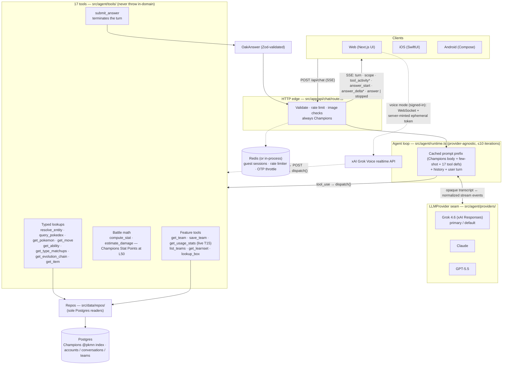

# Oak

A chat agent that **coaches Pokémon Champions** for the **current regulation**.
It answers natural-language questions about the Champions roster, Stat Points,
Mega Evolution, live ladder usage, and battle math. It is **not** a
whole-franchise or multi-generation Pokédex: other games (mainline generations,
National Dex, Mystery Dungeon, catch locations) and franchise media (anime,
movies, TV, manga) are out of scope and declined. Its defining trait is that it
**reasons on top of data**: tools supply the raw building blocks (move priority,
ability effect text, type charts, base stats, live usage), and the agent
deduces how those pieces interact.

> Example: _"does Fake Out work on Farigiraf?"_ → "Fake Out is a +3 priority
> move; Armor Tail negates priority moves; if Farigiraf has Armor Tail, Fake Out
> fails." Every answer carries its reasoning, the cited data, an explicit
> inference/uncertainty flag, and that it is based on Pokémon Champions.

Asking about something that is not on the current Champions roster is declined:
Oak **names the entity and says it is not in the Champions roster**, with no
other-game facts.

## Status

✅ **Implemented and deployed.** Runs in production on [Fly.io](https://fly.io)
(app `oak-gowtam`). The codebase is the source of truth; the docs below describe
the design intent. Product identity after the Champions-first cut lives in
[`docs/features/champions-first/`](docs/features/champions-first/).

## Features

- **Reasoned, cited answers.** Each response is a Zod-validated `OakAnswer`
  rendered field-by-field: the answer, the reasoning, cited sources, explicit
  inference/uncertainty flags, and the Champions generation/format it's based on.
- **Pokémon Champions only.** Every new chat turn, Dex page, calculator, living
  team, usage view, voice turn, box paste, and screenshot parse is Champions for
  the **current regulation**. There is no generation picker and no National Dex
  default. The header chip is a **display-only regulation** indicator (not an
  eleven-scope menu).
- **Accounts are optional.** Anyone can use Oak as a **guest** (in-memory,
  per-session multi-turn). Signing in with an **email one-time code** unlocks the
  durable, per-account features below. Guests and signed-in users get separate,
  tiered rate limits.
- **Durable chat history** (signed-in) — conversations persist in Postgres, with
  search, pin, rename, and delete. A guest thread is imported into the account on
  first sign-in. Old transcripts are not rewritten.
- **Team builder** (signed-in) — create, edit, import, and export **living**
  Champions teams (Showdown paste; Stat Points in the EV fields, no Tera, level
  50). Other-format teams from before this cut are **archived**, not living. A
  team can be set **active** for a conversation.
- **Live Champions usage** — a public [`/usage`](web/src/app/(reference)/usage/)
  section (no sign-in needed): Doubles ladder by default, Singles as a second
  view, leaderboard plus species drill-in, dated as live. Backed by the same
  live T15 `get_usage_stats` client as chat (championsbattledata.com). Smogon
  monthly OU and `/meta` are gone (`/meta` redirects to `/usage`).
- **Voice mode** (signed-in) — real-time spoken conversation with Oak as a
  Champions coach. The browser talks directly to xAI's Grok Voice realtime API
  over WebSocket with a server-minted ephemeral token; the voice model calls
  Oak's same tool layer and finished turns land in the same conversation history
  (see [Voice mode](#voice-mode)).
- **Artifact viewer** — answers can open rich, interactive side-panel artifacts
  (Pokémon, moves, abilities, items, teams, comparisons, damage calcs, type
  matchups) with clickable entity links and citations.
- **Calculator** — a first-class `/calc` screen (and a chat overlay via the
  `/calc` slash) for honest damage estimates at Level 50 with Stat Points.
  Edits are not asks; **Explain this calc** is a normal chat turn.
- **Image input (vision)** — attach up to 4 images per turn ("what is this?",
  "rate this team sheet"); images are interpreted as Champions (stats screen,
  team sheet). All three models are vision-capable.
- **Admin panel** (operator-only) — a private `/admin` dashboard for the single
  owner: usage/growth, estimated cost by model, error rollups, per-turn
  drill-down, a live view, read-only account/conversation/team browsers, the
  Champions item allowlist, and a **Settings** tab to switch the active model.
  Gated by an `ADMIN_EMAILS` allowlist on top of email-OTP auth (see
  [Admin panel](#admin-panel)).

## Agent architecture

One provider-agnostic tool-loop serves every question. A chat turn arrives at
`POST /api/chat` (SSE), which rate-limits, validates any attached images, and
**always binds Champions** (`ctx.mode = "champions"`). `scope_seed`,
`champions_mode`, and in-message generation signals do not switch games. The
runtime then assembles a byte-stable, prompt-cached prefix (one canonical
Champions system prompt for all three providers) and loops up to 10 iterations:
the model calls tools, tools return structured facts (they **never throw
in-domain** — misses come back as documented shapes like `{ found: false,
suggestions }`), and the turn ends when the model calls `submit_answer`, whose
payload is validated against the `OakAnswer` Zod schema. In-domain failures
still produce a valid `OakAnswer`; only transport faults surface as SSE errors.

**Tool barrel (ADR-2):** historically the list was append-only so the prompt
cache stayed byte-stable. Champions-first **removes** T14 `get_encounters`,
T18 `run_sql`, T19 `search_wiki`, and T21 `get_meta_usage` and **accepts a new
prompt-cache prefix**. Dispatch of a hallucinated old name returns
`{ error: "unknown_tool" }`. **17 tools** remain.



The client sees the loop as an SSE stream: one `turn` event first (the
server-minted `turn_id`), one `scope` event (always Champions), a
`tool_activity` event per tool call, then `answer_start` / `answer_delta`\*
(token-by-token markdown) and exactly one terminal `answer` — or `stopped`, if
the user explicitly stopped the turn.

**Turns are durable server-side** (`docs/features/background-turns/design.md`):
the SSE connection is only a *subscription*. If the phone sleeps, the tab
hides, or the user switches conversations, the turn keeps generating and
persists on completion; clients reattach with
`GET /api/chat/turns/:id/stream` (the server replays the turn's buffered
events, then tails live), check `GET /api/chat/turns/:id` for a finished
answer, and stop generation only via the explicit
`POST /api/chat/turns/:id/stop`. One turn may run per conversation (a
duplicate send gets `409` + the running `turn_id` to reattach), up to three
per account. Voice mode bypasses the text loop entirely — the
`grok-voice` model is its own brain, calling the same tool layer per-call over
`POST /api/voice/tool` and speaking its answers instead of emitting an
`OakAnswer`.

## Stack

A single **TypeScript / Next.js (App Router) monolith** — one language across
frontend, API, agent loop, and the ingest CLI.

- **Data** — **Postgres + Drizzle ORM** (node-postgres). One Champions format
  index built offline from a **pinned Pokémon Showdown SHA**
  (`web/vendor/pokemon-showdown/`, `SHOWDOWN_PIN`) with [`@pkmn/dex`](https://github.com/pkmn)
  as the Dex.mod / Dex.forGen engine. npm `@pkmn/mods` is not the roster clock.
  Wiki, national-dex warehouse, encounter, PMD, and Smogon OU tables are
  dropped. See [Data](#data).
- **Agent** — a provider-agnostic tool-loop over **17 tools** that return
  structured facts; the model reasons on top and emits a Zod-validated
  `OakAnswer`.
- **Models** — **xAI Grok 4.6** (native Responses API) is the primary/default,
  with **Grok 4.5**, **Grok 4.3**, **Claude Sonnet 5**, **Claude Sonnet 4.6**,
  and **GPT-5.5** selectable.
  The active model is **operator-controlled** via the admin panel's **Settings**
  tab (a Postgres-backed selection, no secret or restart needed) — there is no
  end-user model picker.
- **Transport** — **Server-Sent Events** stream scope, tool activity, then a
  token-by-token answer. Voice mode is a direct browser ↔ xAI **WebSocket**
  (server-minted ephemeral token; no WS proxy through Oak).
- **Validation** — **Zod** is the single source of truth (runtime validation,
  inferred types, and the provider tool / `submit_answer` JSON Schemas).
- **Auth** — email + one-time-code (OTP) sessions; OTP email sent via
  [Resend](https://resend.com) (a console transport logs the code in local dev).
- **Tests** — **Vitest**, two projects (a Node project backed by ephemeral
  Testcontainers Postgres + Redis, and a jsdom project for components).

## Data

Everything the agent reads lives in Postgres, built by `npm run ingest` — which
is **fully offline and deterministic**. Champions roster bytes come from the
vendored Showdown pin (`web/vendor/pokemon-showdown/` at `SHOWDOWN_PIN`);
`@pkmn/dex` is only the overlay engine. Ingest never hits the network (the
only fetch is `web/scripts/sync-showdown-pin.sh` when cutting over). Pokémon
`sprite_url` / `artwork_url` values are absolute first-party media links
(`/api/media/sprite|artwork|dex-sprite`), proxied at request time from Showdown
/ PokeAPI with a long cache — after changing those URL helpers, **re-ingest**
so index rows pick up the new hosts.

**Champions-only ingest (ADR-4).** `DEFAULT_FORMATS = ["champions"]`. Ingest
builds the Champions pokedex, learnsets, searchable names, and reference cache
from the Showdown pin, then writes `ingest_meta`. Other-game warehouse
pipelines (wiki, national-dex, encounters, PMD, Smogon meta) are gone.
`npm run sync:meta` is **retired** — live Champions usage is fetched at
request time by T15 (championsbattledata.com), not stored as monthly OU rows.
Regulation cutover:
[`docs/features/champions-first/regulation-cutover.md`](docs/features/champions-first/regulation-cutover.md).
Do not bump npm `@pkmn/mods` to stay current.

The historical `Format` union (`national-dex`, `gen-1`…`gen-8`,
`scarlet-violet`, `champions`) remains so **archived teams** and old
conversations still decode. Runtime, ingest, Dex, calc, and living teams are
Champions only.

## Getting started

Requires Node 20+ (`.nvmrc`) and a Docker daemon (for the local Postgres and the
test suite). The web app lives in **`web/`** — run every command from there.
Native clients are sibling folders: **`ios/`** (Swift 6/SwiftUI,
[`ios/README.md`](ios/README.md)) and **`android/`** (Kotlin/Jetpack Compose,
[`android/README.md`](android/README.md)) — both pure clients of this same
backend, holding no LLM keys or DB access of their own. `docs/` stays at the
repo root.

```bash
cd web
npm install
cp .env.example .env.local   # add XAI_API_KEY (required); other keys are optional
npm run docker:dev           # Postgres + next dev on :3000 (the intended dev environment)
npm run docker:migrate       # apply Drizzle migrations
npm run docker:ingest        # build the Champions index from the Showdown pin (migrates first)
```

Only `XAI_API_KEY` is required to boot (Grok is the default model). The other
keys are optional and validated on use:

- `ANTHROPIC_API_KEY` / `OPENAI_API_KEY` — needed only to make Claude or
  GPT-5.5 **selectable** in the admin Settings panel; a provider with no key
  configured shows its models disabled there, and selecting one server-side
  is rejected with a 409.
- `AUTH_SECRET` — HMAC secret for OTP codes (a dev default is used locally; a
  strong value is required in production).
- `RESEND_API_KEY` — to send real OTP emails. Absent ⇒ the code is logged to the
  console (fine for local dev).
- `ADMIN_EMAILS` — comma-separated allowlist of admin emails for the `/admin`
  panel. Unset ⇒ zero admins ⇒ the panel is dark (the safe default). See
  [Admin panel](#admin-panel).
- `REDIS_URL` — backs the guest session store, chat rate limiter, and OTP
  throttle. **Unset ⇒ in-process stores, single-machine only** (fine for local
  dev and tests); set ⇒ those three stores run on Redis instead, so any
  machine can serve any request. See [Redis (state tier)](#redis-state-tier).

To run the Next dev server directly against a local Postgres instead of in Docker:

```bash
npm run db:migrate && npm run ingest && npm run dev
```

## Scripts

| Script                    | What it does                                                          |
| ------------------------- | --------------------------------------------------------------------- |
| `npm run dev`             | Next dev server (local).                                              |
| `npm run build`           | Next production build (standalone output).                            |
| `npm start`               | Run the production server.                                            |
| `npm test`                | Full Vitest run (unit + integration + deterministic eval). Needs Docker. |
| `npm run test:node`       | Node project only (backend/unit). Needs Docker.                       |
| `npm run test:components` | jsdom project only (React components). No Docker.                     |
| `npm run typecheck`       | `tsc --noEmit`.                                                       |
| `npm run lint`            | `eslint .`.                                                           |
| `npm run db:generate`     | `drizzle-kit generate` — author a new migration from the schema.      |
| `npm run db:migrate`      | Apply Drizzle migrations to `$DATABASE_URL`.                          |
| `npm run ingest`          | (Re)build the Champions Postgres index from the Showdown pin (migrates first). Offline. Default `--formats=champions`. |
| `npm run eval`            | Full LLM-judge golden suite (needs live `XAI_API_KEY` + `ANTHROPIC_API_KEY`). |
| `npm run docker:*`        | Docker-Compose helpers (`dev`, `down`, `migrate`, `ingest`, `logs`, `psql`, `sh`). |

## Models

Six models plug into one provider-agnostic loop across three providers.
**Grok 4.6** (xAI's native Responses API) is the default; **Grok 4.5**,
**Grok 4.3**, **Claude Sonnet 5**, **Claude Sonnet 4.6**, and **GPT-5.5** are
drop-in alternatives. The active model is chosen by the operator, not the end user —
via the admin panel's **Settings** tab (`/admin/settings`), which writes the
selection to Postgres (`app_setting`) and is read fresh on every turn:

```
Admin → Settings → pick a model → Save
```

Switching takes effect on the next turn — no secret change, no rebuild, no
restart. A model whose provider API key isn't configured shows as disabled in
the picker, and selecting it is rejected server-side with a 409. If the stored
selection is ever missing or invalid, resolution fails soft to `grok-4.6`.

All three providers share **one canonical Champions prompt body**. Each
provider gets only a thin style wrapper, so the prompt-cached prefix stays
byte-stable (new prefix after ADR-2).

## Voice mode

Signed-in users can hold a real-time spoken conversation with Oak. Three
endpoints power it (`POST /api/voice/token`, `/api/voice/tool`,
`/api/voice/transcript`); guests get a 401. The browser connects **directly**
to xAI's Grok Voice realtime API over WebSocket using a server-minted ephemeral
token — there is no WebSocket proxy through Oak's server. The voice model is
its own brain (not the text tool-loop): it calls Oak's existing tool layer as
realtime function calls, relayed per-call through `/api/voice/tool` into the
same `dispatch()` (minus `submit_answer` only), and speaks its answers
directly. Each finished voice turn is persisted into the signed-in conversation
as a synthesized, schema-valid `OakAnswer`, so voice and text share one unified
history. Design: [`docs/features/voice-mode/`](docs/features/voice-mode/).

## Admin panel

A private operator dashboard for the single owner, served as a protected
`/admin` route group inside the same Next.js app (no second deploy). It
surfaces usage & growth, **estimated** cost by model, error rollups, a
searchable per-turn drill-down, a live activity view, read-only browsers for
accounts, conversations, and saved teams, the Champions item allowlist, and a
**Settings** tab for switching the active model (see [Models](#models)). It was
originally read-only — the only writes were the two append-only records below —
until Settings added its first genuine mutation, an upsert into a Postgres
`app_setting` table.

- **Access** — reuses the existing email-OTP login, gated by an `ADMIN_EMAILS`
  allowlist (comma-separated). Set it as a secret:

  ```bash
  fly secrets set ADMIN_EMAILS=you@example.com,ops@example.com
  ```

  The allowlist is read from the environment at call time, and gating is
  enforced **server-side on every `/api/admin/*` request** plus the `/admin`
  layout. **Unset `ADMIN_EMAILS` ⇒ zero admins ⇒ the panel is dark** (the safe
  default); there is no link to it from the main app — reach it at the `/admin`
  URL.
- **Recording enabler** — Oak persists **one `turn_record` per chat turn**
  (guest **and** signed-in: prompt text, answer, model, mode, token counts, tool
  trace, status, timing) and **one `auth_event` per auth event** (code
  requested / verified / delivery failed). Recording is **non-blocking and
  best-effort** — fired as `void recordX(...).catch(logOnly)`, never awaited on
  the chat or auth path, so it can never fail or slow a user's turn. These two
  tables are the analytics store the panel reads.
- **Cost is an estimate** — dollar figures come from a static in-code per-model
  price table and are always labelled as estimates; provider billing is
  authoritative.
- **Retention** — one `turn_record` is still written per chat turn (guest and
  signed-in). Full message / answer / tool-trace is kept for about **14 days**
  (guests) or about **90 days** (signed-in), then those fat columns are
  stripped; analytics columns (model, tokens, timing, status) stay so `/admin`
  cost and error charts still cover history. Auth events are still small and
  unpruned. Signed-in **chat history** (`conversation_message`) is unchanged
  and stays until the user deletes the account. A daily in-process prune plus
  `npm run db:prune-turns` implement this (B-26). The
  [privacy policy](web/src/app/privacy/page.tsx) discloses operator read access
  and the windows.

Full requirements and design live in
[`docs/features/admin-panel/`](docs/features/admin-panel/).

## Deploy

Deployed to Fly from `web/` (`cd web && fly deploy`) via the production
`Dockerfile` (`output: "standalone"`). The
release command runs `migrate.mjs` (a plain-ESM migration runner) before the new
version takes traffic, so migrations apply atomically on each deploy. After the
Champions-first schema cutover, re-ingest production with
`npm run ingest` (Champions default). With `REDIS_URL` set, the guest session
store, rate limiter, and OTP throttle all live in Redis and the app machine(s)
are stateless (safe to scale out or recycle); with it unset, a single always-on
machine backs those stores in-process instead. `/api/health` is a DB-free (and
Redis-free) liveness probe. See [`docs/`](docs/) and the deployment notes for
details.

### Redis (state tier)

Guest session history, the chat rate limiter, and the OTP throttle are
dual-backend (`web/src/server/redis.ts`): in-process when `REDIS_URL` is unset,
Redis when it's set. Production runs a small self-run Fly Redis machine
(`web/deploy/redis/`, its own `fly.toml` + `Dockerfile`) reachable only over
Fly's private 6PN networking — no public IP, no volume (all stored state is
TTL'd/ephemeral, same as today's in-process behavior on a restart).

```bash
fly apps create oak-gowtam-redis
fly secrets set REDIS_PASSWORD='<strong-random>' -a oak-gowtam-redis
cd web/deploy/redis && fly deploy -a oak-gowtam-redis
fly secrets set REDIS_URL='redis://default:<pw>@oak-gowtam-redis.internal:6379' -a oak-gowtam
```

The password must be URL-encoded in `REDIS_URL` if it contains special
characters. `/api/health` and `migrate.mjs` stay Redis-free — neither depends
on Redis being up.

## Documentation

| Doc                                                                      | What it covers                                                                                          |
| ------------------------------------------------------------------------ | ------------------------------------------------------------------------------------------------------- |
| [`docs/features/champions-first/`](docs/features/champions-first/)       | **Current product** — Champions-only coach: requirements, ADRs, implementation plan.                    |
| [`docs/features/champions-first/regulation-cutover.md`](docs/features/champions-first/regulation-cutover.md) | How to pin the next Champions regulation (Showdown SHA, not npm `@pkmn/mods`). |
| [`docs/requirements/requirements.md`](docs/requirements/requirements.md) | Historical core requirements — superseded where they conflict with champions-first.                     |
| [`docs/agent-design/`](docs/agent-design/)                               | Historical agent internals; ADR-2 is the append-only exception (17 tools, new cache prefix).            |
| [`docs/architecture/design.md`](docs/architecture/design.md)             | Technical design — stack, data store, ingest pipeline. Predates several choices.                        |
| [`docs/features/`](docs/features/)                                       | Per-feature requirements + design (accounts, history, teams, admin, voice, iOS, Android).               |
| [`docs/design/signal.md`](docs/design/signal.md)                         | Visual language to implement (**Signal**). Short contract: [`docs/design/soul.md`](docs/design/soul.md). |
| [`docs/eval-reports/`](docs/eval-reports/)                               | Judged eval runs (incl. a Grok-vs-Claude A/B).                                                           |
| [`docs/app-store/ios.md`](docs/app-store/ios.md)                         | iOS App Store listing copy (Champions coach).                                                           |

> The architecture doc and older agent-design pages predate several
> implementation choices — notably the move from PokeAPI/SQLite to
> `@pkmn`/Postgres, multi-user accounts, and the Champions-first cut (17 tools,
> no wiki/SQL/OU). Where they disagree, trust the code and `AGENTS.md` /
> `CLAUDE.md` / this README.
