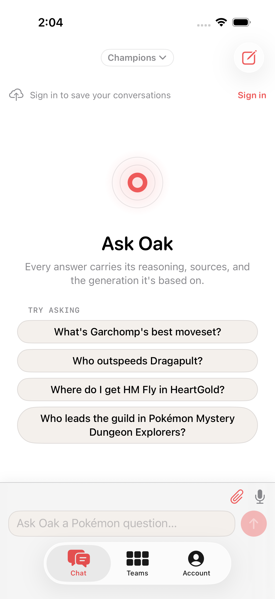
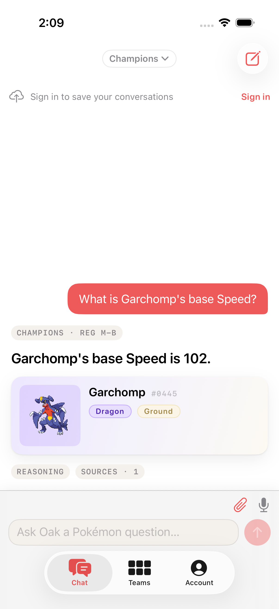

# Beyond Generic AI — Oak redesign (post-implementation)

> Design pass · 2026-07-13 · commit `502ce17`  
> Seen via: current web implementation (`globals.css` + components) + production HTML + iOS v2 screens (`docs/design/screens/ios-v2/`) + prior Fable strategy (2026-07-03) as already shipped  
> Status: **strategy only — no code changed.** Implementation is a separate pass.  
> Context: The Fable UI strategy was implemented. Users still say the app looks **generic**. This doc explains why that feedback is correct, and what to change so polish stops being the answer.

---

## TL;DR

- **The diagnosis in one line:** Oak is no longer *badly* designed — it is *well-designed in the default AI-chat genre*, so it still reads as “another ChatGPT skin with a red O.”
- **The direction:** **Specimen plates on a field desk** — every answer is a type-reactive specimen card (the thing only Oak can show), chrome is a quiet lab desk, empty state is an open dex not an “Ask AI” hero. Not more Linear/Claude calm.
- **The three highest-impact moves:** (1) ban the AI-chat empty state and replace it with a Pokédex desk; (2) make every answer card **type-reactive** (atmosphere from the subjects’ types, not beige paper); (3) write a hard `soul.md` of visual *forbiddens* so agents/humans stop “improving” Oak into Claude.

This pass is **not** “add more shadows / tighten the type scale again.” That work already shipped and raised the floor. The ceiling is imagination.

---

## 0. What already shipped (and should not be undone)

The 2026-07-03 Fable pass landed. Evidence in code:

| Move | Status in `web/` |
|---|---|
| Paper header + red thread (no red slab) | `.chat-page__header` — paper bg, 2px red top rule |
| Answer lead 22px / 68ch measure | `.answer-body__content > p:first-child` + `--measure-prose` |
| Masthead + status + scope | `.answer-masthead` |
| Instrument labels + mono numerals | `.ilabel` / `.mono-num` |
| Evidence rail for sprites | `.answer-card__evidence-rail` |
| Field-notes tool trail | `ChatThread` field-note chips |
| Warm tokens, type badges, motion grammar | `globals.css` token block |

**Protect:** layout stability, zero-FOUC, token discipline (no stray hex), type-badge recipe, mobile thumb composer, structured `OakAnswer` transparency (reasoning/sources).  
**Do not “fix” generic by reverting to the red-band header.** That was a different problem (chrome loud). This is a new problem (product forgettable).

---

## 1. Diagnosis — why “generic” after a good redesign

### The feedback is about *genre*, not *quality*

When people say “generic” now, they almost never mean “broken CSS.” They mean:

> I’ve seen this app a hundred times, only the logo was different.

Oak currently matches the **2024–26 AI chat template**:

1. Centered brand mark  
2. Display headline (“Ask Oak”)  
3. Soft subtitle about reasoning/sources  
4. Equal-weight suggestion pills  
5. Bottom-docked pill composer + round send  
6. Soft cream/white canvas, rounded white cards, hairline borders  
7. Quiet mono micro-labels  



That template is competent. It is also the **most over-indexed UI pattern on the internet**. Implementing Fable’s “Claude-like answer-first calm + Linear chrome” *improved craft by converging harder on that genre*. Convergence ≠ character.

### Systemic tells (post-redesign)

#### 1. Empty state is pure AI-chat genre *(hierarchy, consistency)*

iOS empty (`ios-01-chat-empty.png`): concentric red rings → “Ask Oak” → gray promise line → four identical beige pills → pill input.  
Web empty (prod / current): same grammar with a wordmark instead of rings.

There is **nothing Pokémon-native** in that composition except a red circle. Swap the word “Oak” for “Ava” and it is every YC AI demo.

#### 2. Color comes from chrome, not content *(color)*

Design system philosophy: *“the color comes from the content”* (18 type colors + sprites).  
Reality: 95% of pixels are warm beige / white / soft red. Type colors appear as **tiny pills**. Sprites sit in pale lavender tiles that don’t own the card.

A Garchomp answer and a Gholdengo answer use the **same card shell**. Only the illustration changes. That is the opposite of a Pokédex.

#### 3. The answer is still “a chat bubble’s cousin” *(hierarchy)*



User = red bubble (iMessage/ChatGPT). Assistant = white card with big sentence + soft entity row + small REASONING / SOURCES chips.  
Credibility is present but **demoted to chips that look like tags**, not receipts. The product thesis (“reasons on data, shows work”) is not the visual thesis.

#### 4. “Instrument” is a font recipe, not an object *(depth, consistency)*

`.ilabel` uppercase mono is correct and underused as *atmosphere*. There is no instrument *object*: no meter theater, no specimen plate, no ruled margin, no device bezel, no living surface. Without an object, mono labels read as “SaaS microcopy,” not Teenage Engineering.

#### 5. Friendly Fredoka + coral red = default “cute product” *(typography, color)*

Fredoka wordmark + `#EE5A5A` coral is pleasant and **non-specific**. Combined with Nunito/system body, the stack is “warm consumer app,” not “field instrument for competitive + curiosity.”

#### 6. No forbidden list *(consistency)*

Without a hard `soul.md` of what Oak **must never look like**, every iteration drifts toward:

- more rounded pills  
- more soft shadows  
- more centered empty heroes  
- more Inter-like calm  

That drift *is* generic.

### What is *not* the problem

- Token system quality (warm ramp, motion, focus rings) — keep  
- Type badges as a recipe — keep, **promote them**  
- Structured answer schema — keep; **design the dual human/machine surface**  
- iOS tab bar / navigation clarity — keep structure, change surfaces  

---

## 2. Direction — one committed taste thesis

### Thesis

**Specimen plates on a field desk.**

Oak is not “ChatGPT for Pokémon.” It is a **personal field desk** where every answer is a **specimen plate**: a card whose atmosphere is colored by the living things and types in the answer, with instrument readouts for numbers and an open margin for reasoning/sources. Chrome stays quiet so plates can be loud. Empty state is an **open dex**, not an AI marketing hero.

### Why this fits

| Product truth | Visual consequence |
|---|---|
| Answers are grounded in entities (species, moves, types) | Card shell reacts to those entities |
| Tools + sources are the soul | Tool trail + sources are *visible machinery*, not collapsed fine print |
| Scope (gen/format) defines truth | Scope is a plate stamp / seal, not a random header chip |
| Competitive *and* curious users | Data = instrument meters; prose = field notes |

### Reference points (borrow specific moves, not whole skins)

1. **Physical Pokédex / field guides** — specimen art dominates; labels engraved; page has a *place* for the creature.  
2. **Are.na / high-end editorial cards** — one strong surface per idea; quiet chrome; content owns color.  
3. **Teenage Engineering / Teenage-adjacent instruments** — mono numerals, small engraved labels, meters that feel physical (already half-specified in Fable — now *build the object*).  
4. **Explicit anti-references:** ChatGPT empty state, Claude’s pure prose column *without* a specimen object, Notion AI gray calm, generic “Ask X” startups.

### Eve Bouffard principles → Oak rules

From YC “Design With AI” (the principles you asked to use):

| Principle | Oak rule |
|---|---|
| **Imagination is the bottleneck** | Prefer one non-obvious signature over ten token tweaks |
| **Escape generic AI design** | Forbidden: centered “Ask Oak” hero, equal suggestion cloud, white card-on-beige chat only |
| **`soul.md` as source of truth** | Ship `docs/design/soul.md` — agents and humans must obey forbiddens |
| **Alive surfaces, not static edges** | Type-reactive washes, meter fills, sprite atmosphere — not more 1px borders |
| **Design for humans *and* machines** | Human plate + machine-readable strip (`sources`, structured flags) always co-present |
| **Playfulness with purpose** | Spotify-Wrapped energy only where data *is* playful (usage, crash-outs, party) — not everywhere |
| **Build dials for yourself** | Dev-only “plate tuner” (type wash intensity, radius, grain) while shipping the signature |

---

## 3. Foundation — what actually changes

Prior foundation stays; we **add character tokens and rules**, not another gray ramp.

### 3.1 `soul.md` (new — non-negotiable)

Create `docs/design/soul.md` with, at minimum:

**We are**

- A field desk and Pokédex, not a chatbot skin  
- Warm paper, but **content-colored plates**  
- Honest about uncertainty (flags are designed objects, not `[high]` leftovers)

**We never**

- Center a logo + “Ask …” + 4 equal chips as the product hero  
- Use pure white chat emptiness as the brand moment  
- Let two answers about different types share an identical beige shell  
- Use red as wallpaper or as the user-bubble default *and* the only brand signal  
- Ship dashed “wireframe” callouts  
- Add decoration that doesn’t encode type, status, scope, or tool work  

**Signature objects (must appear)**

1. **Specimen plate** — the answer card  
2. **Field notes** — tool trail while thinking  
3. **Desk chrome** — quiet header/sidebar; red = record light only  

### 3.2 Type-reactive surface system

New tokens (conceptually):

```text
--plate-wash: color-mix from subject type solids at 6–14% into --surface
--plate-edge: color-mix type 22% into --border
--plate-glow: radial gradient behind sprite from type solids
--desk-bg: --bg with optional 2% grain (CSS noise or SVG, very light)
```

Rules:

- If `subjects[]` has types → plate wash from **primary type**, edge tint from **secondary** if dual  
- If multi-subject table → neutral plate + **type-rail** (vertical stripe stack)  
- If no subject (pure mechanics) → “ink” plate: deeper sunken paper + mono stamp `MECHANICS`  
- Dark mode: wash at higher mix (18–28%) so it still reads  

### 3.3 Typography — one bolder commitment

Keep Fredoka only for **device chrome** (app name).  
Answer leads move to a **slightly more editorial** treatment:

- Lead: body face **800**, 24–26px, tracking −0.01em (still `--text-xl` or one step up)  
- Key numerals in the lead (102, ×2, 169) forced `.mono-num` via markdown component or post-process — **numbers are instruments**  
- Optional later: a single display face with more ink (not another rounded geometric) if Fredoka starts to read “kids app”

### 3.4 Elevation — plates float; desk is flat

- Desk (page, sidebar, header): flat, hairline only  
- Specimen plate: `--shadow-floating` + type edge (not generic gray card shadow alone)  
- Popovers: desk-floating, no type wash  

### 3.5 Motion — causality only

Keep existing grammar. Add:

- Plate wash **crossfades** when subjects resolve (continuity)  
- Stat meters fill on plate open (already specified — ensure shipped on web + iOS)  
- Field-note chips already cascade — keep; collapse into a **receipt stub** on the plate footer  

---

## 4. Screen-by-screen strategy

### 01 — Empty state (highest “generic” offender)


- **Current read:** AI-chat marketing hero.  
- **Target:** **Open Pokédex desk** — you sat down to research, not to “prompt an LLM.”  
- **Hero moment:** A **blank specimen frame** (rounded plate outline with faint grid / dex ruled lines) and a **live scope seal** (“CHAMPIONS · REG M-B”) stamped on it. Composer sits *inside or docked to* the plate, not floating in a void.  
- **Concrete moves:**
  - Kill centered concentric rings / big “Ask Oak” as the brand moment.  
  - Title becomes small desk label: `NEW ENTRY` or `FIELD NOTES` (ilabel) + one line of voice (“What are we looking up?”).  
  - Suggestions become **filed starters**: left type-dot or icon category (Battle / Dex / Location / Team), not four identical pills.  
  - Optional: faint silhouette of a random dex mascot at 4% opacity in the plate — changes daily, never a marketing illustration dump.  
- **Microinteractions:** focusing the composer brightens the plate edge (feedback); first send morphs blank plate → field-notes trail (causality).

### 02 — Streaming / field notes

- **Current read:** Better than 2026-07-01 (chips exist) but still “chat thinking.”  
- **Target:** **Lab printer** — notes feed onto the plate area.  
- **Hero moment:** Vertical instrument chips (`GET_POKEMON · garchomp`) with pokeball spinner; plate skeleton underneath already tinted if entity known mid-stream.  
- **Concrete moves:**
  - Prefer mono tool names **or** friendly labels consistently (web/iOS parity) — mixed friendliness currently softens the instrument. Pick one voice.  
  - When first subject resolves, start plate wash early (don’t wait for final answer).  

### 03 — Answer / specimen plate (the product)


- **Current read:** Good hierarchy start (big lead), still a white SaaS card.  
- **Target:** Unmistakable **specimen plate**.  
- **Hero moment:** Type-washed card + sprite in a **type-glow well** + lead verdict with mono numbers.  
- **Concrete moves:**
  - Apply `--plate-wash` / `--plate-edge` from subjects.  
  - Sprite well: 88–96px, radial type glow, not flat lavender square.  
  - Status + scope as a **stamp row** on the plate top (not free-floating gray chips only).  
  - Reasoning / Sources: **receipt drawer** — full-width foot tab `RECEIPTS · 1 SOURCE · 6 LOOKUPS`, expands to reasoning + sources. Stop looking like filter chips.  
  - Inference: solid soft panel with instrument header `INFERENCE · HIGH` (no brackets, no dashed border).  
  - User message: demote pure red bubble (ChatGPT twin). Prefer desk note style — sunken paper + red *corner pip*, or soft red wash without full iMessage red fill.  
- **Microinteractions:** plate sections stagger; opening receipts slides height; type wash settles over 200ms.

### 04 — Artifact panel

- **Target:** Same specimen language as the plate — **continuation**, not a second product.  
- **Hero:** Stat meters (value-colored, animated).  
- **Moves:** Type-glow hero header; instrument section labels; movepool without repeated “Normal” noise; panel edge inherits type wash.

### 05 — Team builder

- **Target:** **Party tray on the desk**, not admin CRUD.  
- **Hero:** Six large slot tiles with type edge tints per member.  
- **Moves:** Keep Fable party-row emphasis; add type-reactive slot edges; assistant panel uses same field-notes language as chat.

### 06 — History sidebar

- **Target:** Index of past plates, not a CRUD list.  
- **Selection (approved):** **not** a red left rail (generic SaaS/AI tell). Active row = **lifted mini-plate** (surface + hairline + raised shadow) + mono **`OPEN`** stamp. Hover actions only. Titles first.  
- **Deferred:** optional type-tint from last subject (needs summary metadata).

### 07 — Dark mode

- **Target:** Night desk — warm near-black, plates still type-reactive (stronger wash). Red thread stays record light.  
- **Never:** cold pure black + saturated red header relapse.

### 08 — Mobile / iOS

- **Same soul as web.** iOS currently looks *more* generic than web because pure white + SF layout + floating tab bar amplify the ChatGPT read.  
- Priority: specimen plates + empty desk + user bubble demotion. Tab bar can stay; don’t invent a gimmick nav.

### 09 — Human + machine dual surface (Eve)

- Visible human plate (above).  
- Machine strip: collapsible raw structured footer or “Copy as markdown for agents” that exports scope, sources, flags — same content, distilled. This is brand *and* product (Oak already has the schema).

---

## 5. Priority & sequencing

### Phase 1 — break the genre (web + iOS + Android)

Impact: people stop saying “looks like ChatGPT.” Operational checklist: [`soul.md`](./soul.md). Interactive reference: [`prototypes/specimen-desk.html`](./prototypes/specimen-desk.html).

1. **`docs/design/soul.md`** — forbiddens + plate rules + starter categories (**done as contract**).  
2. **Empty state redesign** — blank specimen plate + filed starters (Battle / Dex / Rules / Meta), not Ask-AI hero.  
3. **Type-reactive answer plates** (wash + edge + sprite glow) driven by `subjects[]`.  
4. **Receipts footer** instead of REASONING/SOURCES filter chips.  
5. **User desk note** + red corner pip (not brand-red bubble).  
6. **History OPEN plate** selection (no red left rail).

### Phase 2 — instrument objects

6. Artifact meters + type hero (if not fully shipped).  
7. Team party tray type edges + status pills.  
8. Streaming: early wash + consistent instrument/friendly voice.  
9. History optional type rails.

### Phase 3 — alive & dual

10. Subtle desk grain / paper texture (very light; respect perf + a11y).  
11. Machine markdown export strip.  
12. Dev-only plate tuner (Eve “build dials”).  
13. Optional playfulness: team “wrapped” moments later — **not** on critical chat path first.

---

## 6. How we’ll know it worked

Qualitative checks (show a stranger for 3 seconds):

| Test | Fail (today) | Pass |
|---|---|---|
| Blur the logo — still recognize the product? | No — could be any AI chat | Yes — specimen plates / type washes |
| Two answers, different types, side by side | Same beige cards | Obviously different atmospheres |
| Empty screenshot in a “AI app UI” moodboard | Fits perfectly | Looks like a dex/desk, odd one out |
| Does red mean one thing? | Brand + bubble + send + selection | Record light + primary action only |

---

## 7. Relationship to prior docs

| Doc | Role |
|---|---|
| `docs/design-system/design-system.md` | Tokens / type scale / brand colors (implementation floor) |
| **This doc** | Strategy — why generic AI still read after the Fable floor-raise; specimen desk direction |
| `docs/design/soul.md` | **Operational forbiddens** — source of truth for implementers |
| `docs/design/prototypes/specimen-desk.html` | Clickable web+mobile mock (states, type washes, OPEN history) |

Superseded Fable UI strategy markdowns (`fable-ui-strategy*.md`, mobile theme translation) were removed after Phases 1–3 shipped.

Do **not** re-open Pass 1 debates (paper header vs red band) unless a new screen reintroduces chrome louder than content.

---

## Appendix — one-sentence briefs for implementers

- **Empty:** “Blank specimen plate on a desk, not a SaaS hero.”  
- **Answer:** “Type-washed specimen plate with receipts, not a white chat card.”  
- **Thinking:** “Field notes printing onto the plate.”  
- **Chrome:** “Quiet desk; red is the record light.”  
- **Never:** “Ask {Name} + four equal chips + centered logo.”
