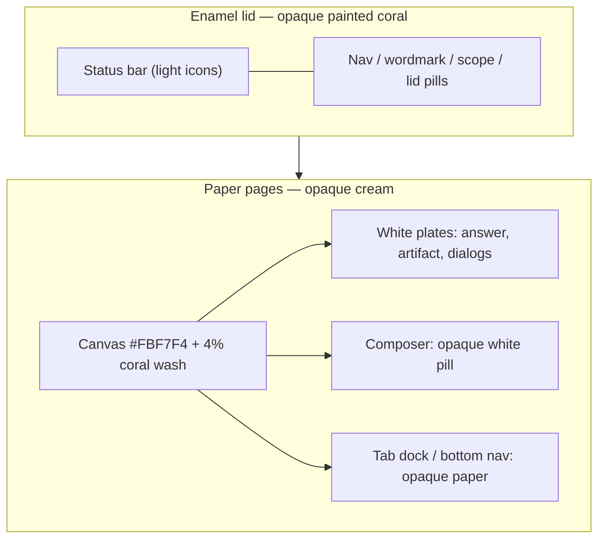
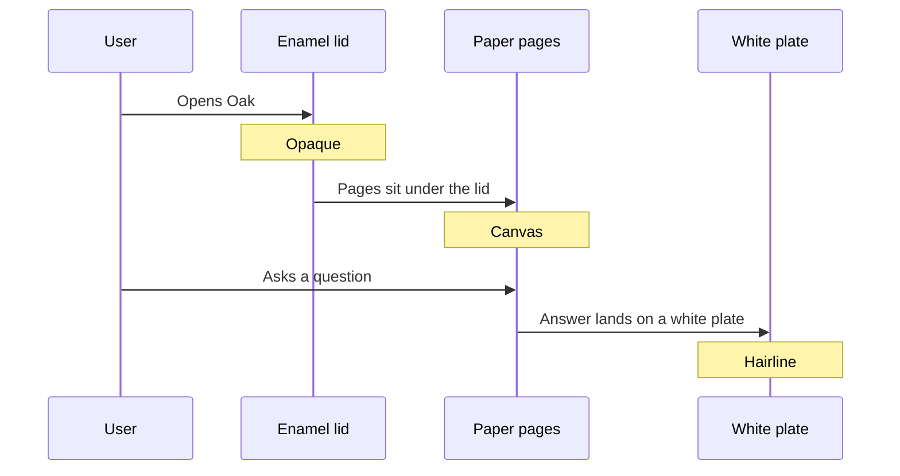

# Enamel & Paper — Oak visual language restore

| Field | Value |
| --- | --- |
| **Author** | TBD |
| **Date** | 2026-09-06 |
| **Status** | Draft (rev 2 — review 21cb68f1) |
| **Scope** | Visual / theme restore on web + iOS + Android. No agent, API, schema, or product-IA change. |
| **Supersedes** | [`docs/design/signal.md`](signal.md) as the language to *implement*. Signal, [`soul.md`](soul.md), [`fable-ui-strategy.md`](fable-ui-strategy.md), and [`docs/design-system/design-system.md`](../design-system/design-system.md) remain as history. |

---

## Overview

Oak's product chrome used to be a **full-bleed coral Pokédex lid** over **warm rag paper**. That language shipped on web until 2026-07-03, was captured in `docs/design/screens/` on `24cc109`, and was demoted the same day in `abd213b` to a paper header with a 2px red thread. Later redesigns (specimen desk, Instrument / `soul.md`, Signal) moved further away: cool daylight neutrals, Figtree + IBM Plex Mono, true Pokéball red `#E3350D` used as a *signal* not a shell. Native iOS never shipped the full-bleed red bar; the last native translation followed Apple Liquid Glass (`.ultraThinMaterial`, iOS 26 glass comments) and the owner said that **did not suit the app**.

This document restores the July 2026 **Pokédex-red header band** on **web, iOS, and Android together**, under a **named material system: Enamel & Paper**. It is not Apple Liquid Glass, not Signal-with-a-red-bar, and not a true-Pokédex `#EE1515` restyle. The implementing agent restyles chrome only. Current product IA (national-dex default, eleven scopes, AppNav rail, iOS/Android tabs, artifacts, background turns, image input, voice) stays.

**Visual contract:** `docs/design/prototypes/red-top-bar.html` plus the July 2026 screenshots. When a token and the mock disagree on *feel*, the screenshots + mock win. When they disagree on *product IA*, **current product wins**.

---

## Background & Motivation

### Provenance (what the owner liked)

- **Shipped on web until 2026-07-03.** Full-bleed saturated coral header. Captured in `docs/design/screens/` on commit `24cc109` (`docs(design): Fable UI strategy for the web app + screen captures`, 2026-07-03 01:44:45 -0700). Key shots: `01-chat-empty.png`, `03-chat-streaming.png`, `04-chat-answer.png`, `05-chat-answer-detail.png`, `06-auth.png`, `07-teams.png`, `10-mobile-chat.png`, `prod-01-chat-answer-artifact.png`, `prod-02-chat-empty.png`, `prod-03-team-builder.png`.
- **CSS at `abd213b^`** names it explicitly: `/* The signature Pokédex-red header band */` on `.chat-page__header`. Tokens + shell live in `web/src/app/globals.css` at that revision. Fonts in `web/src/app/layout.tsx` at that revision: **Fredoka** (`--font-display`), **Nunito Sans** (`--font-body`), **JetBrains Mono** (`--font-mono`). `themeColor: "#ee5a5a"`.
- **Demoted the same day** in `abd213b` (`feat(ui-foundation): demote header to paper…`): header became warm paper (`--bg`) with a hairline bottom border and a 2px `--poke-red` top thread. Controls flipped from white-on-red to paper ink. That demotion is the failed state this restore undoes.
- Later redesigns (specimen desk / `soul.md`, Instrument, Signal) moved further away. **Current authority is Signal** (`docs/design/signal.md`): cool daylight `#F6F7F9`, Figtree + IBM Plex Mono, true Pokéball red `#E3350D` as a 2px LED. Current header comment in `web/src/app/globals.css`: "Canvas header, hairline only. No red thread."
- **Native iOS never shipped the full-bleed red bar.** iOS of that era used quiet chrome; later polish (`docs/plans/ios-ui-polish.md`) pushed `.ultraThinMaterial` on the composer. `ios/OakApp/Features/Teams/TeamEditorView.swift` still has an iOS 26 Liquid Glass comment (toolbar items merge into one capsule). The owner says following Apple's liquid glass last time did not suit the app.
- **Surviving cousin: the OTP email**, still live in `web/src/server/auth/email/resend-transport.ts` (`buildOtpEmail`). White card, **6px `#EE1515` bar**, CSS Poké Ball mark, **Sora** + JetBrains Mono, paper `#F3F4F2`. This is how the owner recognized the era. **Do not restyle the email.** Product chrome uses the *app* coral `#EE5A5A` + Fredoka (what they used daily), not the email's true Pokédex `#EE1515` + Sora — do not "correct" the shell to `#EE1515`.

### Current state (what you will overwrite)

| Surface | Current (Signal) | Restore to (Enamel & Paper) |
| --- | --- | --- |
| Web tokens | Cool gray `#F6F7F9`, `--poke-red: #e3350d`, Figtree aliased as `--display` | Warm taupe `#FBF7F4`, `--poke-red: #ee5a5a`, Fredoka + Nunito Sans + JetBrains Mono |
| Web header | `.chat-page__header` canvas + hairline (`web/src/app/globals.css`) | Opaque enamel gradient through `env(safe-area-inset-top)` |
| Web wordmark | `Oak.` + red period (`web/src/components/brand/OakWordmark.tsx`) | Fredoka 600 white wordmark + 32px coral mark with white ring |
| Web composer | `--radius-lg` field, hairline, 6px `backdrop-filter` dock | Opaque white pill, floating umber shadow, red halo; dock fade-to-paper **without** blur |
| iOS Theme | `ios/OakApp/UI/Theme.swift` Signal cool ramp, Figtree, IBM Plex Mono | Historical coral + warm taupe; Fredoka / Nunito Sans / JetBrains Mono |
| iOS chrome | `OakChrome.applyBarAppearance()` paints **canvas** opaque (`ios/OakApp/UI/OakChrome.swift`) | Opaque **enamel red** nav through the status bar; tab bar opaque **paper** |
| iOS composer | `Theme.canvas.opacity(0.92)` bar (`ComposerView.swift`) | Opaque white pill on paper. No `.bar`, no material |
| Android theme | `android/.../ui/Theme.kt` Signal hexes; Figtree in `Type.kt` | Same enamel tokens; Fredoka / Nunito Sans / JetBrains Mono |
| Android top bar | `OakTopBar` paints **canvas** through status bar (`Chrome.kt`) | Opaque `--poke-red` through status bar, light icons |
| Android bottom nav | `NavigationBar(containerColor = background)` (`OakApp.kt`) | Opaque paper (`surface`), red selected, no tonal frost |
| Mark | Cool gray field, dark O, true-red dot (`web/src/app/icon.svg`) | Coral rounded-square white-O (`docs/design/prototypes/red-top-bar-assets/oak-mark.svg`) |

### Why a named material system this time

Last time the iOS/Android translation mapped "red header" onto **system material bars**. That produced frosted chrome that fights the object the owner liked. This pass names the translation **Enamel & Paper** so native implementers cannot "also support glass on iOS 26" or treat Liquid Glass as a progressive enhancement.

---

## Goals & Non-Goals

### Goals

1. Restore the July 2026 Pokédex-red header band (opaque enamel lid) on **web + iOS + Android in one branch**.
2. Land the **Enamel & Paper** material system as the only allowed chrome recipe. Ban Liquid Glass and friends (see Hard bans).
3. Restore historical **tokens, typefaces, mark, radius, shadows, motion, type-badge recipe, user bubble, composer pill**. The **lid** is the July enamel header; the **empty page** is current landing IA painted onto enamel paper (title, recents, filed starters, in-plate composer — not the July centered lockup).
4. Keep **current product IA**: national-dex default, eleven formats, AppNav destinations, native tabs, artifacts, background turns, image input, voice, spend-control banners, empty-desk recents.
5. Leave the live OTP email HTML unchanged.
6. Dark theme: opt-in (web `data-theme="dark"` / ThemeToggle). Light is the unconditional default. Dark **surfaces** restore historical taupe (`#161311` / `#231F1C`); dark **lid** is `#C44545` (not historical `#ff6b6b` — see contrast).

### Non-goals

- No agent / prompt / tool / `OakAnswer` / SSE / schema changes.
- No IA redesign. Do **not** restore Champions-as-default or the deprecated Champions composer toggle. Do **not** shrink the scope chip back to six formats.
- No new animation system. Historical springs stay limited to chips / send / sprite hover.
- No store listing rewrite (ASO copy, screenshot sets under `docs/app-store/generated-screenshots/signal/`). Home-screen / in-app marks **do** swap this pass (see Key Decisions).
- No email restyle (`buildOtpEmail`).
- No admin IA change. Admin retokens so it does not clash; it does **not** get a coral lid.
- No revival of specimen-desk grain, graph paper, dashed plates, Instrument chassis grooves, or Signal cool daylight as the voice of the app.

---

## Authority

**This document supersedes `docs/design/signal.md` as the language to implement**, the same way Signal superseded `soul.md`.

| Layer | Wins when |
| --- | --- |
| This file | Completeness: tokens, file map, bans, recipes, PR order |
| `docs/design/prototypes/red-top-bar.html` + `docs/design/screens/` July 2026 shots | *Feel* (header enamel, paper canvas, white plates, lid pills) |
| Current product (`web/src/data/formats.ts`, `AppNav`, iOS `RootView`, Android `OakApp`) | *IA* (default scope, nav destinations, eleven formats) |
| `abd213b^:web/src/app/globals.css` + `abd213b^:web/src/app/layout.tsx` | Starting CSS for the lid, composer, type badges, user bubble. **Not** the empty-page layout (current landing IA wins). |
| Enamel & Paper bans in this file | Beat historical CSS where history used `backdrop-filter` as chrome |

History, not implementation:

- `docs/design/signal.md` — cool daylight, red as signal.
- `docs/design/soul.md` — Instrument / chassis.
- `docs/design/fable-ui-strategy.md` — specimen desk.
- `docs/design-system/design-system.md` — the old warm-paper / Fredoka system (token tables here are restored from it).

A new agent should: (1) read Thesis + Hard bans, (2) land Foundation tokens on all three clients, (3) restyle screens in the File map order, (4) tick Acceptance.

---

## Proposed Design

### Thesis (one sentence)

Oak is a **hard enamel Pokédex lid over rag-paper pages**: the red is a painted object, the body is opaque paper, data sits on white plates. It is a device, not a window.

### Why it fits

- The thing they liked *was already this*: a solid coral band, cream canvas, opaque white cards, inset white-on-red pills. Liquid Glass fights that (it wants the chrome to disappear). Enamel & Paper *is* that object.
- Oak is a **games** research companion (lookups, battle math, teams). A Pokédex has a lid and pages. That metaphor matches the red bar without costume (no dex-screen scanlines, no Game Boy bezels, no clamshell hinge illustration).
- Distinct from **Signal** (cool daylight, red as a 2px LED) and from **Instrument** (over-machined chassis). Distinct from **specimen desk** (grain, dashed plates, graph paper — do not revive those even though they also used cream).



### The two materials (this is the whole system)

**1. Enamel (the lid / shell)**

Opaque painted red. Slight 180° bake (the historical gradient), not a gloss overlay, not a blur.

Used for:

- Web `.chat-page__header` and `.teams-page__band` (restore — they are the July lid).
- **Apply the lid recipe** (new application of the language, not a restore) to `.calc-page__band`, `.ref-header`, and `.share-page__header`. Today those are **not** chat-header twins: calc is already a solid `--poke-red` band (`web/src/components/calc/calculator.css`); reference and share are translucent paper + 8px blur. Putting enamel on SEO reference + public share is intentional so user-facing chrome matches the device.
- iOS status bar + navigation bar as **one opaque red block through the safe area**.
- Android status bar + `OakTopBar` as one opaque red block, light icons.
- Primary actions: New chat, Save, Send-when-ready, Send code.

Lid controls are **inset enamel**, not glass:

```css
height: 40px;
border: 1px solid rgba(255, 255, 255, 0.45);
background: rgba(255, 255, 255, 0.16);
color: #ffffff; /* --neutral-0 */
font-weight: 600;
border-radius: var(--radius-pill);
```

Hover: `background: rgba(255, 255, 255, 0.28)`. They are paint on the lid.

**2. Paper (the pages)**

Opaque warm cream `#FBF7F4` canvas. White `#FFFFFF` plates with 1px warm hairline `#E9E0D8` and a warm umber shadow. Used for: thread, sidebar, artifact sheet, answer cards, dialogs, iOS tab dock, Android bottom nav, composer field. Depth = **stacked paper**, not fog.

Canvas wash (historical):

```css
background: radial-gradient(
  120% 60% at 50% -10%,
  color-mix(in srgb, var(--poke-red) 4%, var(--bg)),
  var(--bg) 55%
) no-repeat;
```

### Hard bans (Liquid Glass and friends)

If a change would do any of these, reject it:

1. Apple Liquid Glass / iOS 26 `glassEffect` / `GlassEffectContainer` / `.ultraThinMaterial` / `.thinMaterial` / `.regularMaterial` / `Material.bar` / `Material.sidebar` as app chrome. (Do **not** grep bare `.bar` — that hits `chart.bar`, `NavigationBar`, `UITabBar`.)
2. `backdrop-filter` / `-webkit-backdrop-filter` as a **brand device**. A *tiny* dock fade-to-paper (`linear-gradient(transparent, var(--bg))`) is allowed so the thread can scroll under the composer; a frosted glass slab is not. Audit and **remove** existing blurs:
   - `web/src/app/globals.css` — `.composer` (6px), `.team-editor__savebar` (8px), `.import-dialog__backdrop` / `.export-dialog__backdrop` (2px), `.voice-overlay` (8px), `.chat-page__scrim` (1px — opaque `--scrim` is enough).
   - `web/src/components/reference/reference.css` — `.ref-header` (8px).
   - `web/src/components/reference/reference-explorer.css` (8px).
   - `web/src/app/a/share.css` — `.share-page__header` (8px).
   Keep `backdrop-filter: none` rules that neutralize inherited blur (e.g. `.chat-empty__composer .composer`).
3. Translucent / vibrancy tab bars, translucent nav bars, "liquid" morphing capsules as identity. (`ToolbarSpacer` on iOS 26 to *stop* system merging of toolbar items is a layout workaround, not a glass recipe — keep that split, do not lean into the capsule.)
4. Android `RenderEffect` blur, `RenderNode` glass, scrim-as-identity, Material tonal elevation that reads as frost.
5. Using Signal's cool gray ramp or Figtree / IBM Plex Mono as the voice of the app.
6. Specimen-desk grain, noise, graph-grid, dashed plate chrome, Space Grotesk.
7. Instrument / chassis machined grooves, inset-well inner-shadow as brand.
8. "Correcting" shell red to `#E3350D` or `#EE1515` on your own.
9. Cream *without* the enamel lid (that is the failed paper-header demotion in `abd213b`).
10. Restoring Champions-as-default or the composer Champions toggle.

Do **not** "also support glass on iOS 26." Do **not** use Liquid Glass as a progressive enhancement.

### iOS / Android translation (this is where last time went wrong)

Do **not** map "red header" to "system material bar." Map it to **opaque enamel**:

- **iOS:** opaque red safe-area header (status + bar in one fill). White wordmark + inset pills. Apply a shared `View.oakEnamelNav()` to **every** `NavigationStack` (Chat, Teams, Dex, Account, History, Calc, Share, Auth, sheets) — not a Chat-only inset. Tab bar is an **opaque paper dock**, painted in the same `OakChrome.applyBarAppearance()` pass as the nav (PR2, not deferred). It may be a capsule like the mock **only if the fill is opaque `--surface`**, never `ultraThinMaterial`. Composer is an opaque white pill on paper, not `.background(.bar)` / `Material.bar`.
- **Android:** `OakTopBar` / status bar opaque `--poke-red`, **always** light icons (`SystemBarStyle.dark(enamel)` in both themes). Bottom nav opaque paper, red selected. Navigation-bar icon contrast **does** follow theme (dark icons on light paper, light icons on dark paper). No tonal elevation that reads as frosted. Re-apply from a Compose `SideEffect` when `isSystemInDarkTheme()` changes — not a one-shot `onCreate`.
- **Web mobile:** already existed in `10-mobile-chat.png` — red bar with wordmark, scope, gear, Sign in; cream canvas; pill composer. Restore that **lid + paper** look, with the **current** eleven-scope list and current empty landing IA.



---

## Foundation tokens

Land these before restyling screens. Hexes are the contract. Restore from `abd213b^:web/src/app/globals.css` and `docs/design-system/design-system.md`. Light is the unconditional default. Dark is opt-in.

### Brand

| Token | Light | Dark | Use |
| --- | --- | --- | --- |
| `--poke-red` | `#ee5a5a` | `#c44545` | Enamel lid, primary fills (New chat, Send-ready, Save) |
| `--poke-red-hover` | `#e04545` | `#d45656` | Hover on red fills |
| `--poke-red-active` | `#c93b3b` | `#b33a3a` | Pressed red fills |
| `--poke-red-soft` | `#fcebeb` | `#3a1e1e` | Chip hover fill, user-bubble mix, selected scope row |
| `--on-red` | `#ffffff` | `#ffffff` | Ink on a solid enamel fill |
| `--sunflower` | `#f5a524` | `#f8b73e` | Estimate / energy tag |
| `--sunflower-soft` | `#fdf1dc` | `#3a2e14` | Estimate tint |
| `--azure` | `#3aa0e3` | `#5bb4ef` | Links, inference, info |
| `--azure-soft` | `#e6f2fb` | `#16263a` | Inference callout fill |

**Contrast (WCAG 2.1, measured — do not reuse the Signal 4.3:1 figure):**

| Pair | Ratio | AA normal 4.5:1 | AA large 3:1 |
| --- | --- | --- | --- |
| `#FFFFFF` on light lid `#EE5A5A` | **~3.36:1** | Fail | Pass |
| `#FFFFFF` on historical dark `#FF6B6B` | **~2.78:1** | Fail | **Fail** |
| `#FFFFFF` on dark lid `#C44545` (this spec) | **~4.9:1** | Pass | Pass |
| `#FFFFFF` on Signal `#E3350D` (do not use) | ~4.39:1 | Borderline | Pass |

Light lid stays `#EE5A5A` with white ink — that is the July object the owner confirmed. **Do not darken the light lid to `#E3350D`.** Wordmark (Fredoka 600 / 28px) is large text and passes. 14px/600 lid pills **fail** normal-text AA; keep the July pill size anyway (see Risks). Dark **deviates from historical `#ff6b6b`**: deepen the lid to `#C44545` so white ink is legal. Do not use Signal's near-black `--on-red` (`#1B1410`) on enamel.

**`--sunflower` / `--sunflower-soft` are a restore-and-fix.** They are **not defined** in current Signal `globals.css` but are still referenced (citation highlight in `globals.css`; `web/src/components/calc/calculator.css` `.calc-side--estimate` and a `var(--warning-soft, var(--sunflower-soft))` fallback). Restoring the tokens unbreaks those rules. Do **not** delete them as "unused."

**Email cousin (do not use on product chrome):** `#EE1515` (true Pokédex red) + Sora + paper `#F3F4F2`. Documented so nobody "corrects" the shell.

**Signal red (do not use):** `#E3350D` / `#FF4A22`.

Keep Signal aliases (`--red`, `--ink`, `--sunken`, `--line`, `--mute`, `--faint`) mapped onto these values so leftover CSS compiles. New CSS uses the historical names.

### Neutrals (warm taupe, not Signal cool gray)

Theme-stable ramp. Same hexes in both themes; surfaces remap.

| Token | Hex | Typical use |
| --- | --- | --- |
| `--neutral-0` | `#ffffff` | White plates, lid ink |
| `--neutral-50` | `#fbf7f4` | Light canvas |
| `--neutral-100` | `#f3ece6` | Subtle fills |
| `--neutral-200` | `#e9e0d8` | Default border |
| `--neutral-300` | `#d8ccc1` | Strong border |
| `--neutral-400` | `#b8a99c` | Disabled |
| `--neutral-500` | `#94867a` | Faint text |
| `--neutral-600` | `#6e625a` | Muted text |
| `--neutral-700` | `#4e453f` | Dark strong border |
| `--neutral-800` | `#332d29` | Dark raised surface |
| `--neutral-900` | `#231f1c` | Dark surface; lid bottom-edge mix |
| `--neutral-950` | `#161311` | Dark canvas |

### Semantic (danger stays distinct from poke-red)

| Token | Light | Dark | Soft light / dark |
| --- | --- | --- | --- |
| `--success` | `#2fb573` | `#46c98a` | `#e3f6ec` / `#10301f` |
| `--warning` | `#f08c00` | `#fba53b` | `#fdefd9` / `#3a2a0f` |
| `--danger` | `#e0394a` | `#ff5c6b` | `#fce8ea` / `#3a1518` |
| `--info` | `= --azure` | `= --azure` | `= --azure-soft` |

`--danger` is a cool crimson so errors never look like brand.

### Surfaces / text

| Token | Light | Dark |
| --- | --- | --- |
| `--bg` | `#fbf7f4` | `#161311` |
| `--surface` | `#ffffff` | `#231f1c` |
| `--surface-raised` | `#ffffff` | `#332d29` |
| `--surface-sunken` | `#f7f1eb` | `#1c1916` |
| `--border` | `#e9e0d8` | `#3a332e` |
| `--border-strong` | `#d8ccc1` | `#4e453f` |
| `--text-strong` | `#2a2521` | `#f5efe9` |
| `--text` | `#3d362f` | `#e4dad0` |
| `--text-muted` | `#6e625a` | `#b7a99c` |
| `--text-faint` | `#94867a` | `#8a7d72` |
| `--scrim` | `rgba(74, 53, 42, 0.45)` | `rgba(0, 0, 0, 0.60)` |

Historical auth backdrop was `rgba(35, 31, 28, 0.45)` — umber, not cool ink. Use the umber scrim.

### Type colors (unchanged solids)

Keep the 18 `--type-*` hexes already in `globals.css` / `Theme.type` / `OakType`. They are theme-stable. **Change the badge recipe**, not the solids (see Page recipes).

### Radius

Restore historical (Signal 8/10/12/16 is out):

| Token | px |
| --- | --- |
| `--radius-sm` | 6 |
| `--radius-md` | 10 |
| `--radius-lg` | 16 |
| `--radius-xl` | 24 |
| `--radius-pill` | 999 |

iOS `Theme.Radius` and Android `OakRadius` match these exactly (`6 / 10 / 16 / 24 / 999`).

### Spacing

Keep the existing 4px scale (`--space-1`…`--space-16`, `Theme.Spacing`, `OakSpacing`). No change.

### Shadows (warm umber, not Signal cool ink)

Light:

```css
--shadow-raised: 0 1px 2px rgba(74, 53, 42, 0.05),
  0 4px 12px rgba(74, 53, 42, 0.07);
--shadow-floating: 0 6px 16px rgba(74, 53, 42, 0.1),
  0 2px 6px rgba(74, 53, 42, 0.08);
--shadow-overlay: 0 16px 40px rgba(74, 53, 42, 0.18);
```

Dark (historical):

```css
--shadow-raised: 0 1px 2px rgba(0, 0, 0, 0.22), 0 4px 12px rgba(0, 0, 0, 0.3);
--shadow-floating: 0 6px 16px rgba(0, 0, 0, 0.34), 0 2px 6px rgba(0, 0, 0, 0.28);
--shadow-overlay: 0 16px 40px rgba(0, 0, 0, 0.45);
```

Drop `--shadow-well` as a brand device (Instrument inset well). iOS `Theme.Shadow.card` / `.raised` retint to umber; dark keeps a stroke instead of a heavy shadow (existing `oakCard` dark rule is fine).

Header-only shadow (enamel, not a page token):

```css
box-shadow: 0 2px 10px color-mix(in srgb, var(--poke-red) 22%, transparent);
```

### Motion

Enamel does not flex. Paper can lift 2px. No material morph, no glass refraction, no large-title collapse-into-blur.

| Token | Value | Use |
| --- | --- | --- |
| `--motion-fast` | `140ms cubic-bezier(0.2, 0.8, 0.2, 1)` | Hover, press, lid pills, focus |
| `--motion-base` | `220ms cubic-bezier(0.2, 0.8, 0.2, 1)` | Content settling |
| `--motion-spring` | `260ms cubic-bezier(0.34, 1.56, 0.64, 1)` | Chips, send pop, sprite hover **only** |

Gate springs behind `prefers-reduced-motion` / `@Environment(\.accessibilityReduceMotion)` / `rememberReduceMotion()`. Under reduce-motion: no translateY, no scale; opacity only.

iOS `Theme.Motion`: map `snappy` → 0.14s curve `(0.2, 0.8, 0.2, 1)`; `smooth`/`enter` → 0.22s same curve; restore a `spring` token at 0.26s `(0.34, 1.56, 0.64, 1)` used only at the three call sites above. Android `OakMotion.FAST_MILLIS = 140`, `BASE_MILLIS = 220`, add a spring spec. Update `ThemeFoundationTests` so `snappy != smooth` still holds.

### Focus

Composer focus is **poke-red**, not azure:

```css
border-color: var(--poke-red);
box-shadow: var(--shadow-floating),
  0 0 0 4px color-mix(in srgb, var(--poke-red) 18%, transparent);
```

Non-composer `:focus-visible` may keep a 2px ring; prefer poke-red with a surface offset. Azure stays for links / inference, not as the brand focus.

### Typefaces

| Role | Face | Weights | Use |
| --- | --- | --- | --- |
| Display | **Fredoka** | 500, 600 | Wordmark, empty-landing title, disclosure titles (`Why`, `Sources`), auth dialog title |
| Body / UI | **Nunito Sans** | 400, 500, 600, 700 | UI, answer body, composer, chips, buttons |
| Mono | **JetBrains Mono** | 500, 600 | Stats, OTP code input, dex numbers, damage figures |

Signal Figtree + IBM Plex Mono **retire for this pass**. Email may keep Sora (already shipped; don't churn).

#### Native packaging (PR1 — static OFL only, not variable)

Repo pattern is **static OFL TTF** in `ios/OakApp/Resources/Fonts/` + `android/app/src/main/res/font/` with licenses in `ios/OakApp/Resources/Fonts/OFL-*.txt` and `android/app/src/main/assets/fonts-licenses/`. Do **not** commit variable fonts. `Font.custom("Fredoka-SemiBold")` silent-falls-back to SF if the bundled file's PostScript name is `Fredoka` (variable) or `NunitoSans10pt-Regular` (optical-size split) — that is the failure `BrandFontsTests` exists to catch.

**Download:** Google Fonts family zip (the zip's `static/` folder), not the variable file at the zip root. For Nunito Sans, use the **2019-style static OFL** cuts (`NunitoSans-Regular.ttf` etc.), **not** the 2023 optical-size family (`NunitoSans10pt-*` / `NunitoSans[opsz,wdth,wght].ttf`). If a vendor zip only ships optical-size statics, instantiate the variable at `opsz=14,wdth=100` with `fonttools varLib.instancer` and **set the PostScript name** to the four names below before committing.

**Commit these files (exact names):**

| Face | iOS filename (`Resources/Fonts/`) | Android filename (`res/font/`) | PostScript name (pin in `BrandFontsTests`) |
| --- | --- | --- | --- |
| Fredoka 500 | `Fredoka-Medium.ttf` | `fredoka_medium.ttf` | `Fredoka-Medium` |
| Fredoka 600 | `Fredoka-SemiBold.ttf` | `fredoka_semibold.ttf` | `Fredoka-SemiBold` |
| Nunito Sans 400 | `NunitoSans-Regular.ttf` | `nunito_sans_regular.ttf` | `NunitoSans-Regular` |
| Nunito Sans 500 | `NunitoSans-Medium.ttf` | `nunito_sans_medium.ttf` | `NunitoSans-Medium` |
| Nunito Sans 600 | `NunitoSans-SemiBold.ttf` | `nunito_sans_semibold.ttf` | `NunitoSans-SemiBold` |
| Nunito Sans 700 | `NunitoSans-Bold.ttf` | `nunito_sans_bold.ttf` | `NunitoSans-Bold` |
| JetBrains Mono 500 | **already** `JetBrainsMono-Medium.ttf` | **already** `jetbrains_mono_medium.ttf` | `JetBrainsMono-Medium` |
| JetBrains Mono 600 | **already** `JetBrainsMono-SemiBold.ttf` | **already** `jetbrains_mono_semibold.ttf` | `JetBrainsMono-SemiBold` |

**iOS `Info.plist` `UIAppFonts` — append these filenames** (keep existing Figtree/Plex/Inter/SpaceGrotesk/JetBrains entries through PR1 so leftover `Font.custom` calls do not silent-fallback; delete unused faces in PR6):

```
Fredoka-Medium.ttf
Fredoka-SemiBold.ttf
NunitoSans-Regular.ttf
NunitoSans-Medium.ttf
NunitoSans-SemiBold.ttf
NunitoSans-Bold.ttf
```

`project.yml` globs `OakApp/`, so adding files under `Resources/Fonts/` is enough for the target; `UIAppFonts` is the checklist that actually registers them.

**iOS `Theme` face switch:** `display()` → `Fredoka-SemiBold`; `body(.regular/.medium/.semibold/.bold)` → `NunitoSans-Regular` / `Medium` / `SemiBold` / `Bold`; `mono()` → `JetBrainsMono-Medium` (semibold/bold → `JetBrainsMono-SemiBold`); `instrument()` → `NunitoSans-Medium`. `BrandFontsTests.postScriptNames` in **PR1** becomes the eight names in the table (replace the current Figtree/Plex list).

**Android:** add `FredokaFamily` + `NunitoSansFamily`. Point **`JetBrainsMonoFamily` at the files that already exist** (`R.font.jetbrains_mono_medium` / `jetbrains_mono_semibold`) — today it is aliased to `PlexMonoFamily`; that alias is the bug. Keep `FigtreeFamily` as a PR1 alias to `NunitoSansFamily` so leftover call sites compile; delete Figtree/Plex/Inter/SpaceGrotesk aliases and files in PR6. Licenses: add `OFL-Fredoka.txt` + `OFL-NunitoSans.txt` next to the existing OFL files.

Web `next/font/google` constructors (`Fredoka`, `Nunito_Sans`, `JetBrains_Mono`) already exist and self-host; no TTF commit on web.

Type scale (from `design-system.md`):

| Name | Face | Size / line-height | Weight | Use |
| --- | --- | --- | --- | --- |
| display | Fredoka | 28px / 1.2 | 600 | Lid wordmark (~1.75rem); empty-landing title `"What do you want to know?"` |
| title | Fredoka | 22px / 1.3 | 600 | Page / auth titles |
| heading | Fredoka | 18px / 1.35 | 500 | Answer-card section titles |
| body-lg | Nunito Sans | 16px / 1.6 | 400 | `answer_markdown` |
| body | Nunito Sans | 15px / 1.55 | 400 | Default UI, composer |
| small | Nunito Sans | 13px / 1.5 | 500 | Captions, table cells |
| micro | Nunito Sans | 11px / 1.4 | 600 | Badges, tags |
| mono | JetBrains Mono | 14px / 1.5 | 500 | Stat cells (`tabular-nums`) |

Fredoka is reserved for the wordmark and card/section *chrome* titles. Headings *inside* answer markdown stay Nunito Sans.

Body default: `font-size: 0.9375rem; line-height: 1.55` on `body`. Composer / auth inputs stay `16px` (`--text-input`) so iOS Safari does not focus-zoom.

### Token mapping onto the three clients

#### Web — `web/src/app/globals.css` `:root` / `[data-theme="dark"]`

Replace the Signal token block (lines 17–181 light, 190+ dark) with the tables above. Point `--display` at `--font-display` (Fredoka), `--body` at `--font-body` (Nunito Sans), `--mono` at `--font-mono` (JetBrains Mono).

`web/src/app/layout.tsx` (join **three** variables — current code only joins two):

```ts
import { Fredoka, Nunito_Sans, JetBrains_Mono } from "next/font/google";

export const viewport: Viewport = {
  width: "device-width",
  initialScale: 1,
  viewportFit: "cover",
  themeColor: [
    { media: "(prefers-color-scheme: dark)", color: "#c44545" },
    { media: "(prefers-color-scheme: light)", color: "#ee5a5a" },
  ],
};

const fredoka = Fredoka({
  subsets: ["latin"],
  weight: ["500", "600"],
  variable: "--font-display",
  display: "swap",
});
const nunitoSans = Nunito_Sans({
  subsets: ["latin"],
  weight: ["400", "500", "600", "700"],
  variable: "--font-body",
  display: "swap",
});
const jetBrainsMono = JetBrains_Mono({
  subsets: ["latin"],
  weight: ["500", "600"],
  variable: "--font-mono",
  display: "swap",
});

// in RootLayout:
<html
  lang="en"
  className={`${fredoka.variable} ${nunitoSans.variable} ${jetBrainsMono.variable}`}
  suppressHydrationWarning
>
```

`themeColor` tints browser chrome to the **lid**, not the canvas. Land it in **PR2 with the lid**, not PR1 (PR1 must not ship a coral Safari chrome over a still-Signal header). The historical file used a single `"#ee5a5a"`; the media pair keeps the existing OS-vs-in-app-toggle accepted mismatch, keyed to enamel (dark = `#c44545`).

Keep `NO_FLASH_THEME` (light default, `oak-theme` storage key).

#### iOS — `ios/OakApp/UI/Theme.swift`

Replace Signal hexes 1:1:

| Theme token | Light | Dark |
| --- | --- | --- |
| `accent` / `uiAccent` / `uiPokeRed` | `0xEE5A5A` | `0xC44545` |
| `accentHover` | `0xE04545` | `0xD45656` |
| `accentActive` | `0xC93B3B` | `0xB33A3A` |
| `accentSoft` | `0xFCEBEB` | `0x3A1E1E` |
| `onRed` / `uiOnRed` | `0xFFFFFF` | `0xFFFFFF` |
| `sunflower` | `0xF5A524` | `0xF8B73E` |
| `sunflowerSoft` | `0xFDF1DC` | `0x3A2E14` |
| `azure` | `0x3AA0E3` | `0x5BB4EF` |
| `azureSoft` | `0xE6F2FB` | `0x16263A` |
| `canvas` / `uiCanvas` | `0xFBF7F4` | `0x161311` |
| `surface` / **`uiSurface`** (add — does not exist today) | `0xFFFFFF` | `0x231F1C` |
| `surfaceRaised` | `0xFFFFFF` | `0x332D29` |
| `surfaceSunken` | `0xF7F1EB` | `0x1C1916` |
| `separator` / `border` | `0xE9E0D8` | `0x3A332E` |
| `borderStrong` | `0xD8CCC1` | `0x4E453F` |
| `textStrong` / `uiTextStrong` | `0x2A2521` | `0xF5EFE9` |
| `textPrimary` | `0x3D362F` | `0xE4DAD0` |
| `textSecondary` / `uiTextSecondary` | `0x6E625A` | `0xB7A99C` |
| `textMuted` | `0x94867A` | `0x8A7D72` |
| `userBubble` | mix `accentSoft` 55% over `surface` (not `surfaceSunken`) | same mix |
| `success` / `warning` / `danger` | historical table | historical table |

UIKit bridge today is only `uiCanvas`, `uiSeparator`, `uiAccent`, `uiTextSecondary`, `uiTextStrong`. **Add** `uiSurface`, `uiOnRed`, `uiPokeRed` in PR1. Tab bar uses `uiSurface`, not `uiCanvas`.

**Type-badge mix helper** (does not exist; `TypeBadge.swift` is currently a solid fill + `typeInk`). Add in PR3:

```swift
enum TypeBadgeChrome {
  static func fill(_ type: String) -> Color  // light: type 16% into surface; dark: 26%
  static func ink(_ type: String) -> Color   // light: type 72% into textStrong; dark: type 45% into white
  static func border(_ type: String) -> Color // type 30% into clear
}
```

Approximate `color-mix` via overlay/`Color.mix` as the web recipe does. `TypeBadge` consumes these three; do not keep the Signal solid chip.

Typography + font files: see Typefaces above. `AccentColor.colorset` (PR2 with the lid): light `#EE5A5A`, dark `#C44545`.

#### Android — `Theme.kt` + `Type.kt` + `res/`

`OakLightColors` / `OakDarkColors` and Material `ColorScheme` slots:

| Slot | Light | Dark |
| --- | --- | --- |
| `accent` / `primary` | `0xFFEE5A5A` | `0xFFC44545` |
| `onRed` / `onPrimary` | `0xFFFFFFFF` | `0xFFFFFFFF` |
| `sunflower` | `0xFFF5A524` | `0xFFF8B73E` |
| `background` | `0xFFFBF7F4` | `0xFF161311` |
| `surface` | `0xFFFFFFFF` | `0xFF231F1C` |
| `surfaceVariant` / sunken | `0xFFF7F1EB` | `0xFF1C1916` |
| `outline` / `borderStrong` | `0xFFD8CCC1` | `0xFF4E453F` |
| `outlineVariant` / `border` | `0xFFE9E0D8` | `0xFF3A332E` |
| `onBackground` / `text` | `0xFF3D362F` | `0xFFE4DAD0` |

`OakRadius`: `sm = 6.dp`, `md = 10.dp`, `lg = 16.dp`, `xl = 24.dp`, `pill = 999.dp`.

`Type.kt` / fonts: see Typefaces. Add `OakType.badgeFill` / `badgeInk` / `badgeBorder` mirroring the 16/72/30 mix (PR3). `colors.xml` `ic_launcher_background` → `#EE5A5A` in **PR2 with the lid**, not PR1.

---

## Icon / mark

**In-app tile ≠ home-screen glyph.** The 32×32 mock SVG is a *tile* (rounded square + white ring) for the **lid** wordmark. The OS home-screen icon is a **full-bleed square**; the OS applies the mask. Shipping the rounded tile as `AppIcon.png` double-rounds (red tile on a default background) and the given assets are too small (32 / 128 / 180) for a 1024 RGB no-alpha App Store icon.

### In-app tile (lid, wordmark `::before`, favicon-sized UI)

**Source:** `docs/design/prototypes/red-top-bar-assets/oak-mark.svg` (from `abd213b^:web/src/app/icon.svg`).

```svg
<!-- 32×32: coral rounded square, white O ring -->
<rect width="32" height="32" rx="7" fill="#ee5a5a"/>
<circle cx="16" cy="16" r="7.7" fill="none" stroke="#ffffff" stroke-width="4.6"/>
```

Lid usage: 32px, radius 8px, extra white ring `0 0 0 2px rgba(255,255,255,0.62)` plus `0 1px 2px rgba(0,0,0,0.24)`. Do **not** put this tile in the empty landing (current IA has no logo there).

Files (PR2 with the lid): `web/src/app/icon.svg`, `web/public/oak-app-icon.svg` (`--brand-mark`), `ios/OakApp/UI/OakBrandMark.swift` (coral tile + white ring, not Signal daylight O.), `web/src/components/brand/OakWordmark.tsx` (Fredoka "Oak", no red-period identity; lid CSS paints it white and prefixes the 32px mark).

### Home-screen / apple-touch export recipe (PR2 with the lid)

Export **one** master, then derive:

1. **iOS `AppIcon.appiconset/AppIcon.png`:** 1024×1024, RGB, **no alpha**, full-bleed `#EE5A5A` (edge to edge — no rounded-rect in the pixels). White O ring centered in the **~20% margin safe zone** (ring sits inside ~204–820 px, stroke ~147 px at 1024 so it reads like the 4.6/32 tile). Do not composite a rounded square. App Store rejects alpha and upscaled 32px sources.
2. **Web `apple-icon.png`:** 180×180, same full-bleed recipe (not the 180px prototype as-is if it has a rounded tile). `docs/design/prototypes/red-top-bar-assets/apple-icon.png` is a reference for *color*, not a drop-in.
3. **Android adaptive:** `ic_launcher_background` = `#EE5A5A` (the color resource). `ic_launcher_foreground.xml` = **the white O ring only**, drawn in the 66% safe zone of the 108dp viewport (current foreground is the Signal daylight O at 108dp — replace the paths). Do not put the rounded square in the foreground.

**Out of band (non-goal):** regenerating `docs/app-store/generated-screenshots/signal/` and ASO copy.

Current Signal mark (cool gray field, dark O, true-red dot) does not belong on an enamel lid.

---

## Shell recipe

### Header anatomy (all three clients)

One enamel block through the safe area. Left: brand cluster. Center/right: scope chip (always visible, including mobile). Right: lid pills.

**Brand cluster**

- 32px mark (radius 8, white ring) + Fredoka 600 ~1.75rem / 28px white "Oak".
- Web: `.chat-page__title` is a reload button wrapping the lockup (`web/src/app/page.tsx`). Keep that behavior; restyle the lockup.
- iOS guest Chat root: leading lockup (replace `OakWordmarkLockup`'s `Oak.`+period). Pushed signed-in threads keep the system Back button; the enamel bar still paints behind it (white back chevron).
- Android: `OakWordmark` inside `OakTopBar` becomes mark + white Fredoka, not `Oak.`.

**Scope chip (current IA, enamel chrome)**

- Still the **only** interactive scope control (`web/src/components/controls/ScopeChip.tsx`, iOS `ChatView` principal item, Android `ChatScreen` header). Eleven formats from `SCOPE_PICKER_ORDER` / `web/src/data/formats.ts`. Default **national-dex**. Disabled while `status === "thinking"`.
- On the lid it is an **inset enamel pill** (white-on-red recipe), not a paper-sunken chip. Menu remains a **paper plate** (`--surface`, `--border`, `--shadow-floating`). Selected row: `--poke-red` ink + `--poke-red-soft` fill.

**Lid pills (guest vs signed-in)**

| Control | Guest | Signed-in | Chrome |
| --- | --- | --- | --- |
| Sidebar toggle (web) | Inset enamel 40px | Same | `SidebarToggle` sits in `.chat-page__title-cluster` |
| Theme toggle (web) | Inset enamel | Same | Keep behavior |
| Auth | "Sign in" inset enamel pill | Email (white 92% opacity) + account/sign-out pill | `AuthMenu.tsx` comments already describe the red-band era |
| Active team select (if shown) | Inset enamel `<select>` | Same | Historical `.active-team-selector__select` |
| Gear / more (web ≤640px) | 44px inset enamel | Same | Historical `.chat-page__more` |
| iOS trailing | New conversation (white SF Symbol on enamel) | Export menu + New conversation | No glass capsule |
| Android actions | New chat / overflow | Same | White icons on enamel |

Vertical divider between clusters: `1px × 20px`, `rgba(255,255,255,0.35)`.

**Do not put Teams / Calculator in the lid.** They live in `AppNav` (`web/src/components/nav/AppNav.tsx` + `nav-items.ts`: New chat, Teams, Calculator; footer Pokédex / Moves / Abilities / Items / Privacy). Historical header had a Teams link on the band; **current rail wins**.

### Exact CSS — web lid (starting point: `abd213b^`)

`.chat-page` canvas + `.chat-page__header` enamel. Copy this, then keep current markup (sidebar toggle, ScopeChip, ThemeToggle, AuthMenu, gear).

```css
.chat-page {
  display: flex;
  flex-direction: column;
  height: 100dvh;
  overflow: hidden;
  background: radial-gradient(
      120% 60% at 50% -10%,
      color-mix(in srgb, var(--poke-red) 4%, var(--bg)),
      var(--bg) 55%
    )
    no-repeat;
}

/* The signature Pokédex-red header band */
.chat-page__header {
  position: sticky;
  top: 0;
  z-index: var(--z-header);
  display: flex;
  align-items: center;
  justify-content: space-between;
  gap: var(--space-4);
  padding-top: max(var(--space-4), env(safe-area-inset-top));
  padding-bottom: var(--space-4);
  padding-left: max(var(--space-10), env(safe-area-inset-left));
  padding-right: max(var(--space-10), env(safe-area-inset-right));
  background: linear-gradient(
    180deg,
    var(--poke-red) 0%,
    color-mix(in srgb, var(--poke-red-active) 60%, var(--poke-red)) 100%
  );
  border-bottom: 2px solid
    color-mix(in srgb, var(--neutral-900) 12%, var(--poke-red-active));
  box-shadow: 0 2px 10px color-mix(in srgb, var(--poke-red) 22%, transparent);
  color: var(--neutral-0);
}

.chat-page__title {
  display: inline-flex;
  align-items: center;
  gap: var(--space-3);
  font-family: var(--display);
  font-weight: 600;
  font-size: 1.75rem;
  line-height: 1.2;
  letter-spacing: 0.01em;
  color: var(--neutral-0);
}
.chat-page__title::before {
  content: "";
  width: 32px;
  height: 32px;
  flex: 0 0 auto;
  border-radius: 8px;
  background: var(--brand-mark) center / cover no-repeat;
  box-shadow:
    0 0 0 2px color-mix(in srgb, var(--neutral-0) 62%, transparent),
    0 1px 2px rgba(0, 0, 0, 0.24);
}
```

Same enamel recipe on `.teams-page__band` (currently canvas + hairline at `globals.css` ~3917). Historical `abd213b^` already had this band.

`.oak-wordmark` on the lid is white, no red period. On paper (auth title) it is `--text-strong`. The empty landing title is Fredoka `"What do you want to know?"`, not a second Oak wordmark.

### iOS shell

`ChatView` is **content-only** and does not own a `NavigationStack`. Stacks live in `ChatTabView`, `TeamsListView`, `DexView`, `RootView` (Account), `CalculatorView`, `ShareSnapshotView`, `AuthView`, and several sheets. A Chat-only `safeAreaInset` does **not** paint Teams/Dex/Account/History.

**Primary recipe (PR2):**

1. `OakChrome.applyBarAppearance()` (already called from `OakApp.init` before first frame):
   - `UINavigationBarAppearance().configureWithOpaqueBackground()`.
   - `backgroundColor` = `Theme.uiPokeRed` (light `#EE5A5A` / dark `#C44545`). **Not** `Theme.uiCanvas`.
   - `shadowColor` = the 12% mix of `neutral-900` into `poke-red-active` (or a close opaque). No system shadow blur.
   - Title attributes: **`uiOnRed` (white)**, Fredoka SemiBold 17 — including `ChatTabView`'s principal `"Chats"` (today `Theme.textStrong`, which would be dark-on-red).
   - `UINavigationBar.appearance().tintColor` = white.
   - `UITabBarAppearance().configureWithOpaqueBackground()`; `backgroundColor` = **`Theme.uiSurface`** (add this UIColor; do not use `uiCanvas`); `shadowColor` = warm separator. Selected icon+title = `uiAccent`; normal = `uiTextSecondary`. **Tab paper dock lands in PR2 with this call**, not PR5.
   - **Do not** call `configureWithDefaultBackground()`. **Do not** set `UIBarAppearance` effects. **Do not** use `glassEffect`.
2. Shared modifier `View.oakEnamelNav()` on **every** `NavigationStack` listed above:

```swift
func oakEnamelNav() -> some View {
  self
    .toolbarColorScheme(.dark, for: .navigationBar)
    .toolbarBackground(Theme.accent, for: .navigationBar)
    .toolbarBackground(.visible, for: .navigationBar)
}
```

Principal/custom titles on the lid use `Theme.onRed`, not `Theme.textStrong`.

**Fail test (screenshot criterion, not a vibe):** status bar + nav bar are **one opaque enamel fill**; **no blur / no translucency** where the bar meets the canvas; status-bar icons and nav titles/tints are **white**. Capture Chat, Teams, Dex, Account. If iOS 26 still injects glass despite (1)+(2), **then** (and only then) ship a shared `EnamelHeader` used by Chat/Teams/Dex/Account/History — not a Chat-only inset — and hide the system nav bar. Glass is not the fallback.

`OakChrome.oakRedThread()` is currently a Signal no-op ("Signal forbids a red header slab"). Delete the no-op comment; the lid *is* the red slab.

`OakWordmarkLockup`: mark tile + white Fredoka "Oak". Drop the red-period identity. Keep VoiceOver label `"Oak"`.

If iOS 26 still frosts `TabView` after opaque `UITabBarAppearance`, replace with a custom opaque `--surface` capsule (mock `.tabs` at 92% white is **too translucent** — use **100% `--surface`**, 1px `--border`, `--shadow-floating`, radius 28). Red active label. No `.ultraThinMaterial`.

**Landed:** appearance proxies were not enough — iOS 26 `TabView` still drew a Liquid Glass capsule and morphed it on tab switch. The system tab bar is now hidden; ``OakTabDock`` (`ios/OakApp/UI/OakChrome.swift`) is the only tab chrome: 100% `--surface` capsule, sliding `accentSoft` pill (`Theme.Motion.snappy`), red selected label. `oakEnamelNav()` also hides the automatic scroll-edge blur (`scrollEdgeEffectHidden`). Sheets use `oakPaperSheet()`. Do **not** set `UIDesignRequiresCompatibility` — that reverts the whole UI to iOS 18 and does not add Enamel motion.

### Android shell

`OakTopBar` (`android/.../ui/Chrome.kt`):

- Column background = `oak.accent`, not `MaterialTheme.colorScheme.background`.
- Status-bar `Spacer` (`WindowInsets.statusBars`) is the same accent, so lid + status bar are one block.
- `TopAppBarDefaults.topAppBarColors(containerColor = accent, titleContentColor = onRed, navigationIconContentColor = onRed, actionIconContentColor = onRed)`.
- Bottom hairline: 2.dp mix of dark umber into `accentActive`, not 1.dp `oak.border`.

**System bars — runtime-safe, not one-shot `onCreate`.** `MainActivity.enableEdgeToEdge()` today is the no-arg call. Native follows **system** appearance (Key Decision 7), so bars must update when `isSystemInDarkTheme()` flips.

From a Compose `SideEffect` inside `OakTheme` (or `OakApp`), re-call `enableEdgeToEdge`:

- **Status bar (always):** `SystemBarStyle.dark(enamel)` — light icons on the coral lid in **both** themes. Do **not** use `SystemBarStyle.auto` here (it would invert icons on enamel).
- **Navigation bar:** light theme `SystemBarStyle.light(lightPaper, lightPaper)` (dark icons on `#FFFFFF` / cream); dark theme `SystemBarStyle.dark(darkPaper)` (light icons on `#231F1C`). `light(paper, paper)` in dark puts dark icons on dark paper and fails. `auto` is acceptable **only** for the nav bar, never the status bar.

Bottom nav (`OakApp.kt`): `NavigationBar(containerColor = oak.surface)` (white paper), `HorizontalDivider(color = oak.border)`, selected = `oak.accent`, `indicatorColor = Color.Transparent`. No tonal elevation.

Keep the current five Android tabs (Chat / Teams / Dex / Calc / Account). That is current IA, not July 2026 IA.

---

## Page recipes

Hero moment is named per screen. Restyle chrome; keep behavior.

### Empty chat

**Hero:** current landing on paper **under the enamel lid**. The lid is July; the page is current IA.

**Paint the current landing. Do not restore the July centered lockup** (48px mark + Fredoka `"Oak"` + uncategorized pill chips). Empty-desk recents, the promoted composer, and categorized filed starters are **product IA**, not paint. Goal 4 / Key Decision 3 already say current IA wins.

Keep:

- Title `"What do you want to know?"` (iOS UITest ID `OakUITestSupport.IDs.emptyState`; web `ChatThread.test.tsx` asserts `queryByText("Oak")` is **null** and requires `data-testid="blank-plate"`).
- Sub: `"Mechanics, locations, teams, damage. Oak will show its work."`
- Signed-in `empty-desk` recents (continue last conversation, last team, scope stamp).
- Categorized `.starter` rows (Battle / Dex / Rules / Meta) from `web/src/lib/example-prompts.ts` (not a component named `ExamplePrompts` on web; iOS `ExamplePrompts.swift` / Android `ExamplePrompts.kt` mirror it).
- In-plate composer on desktop empty (`chat-empty--hero` / `composerSlot`).

Drop (paint, not IA):

- STANDBY / LED well (`.blank-plate__ilabel` + `::before` record-dot in `globals.css`; Android `LedDot` if still mounted on the empty plate). Scope lives in the **header chip** only.
- Specimen/Instrument chrome (dashed plates, grain, cool-gray hero).

Restyle:

- `.blank-plate__prompt` / iOS title / Android `displaySmall` → **Fredoka 600**, `--text-strong`, paper (not white-on-red).
- `.blank-plate` / `.chat-empty`: cream canvas, no STANDBY plate fill.
- `.starter` / filed rows: white `--surface`, `--border-strong`, `--shadow-raised`; hover `--poke-red-soft` fill + `--poke-red` border + 2px lift (`--motion-spring`). Keep category prefix + prompt text.
- `.empty-desk__row`: paper hairline rows, not LED chips.

**Do not cite `web/src/app/page.tsx` for empty markup.** Empty lives in:

| Client | File |
| --- | --- |
| Web | `web/src/components/chat/ChatThread.tsx` (`blank-plate`, `empty-desk`, `starters`); CSS `.chat-empty*` / `.blank-plate*` / `.starter*` / `.empty-desk*` in `globals.css`; tests `ChatThread.test.tsx` |
| iOS | `ChatView.blankSpecimenPlate` / `emptyDeskRecents` / `filedStarterRow`; `ExamplePrompts.swift`; UITest string in `OakUITestSupport.swift` |
| Android | `ChatScreen.kt` `EmptyState` / `FiledStarterRow` / `FiledActionRow`; `ExamplePrompts.kt` |

Rename iOS `blankSpecimenPlate` when touching it (optional; behavior stays).

### Thinking / streaming

**Hero:** paper thread under the lid; a **22px CSS Poké Ball** as the thinking mark (July `docs/design/screens/03-chat-streaming.png` and mock `.ball`). Not the Signal/Instrument thinking orb, not "either is legal."

```css
.ball {
  width: 22px;
  height: 22px;
  border-radius: 50%;
  background: linear-gradient(180deg, var(--poke-red) 0 46%, #1a1a1a 46% 54%, #fff 54% 100%);
  border: 2px solid #1a1a1a;
  box-shadow: 0 0 0 2px #fff inset;
  animation: spin 1.1s linear infinite;
}
@keyframes spin { to { transform: rotate(360deg); } }
```

Web: replace `ThinkingOrbMark` in the streaming row with this 22px ball. iOS: `StreamingStatusView` currently mounts `ThinkingOrbView` — swap to a 22pt drawn ball matching the CSS (red top / white bottom / black equator / inner white ring). Android: `StreamingStatus.kt` `ThinkingOrb` likewise. Reduce-motion: static ball, no spin.

`OakSpinner` (abstract dual-arc, "deliberately NOT a Pokéball") may remain for generic ProgressView replacements (team save, etc.). **Chat thinking uses the 22px ball.** Voice `VoiceOrbView` stays the voice-mode object, not the thinking mark. No scanlines, no LIVE split-flap, no new animation system.

Stop control: 44px sunken fill, red square glyph, same footprint as Send (historical `.composer__stop`).

### Answer card + artifact

**Hero:** white plate on paper. Data order unchanged (lead → body → subjects → table → reasoning → inferences → uncertainty → citations).

```css
.answer-card {
  display: flex;
  flex-direction: column;
  gap: var(--space-6);
  padding: var(--space-6); /* 24px */
  background: var(--surface);
  border: 1px solid var(--border);
  border-radius: var(--radius-lg); /* 16px */
  box-shadow: var(--shadow-raised);
}
```

Drop specimen type-light: web `.answer-card::before` / `::after` are already `content: none`; iOS `AnswerCardView` is already `Theme.surface` + hairline (not `oakSpecimenPlate`). Do not revive radials / leading-edge capsules on the answer card.

**Kill `oakSpecimenPlate` on artifacts and Dex** (those are the leftover Soul call sites; leaving them would fight this recipe):

- `ios/OakApp/Features/Artifact/ArtifactSheetView.swift`
- `ios/OakApp/Features/Artifact/EntityDetailView.swift`
- `ios/OakApp/Features/Artifact/ComparisonArtifactView.swift`
- `ios/OakApp/Features/Dex/DexEntityDetailContainer.swift`

Replace with `oakCard` / white `--surface` + `--border` + umber `--shadow-raised`. The `oakSpecimenPlate` modifier may remain in `Theme.swift` through PR3 so `ThemeFoundationTests` still compiles; stop calling it. Delete the modifier in PR6 if nothing references it. Android artifact/Dex sheets: same paper plate, no type-glow chassis.

**User bubble** (historical, restore) — web `.chat-turn--user`; iOS `ChatView.UserMessageView` (today sunken, comment "no red bubble"); Android `ChatScreen.kt` `UserMessageRow` (~732 `surfaceSunken`):

```css
.chat-turn--user .chat-turn__content {
  background: color-mix(in srgb, var(--poke-red-soft) 55%, var(--surface));
  border: 1px solid color-mix(in srgb, var(--poke-red) 30%, var(--border));
  border-radius: var(--radius-lg);
  border-bottom-right-radius: var(--radius-sm);
  box-shadow: var(--shadow-raised);
}
```

Signal forbade red bubbles; Enamel restores this one. iOS `Theme.userBubble` and Android user-message bubble must match.

**Type badges** — tinted pills, not Signal solids:

```css
.type-badge {
  --type: var(--type-normal);
  padding: 2px 10px;
  border-radius: var(--radius-pill);
  font: 600 11px/1 var(--body);
  letter-spacing: 0.03em;
  text-transform: capitalize;
  background: color-mix(in srgb, var(--type) 16%, var(--surface));
  color: color-mix(in srgb, var(--type) 72%, var(--text-strong));
  border: 1px solid color-mix(in srgb, var(--type) 30%, transparent);
}
[data-theme="dark"] .type-badge {
  background: color-mix(in srgb, var(--type) 26%, var(--surface));
  color: color-mix(in srgb, var(--type) 45%, #ffffff);
}
```

Update `ios/OakApp/UI/TypeBadge.swift` and `android/.../ui/TypeBadge.kt` to this recipe (label always present). Consume `Theme.TypeBadgeChrome` / `OakType.badgeFill|Ink|Border` — do not hand-roll a second mix.

**Inference:** azure-soft fill, dashed azure border (`abd213b^` `.inference-callout`). Files: `InferenceCallout.tsx`, iOS `InferencesView.swift`, Android `Inferences.kt`.

**Artifact:** white paper sheet, 1px `--border`, no type-glow chassis. Web `web/src/components/artifact/artifact-viewer.css` already neutralized `::before/::after`; keep a hairline + optional raised shadow. iOS/Android artifact sheets use `surface`, not materials.

### Composer (see also Composer dock rule)

**Hero:** opaque white pill floating on paper; focus = poke-red border + 4px 18% red halo; send disabled = sunken + scale 0.85; send ready = solid poke-red 44px with spring pop.

Files: `web/src/components/chat/Composer.tsx` + `.composer*` in `globals.css`; `ios/OakApp/Features/Chat/ComposerView.swift`; `android/.../features/chat/Composer.kt`.

### History sidebar / AppNav

**Hero:** paper rail; **New chat is solid poke-red, white label**.

Keep destinations in `web/src/components/nav/nav-items.ts` (Teams, Calculator; reference footer). `.app-nav__newchat` is already a red fill — retoken to enamel `--poke-red` / `--on-red`, height 40px, radius-md. Active row: `--poke-red-soft` fill + `--poke-red` ink (historical selected), not Signal's cool 2px inset on white.

iOS `HistoryListView` / Android `HistoryList.kt`: paper rows, red New-chat FAB/disc (mock `.ios-fab` is enamel 56px — keep the existing one-handed New Chat control, paint it `--poke-red`).

### Teams builder

**Hero:** red selection ring on the party slot (`border: 2px solid var(--poke-red)`). Enamel lid on `.teams-page__band`. Save = enamel fill.

Files: `web/src/app/teams/page.tsx`, `.teams-page__*` / `.roster-slot` in `globals.css`; iOS `TeamsListView.swift` / `TeamEditorView.swift`; Android `TeamsList.kt` / `TeamEditor.kt`.

`.team-editor__savebar`: **remove** `backdrop-filter`. Opaque `--surface` + `--shadow-floating`.

Do not restore July format chips if current format `<select>` is the control — restyle the select as a lid pill when it sits on the band.

### Auth dialog

**Hero:** white paper card over umber scrim; Fredoka title; enamel "Send code" / "Sign in".

Restore historical `.auth-dialog` (`abd213b^` ~2408). OTP input stays **JetBrains Mono** + letter-spacing (not Sora). Files: web `AuthDialog` (imported from `page.tsx`), iOS `AuthView`, Android `AuthScreen.kt`. Guest "Sign in" on the lid is inset enamel (see Shell).

### iOS tab dock / Android top+bottom bars

Covered in Shell. **PR2 `OakChrome.applyBarAppearance()` paints nav enamel and tab paper together.** Dex / Account / History / Calculator screens inherit the enamel top bar + paper canvas via `oakEnamelNav()` / `OakTopBar`. Do not leave Dex on Signal cool gray.

### Calc / reference / share headers (apply the lid, not a restore)

These do **not** currently share chat chrome:

| Surface | Today | This pass |
| --- | --- | --- |
| `.calc-page__band` (`web/src/components/calc/calculator.css`) | Already solid `--poke-red` / `--on-red` | Token swap + Fredoka white lockup + inset pills; apply the 180° enamel gradient / 2px umber-mix bottom edge so it matches the chat lid |
| `.ref-header` (`web/src/components/reference/reference.css`) | Translucent paper + 8px blur | **Apply the lid recipe** (new). Drop blur. Recalculate `--ref-header-h` (today `68px`; the explorer toolbar parks at that token — measure after the lid grows with safe-area + 32px mark) |
| `.share-page__header` (`web/src/app/a/share.css`) | Translucent paper + 8px blur | **Apply the lid recipe** (new). Drop blur |

CSS owners: `calculator.css`, `reference.css`, `reference-explorer.css`, `share.css` — not only the page TSX files.

### Admin / quieter surfaces

`web/src/app/admin/admin.css` already consumes global tokens — retokening `globals.css` restyles it. **Do not** put a coral lid on `/admin`. Update `web/src/components/admin/TimeSeriesChart.tsx` fallback hex `#e3350d` → `#ee5a5a`. Privacy page: paper + tokens, no costume. `web/src/app/opengraph-image.tsx` currently hardcodes Signal `#F6F7F9` / `#E3350D` `Oak.` — restyle to cream `#FBF7F4`, coral `#EE5A5A`, Fredoka "Oak" (no period identity) in PR2 with the lid.

---

## Composer dock rule

The composer is the easiest place to accidentally ship glass. Rules:

1. **Dock background** = `linear-gradient(180deg, transparent, var(--bg) 38%)` only. **No** `backdrop-filter`. **No** `-webkit-backdrop-filter`. Historical CSS had a 6px blur here — Enamel bans it even though history had it.
2. **Field** = opaque `--surface`, `border: 1px solid var(--border-strong)`, `border-radius: var(--radius-pill)`, `box-shadow: var(--shadow-floating)`.
3. **Focus** = poke-red border + `translateY(-1px)` + 4px 18% poke-red halo. Not Signal's 2px canvas-offset ring.
4. **Send disabled** = `--surface-sunken`, `--text-faint`, `scale(0.85)`, no shadow.
5. **Send ready** = `--poke-red`, `--on-red`, 44×44 pill, `scale(1)`, hover `scale(1.06)` on `--motion-spring`.
6. iOS: delete `Theme.canvas.opacity(0.92)` + upward shadow-as-frost. Padding on paper; the pill carries the elevation.
7. Android: do not use `OutlinedTextField` tonal containers that read as Material frost. One white pill + red send circle.

Starting CSS: `abd213b^` `.composer` / `.composer__field` / `.composer__send` (quoted in the hunt). Copy it, then **delete** the two `backdrop-filter` lines.

---

## File map

Ordered so tokens/fonts land before screen restyle. One worktree off `develop`, branch `agent/enamel-paper` (or `agent/<task>`). **Six stacked commits on that branch; one merge to `develop`.** Commits are reviewable; they are **not** independently shippable. Do not commit straight to `develop`.

### PR1 — tokens + fonts only (not shippable alone)

Token tables and typefaces. **No** `themeColor`, **no** AppIcon / launcher / AccentColor, **no** lid. Header will be cream canvas with enamel-colored accents until PR2 — do not merge this commit to `develop` by itself.

| Client | Files |
| --- | --- |
| Web | `web/src/app/globals.css` (token block only, including `--sunflower*`), `web/src/app/layout.tsx` (three `next/font` variables + `className` join; **leave** `themeColor` until PR2), `web/src/components/admin/TimeSeriesChart.tsx` (fallback `#e3350d` → `#ee5a5a`) |
| iOS | `ios/OakApp/UI/Theme.swift` (colors including `sunflower` / `uiSurface` / `uiOnRed` / `uiPokeRed`, radius, shadow, motion, font functions), `ios/OakApp/Resources/Info.plist` (`UIAppFonts` filenames), `ios/OakApp/Resources/Fonts/` (add Fredoka + Nunito Sans static OFL + OFL txts), `ios/OakAppTests/UI/BrandFontsTests.swift` (pin the eight PostScript names in PR1) |
| Android | `android/.../ui/Theme.kt`, `Type.kt` (`FredokaFamily` / `NunitoSansFamily`; point `JetBrainsMonoFamily` at existing `jetbrains_mono_*` files), `res/font/fredoka_*.ttf` + `nunito_sans_*.ttf`, `assets/fonts-licenses/OFL-Fredoka.txt` + `OFL-NunitoSans.txt` |

### PR2 — enamel lid, current empty landing, composer pill, home-screen mark

**First user-visible identity.** `themeColor`, AccentColor, AppIcon, Android launcher, OG image land here with the lid.

| Client | Files |
| --- | --- |
| Web | `globals.css` (`.chat-page`, `.chat-page__header*`, `.oak-wordmark`, `.composer*` **delete blur**, `.chat-empty*` / `.blank-plate*` / `.starter*` / `.empty-desk*` — **paint current landing**, drop LED), `layout.tsx` (`themeColor`), `web/src/app/page.tsx` (header lockup mark only — **not** empty markup), **`web/src/components/chat/ChatThread.tsx`**, `OakWordmark.tsx`, `ScopeChip.tsx`, `AuthMenu.tsx`, `Composer.tsx`, `ThemeToggle.tsx`, `SidebarToggle.tsx`, `web/src/app/icon.svg`, `apple-icon.png`, `web/public/oak-app-icon.svg` / `.png`, `web/src/app/opengraph-image.tsx` |
| iOS | `OakChrome.swift` (**nav enamel + tab paper** in this commit), `oakEnamelNav()` on every `NavigationStack` (`ChatTabView`, `TeamsListView`, `DexView`, `RootView` Account, `CalculatorView`, `ShareSnapshotView`, `AuthView`, sheets), `OakBrandMark.swift`, `OakWordmarkLockup`, `ChatView.swift` (toolbar lockup + **empty landing** `blankSpecimenPlate` / recents / starters), `ChatTabView.swift` (**white onRed** principal `"Chats"`), `ComposerView.swift` (delete `canvas.opacity(0.92)`), `AppIcon.appiconset` (1024 full-bleed recipe), `AccentColor.colorset` |
| Android | `Chrome.kt`, `OakTheme`/`OakApp` **`SideEffect` `enableEdgeToEdge`**, `OakApp.kt` (bottom nav `surface`), `ChatScreen.kt` (top bar + **EmptyState** restyle, not UserMessageRow yet), `Composer.kt`, `ic_launcher_foreground.xml` + `colors.xml` `ic_launcher_background` |

### PR3 — answer plate, artifact/Dex specimen kill, 22px thinking ball, badges, user bubble

| Client | Files |
| --- | --- |
| Web | `globals.css` (`.answer-card`, `.chat-turn--user`, `.type-badge`, `.inference-callout`, `.ball` thinking), `web/src/components/answer-card/*`, `artifact-viewer.css`, `ThinkingTrace.tsx`, **replace** `ThinkingOrbMark.tsx` with the 22px ball |
| iOS | `AnswerCardView.swift` tree (already surface+hairline — retoken shadow), `TypeBadge.swift` + `TypeBadgeChrome`, `OakCard.swift` (umber), **kill** `.oakSpecimenPlate` in `ArtifactSheetView.swift`, `EntityDetailView.swift`, `ComparisonArtifactView.swift`, `DexEntityDetailContainer.swift`, `StreamingStatusView.swift` (22pt ball, not `ThinkingOrbView`), **`ChatView.UserMessageView`** (red-soft bubble; today sunken "no red bubble") |
| Android | `features/chat/answercard/*`, `ui/TypeBadge.kt` + `OakType.badge*`, `features/artifact/ArtifactSheet.kt` / `EntityDetail.kt` / `ComparisonView.kt` / `PokemonCompare.kt` (paper plates, no type-glow), `StreamingStatus.kt` (22dp ball), **`ChatScreen.kt` `UserMessageRow`** (~732) |

### PR4 — teams + auth

| Client | Files |
| --- | --- |
| Web | `web/src/app/teams/page.tsx`, `.teams-page__band*`, `.roster-slot`, `.team-editor__savebar` (delete blur), `.auth-dialog*`, `.chat-page__scrim` (delete 1px blur) |
| iOS | `TeamEditorView.swift` (keep `ToolbarSpacer`; not glass identity), `TeamsListView.swift`, `AuthView.swift` |
| Android | `features/teams/*`, `features/auth/AuthScreen.kt` |

### PR5 — remaining surfaces (apply lid on calc/reference/share; Dex/history/account/voice)

| Client | Files |
| --- | --- |
| Web | `AppNav.tsx`, `ReferenceHeader.tsx`, **`reference.css`** (lid + `--ref-header-h` remeasure), **`reference-explorer.css`**, **`calculator.css`** (`.calc-page__band` enamel gradient), `calc/page.tsx`, **`share.css`**, `.voice-overlay` (delete blur), `admin.css` (inherits; no lid), `web/src/components/voice/VoiceOverlay.tsx` if it owns chrome |
| iOS | `DexView.swift`, `HistoryListView.swift`, `AccountView.swift`, `CalculatorView.swift`, `ShareSnapshotView.swift`, **`Features/Voice/VoiceOverlayView.swift`** (paper canvas, no material) |
| Android | `DexScreen.kt`, `HistoryList.kt`, `AccountScreen.kt`, `CalculatorScreen.kt`, voice overlay if present |

### PR6 — glass/blur regression gate, authority banners, leftover fonts, tests

Grep (not bare `.bar`):

```
backdrop-filter
ultraThinMaterial
thinMaterial
regularMaterial
glassEffect
GlassEffectContainer
Material.bar
Material.sidebar
UIBlurEffect
RenderEffect
```

Allow `backdrop-filter: none`. Flip authority banners so the next agent does not re-apply Signal/glass:

- `docs/design/signal.md` — "superseded by `enamel-paper.md`; do not implement from this file"
- `docs/design/soul.md` — same
- `docs/plans/ios-ui-polish.md` — composer `.ultraThinMaterial` instruction is **not** current; point at Enamel & Paper

Delete unused Figtree/Plex/Inter/SpaceGrotesk faces after `BrandFontsTests` pins Fredoka/Nunito/JetBrains. Tests: `ChatThread.test.tsx` (keep `queryByText("Oak")` null, `blank-plate`, `"What do you want to know?"`), `ThemeToggle.test.tsx`, `ScopeChip.test.tsx`, `Composer.test.tsx`, `AnswerCard.test.tsx`, iOS `BrandFontsTests` / `ThemeFoundationTests`, iOS UITest empty string unchanged, Android compile + unit tests. Visual QA vs mock **lid** + July shots for enamel/paper; empty **page** vs current landing, not `01-chat-empty.png` lockup.

---

## API / Interface Changes

None. No request/response, SSE, or `OakAnswer` field changes. `themeColor` in `layout.tsx` is a viewport metadata change only.

`OakWordmark` / `OakWordmarkLockup` / `OakTopBar` **visual** APIs change (mark tile returns; red period is no longer the identity). Keep function signatures so call sites compile; unused Signal knobs (`tileSize`, `elevated`) become meaningful again on iOS if the tile is restored.

---

## Data Model Changes

None. No migrations. No format table changes. `account.last_used_scope` and sticky conversation format are untouched.

---

## Alternatives Considered

### A — Restore Signal / keep cool daylight, only add a red header

Put `#E3350D` on `.chat-page__header` and leave Figtree, cool gray, solid type chips, `Oak.` period.

**Rejected.** The owner asked for the era they liked: cream paper + Fredoka + coral lid. A Signal canvas with a red bar is a different object (a window with an LED, not a Pokédex). It also keeps the paper-header demotion's relatives (cool ink, no taupe).

### B — Liquid Glass translation of the red bar

Map the lid to `UIBlurEffect` / `.ultraThinMaterial` / iOS 26 `glassEffect`, maybe tinted red. Android `RenderEffect` blur.

**Rejected.** The owner already said following Apple's liquid glass last time did not suit the app. Glass wants chrome to disappear; Enamel wants chrome to be a painted object. This document exists so we do not do B again. No progressive enhancement.

### C — True Pokédex `#EE1515` + Sora everywhere

Unify on the OTP email's red and display face.

**Rejected.** Harsher, and not what the app used daily. The email is a cousin, not the product shell. `#EE5A5A` + Fredoka is the shipped app language. Do not "correct" it.

### D — Enamel & Paper (chosen)

Opaque coral lid, rag paper, white plates, inset lid pills, Fredoka / Nunito / JetBrains. Light tokens match July; dark lid deepens to `#C44545` for AA. Native translation is the named material system, not UIKit materials.

### E — Cream paper header with a 6px enamel thread only

The `abd213b` demotion (or the email's 6px bar as app chrome).

**Rejected.** That is the change they did not like. Cream *without* the enamel lid is explicitly banned.

---

## Security & Privacy Considerations

This is a restyle of product chrome.

- No auth, session, OTP, or data-model change.
- OTP email HTML in `web/src/server/auth/email/resend-transport.ts` **stays**. Do not restyle it toward Fredoka / `#EE5A5A` and do not restyle the app toward Sora / `#EE1515`.
- No new cookies, no new telemetry, no PII in theme storage beyond the existing `oak-theme` localStorage key.
- Contrast risk (white on `#ee5a5a`) is accepted historical brand (see Risks). Do not "fix" it by darkening the lid to `#E3350D`.

---

## Observability

No new metrics or logs. Existing `turn_record` / admin charts pick up `--poke-red` via CSS (`TimeSeriesChart.tsx` fallback hex is currently `#e3350d` — update the fallback to `#ee5a5a` so a missing token does not flash Signal red). No alerts.

---

## Rollout Plan

No feature flag. Theme restore **is** the product chrome.

1. Worktree off `develop`: `git worktree add ../oak-enamel-paper -b agent/enamel-paper develop`.
2. Land commits 1–6 **on that branch only**. They are stacked for review, **not** independently mergeable to `develop`. PR1 especially must not ship (enamel tokens on a Signal header; no lid, no matching `themeColor`).
3. Verify: `cd web && npm run typecheck && npm run lint` and the relevant vitest files; iOS `xcodebuild test -scheme OakApp -only-testing:OakAppTests`; Android `./gradlew --no-daemon :app:compileDebugKotlin :app:testDebugUnitTest`.
4. **One merge** of `agent/enamel-paper` into `develop`. Remove the worktree.
5. **Rollback** = revert that merge. Dark remains opt-in; a rollback restores Signal, not a half-enamel state.
6. Fly deploy is unchanged (`cd web && fly deploy`). No native store submission is required to land web; iOS AppIcon change ships with the next TestFlight (bump `CURRENT_PROJECT_VERSION` in `ios/project.yml` when cutting that build, not in the theme PR unless the implementer is also shipping TestFlight).

Staged visual QA: lid vs mock + July shots; empty **page** vs current landing (`ChatThread` / UITest title), not the July centered lockup.

---

## Risks

| Risk | Severity | Mitigation |
| --- | --- | --- |
| White-on-`#ee5a5a` is **~3.36:1** (fails normal text; passes large text). 14px/600 lid pills fail AA. | Medium | Honest numbers (the ~4.3:1 figure is Signal `#E3350D`, not enamel). Light lid stays `#EE5A5A` — do not darken to `#E3350D`. Wordmark 28px/600 passes large-text AA. Pills stay July-sized; pair with visible labels. |
| White-on-historical-dark `#ff6b6b` is **~2.78:1** (fails even large text) | High | Do **not** restore `#ff6b6b` as the dark lid. Dark lid is `#C44545` (~4.9:1 with white). Light lid unchanged. |
| iOS 26 injects glass despite opaque `UIBarAppearance` | High | `oakEnamelNav()` on every stack; screenshot fail test (one fill, no blur, white icons). Shared `EnamelHeader` only if that fails — never Chat-only, never `glassEffect`. |
| AppIcon from 32px rounded tile (double-round + alpha / too small) | High | 1024 full-bleed no-alpha recipe; in-app tile ≠ home-screen glyph. Land with the lid (PR2). |
| Accidentally restoring Champions-as-default **or** the July empty lockup | High | Do not touch `formats.ts` defaults. Empty stays `ChatThread` landing; tests keep `queryByText("Oak")` null. |
| Half-migrate (web lid, native still Signal/glass) | High | One branch, all three clients, **one merge** to `develop`. PR1 not shippable alone. |
| Leftover `backdrop-filter` / Figtree / Signal banners | Medium | PR6 grep (not bare `.bar`); authority banners on `signal.md` / `soul.md` / `ios-ui-polish.md`. |
| Variable/optical-size fonts silent-fallback to SF | High | Static OFL + exact `UIAppFonts` filenames + `BrandFontsTests` in PR1. |

---

## Acceptance

An implementer can tick this:

- [ ] Web, iOS, and Android headers are **opaque enamel red through the status bar / safe area**. One painted block, not a canvas bar with a red thread.
- [ ] No `.ultraThinMaterial` / `glassEffect` / `GlassEffectContainer` / `Material.bar` / `Material.sidebar` as app chrome. iOS composer is an opaque white pill on paper.
- [ ] No `backdrop-filter` as brand (composer dock, reference header, share header, savebar, voice overlay, import/export scrim, `.chat-page__scrim`). Dock may fade-to-paper with a gradient only.
- [ ] Android top bar + status bar are opaque `--poke-red` with light icons; bottom nav is opaque paper, red selected, no tonal frost.
- [ ] Wordmark is **Fredoka 600**, white on the lid, with the 32px coral **tile** and white ring. Empty **page** still reads `"What do you want to know?"` (no centered Oak lockup; `ChatThread.test.tsx` `queryByText("Oak")` remains null). Recents, filed starters, in-plate composer remain.
- [ ] Body face is Nunito Sans; mono is JetBrains Mono. Static OFL TTFs committed; `BrandFontsTests` pins the eight PostScript names. Figtree / IBM Plex are not the voice of the app.
- [ ] Canvas is cream `#FBF7F4` (dark `#161311` opt-in). Answer cards are white plates, 24px pad, radius-lg, umber raised shadow.
- [ ] Type badges are tinted pills (16/72/30 mix), not Signal solids.
- [ ] User bubble is poke-red-soft mixed 55% with surface, 30% red border, sm radius on the bottom-right.
- [ ] Composer: opaque pill, red focus halo, send pop 44px. No glass bar.
- [ ] New chat is solid poke-red, white label.
- [ ] Teams party slot selection is a 2px poke-red ring.
- [ ] OTP email HTML is **unchanged** (still `#EE1515` + Sora + `#F3F4F2`).
- [ ] Default scope is still **national-dex**. Eleven formats in the chip. No Champions composer toggle.
- [ ] AppNav still has New chat, Teams, Calculator, reference footer. iOS tabs still Chat / Teams / Dex / Account. Android keeps its current tabs including Calc.
- [ ] `themeColor` / iOS status bar / Android status bar match the lid (`#ee5a5a` light, `#c44545` dark). Android status bar is always `SystemBarStyle.dark(enamel)`; nav bar icon contrast follows theme via `SideEffect`.
- [ ] Home-screen icon is 1024 full-bleed coral, no alpha, white O in the safe zone — not the 32px rounded tile. Android adaptive = color background + ring-only foreground.
- [ ] Thinking mark is the **22px ball** on all three clients (`03-chat-streaming.png`). Not the thinking orb.
- [ ] `oakSpecimenPlate` is not used on artifacts/Dex. User bubbles are red-soft (`ChatView.UserMessageView`, `ChatScreen.UserMessageRow`).
- [ ] `cd web && npm run typecheck && npm run lint` pass; `ChatThread.test.tsx` + ThemeToggle / ScopeChip / Composer / AnswerCard; iOS `BrandFontsTests` + `ThemeFoundationTests`; Android compile + unit tests.
- [ ] Visual match: **lid** vs mock + July shots `03-chat-streaming.png`, `04-chat-answer.png`, `07-teams.png`, `10-mobile-chat.png`. Empty **page** vs current landing, not `01-chat-empty.png` lockup. Product IA in July shots (Champions default, six-format chip, centered Oak lockup) is **not** restored.
- [ ] `docs/design/signal.md`, `soul.md`, `docs/plans/ios-ui-polish.md` banners point at this file. One merge to `develop`; PR1 was not shipped alone.

---

## Open Questions

None. Empty landing vs July lockup, static vs variable fonts, AppIcon full-bleed vs tile, iOS 26 `oakEnamelNav()` trigger, `oakSpecimenPlate` death, and the 22px thinking ball are Key Decisions 13–18.

---

## References

- Interactive mock: [`docs/design/prototypes/red-top-bar.html`](prototypes/red-top-bar.html)
- Mark assets: [`docs/design/prototypes/red-top-bar-assets/`](prototypes/red-top-bar-assets/)
- July 2026 screenshots: [`docs/design/screens/`](screens/) (`24cc109`)
- Historical CSS: `abd213b^:web/src/app/globals.css`, `abd213b^:web/src/app/layout.tsx`
- Demotion: `abd213b` (`feat(ui-foundation): demote header to paper…`)
- Historical token tables: [`docs/design-system/design-system.md`](../design-system/design-system.md) (superseded; tables reused)
- Superseded language: [`docs/design/signal.md`](signal.md), [`docs/design/soul.md`](soul.md)
- OTP email cousin: `web/src/server/auth/email/resend-transport.ts` (`buildOtpEmail`)
- Current web chrome: `web/src/app/globals.css`, `web/src/app/layout.tsx`, `web/src/app/page.tsx` (header), `web/src/components/chat/ChatThread.tsx` (empty landing), `web/src/components/nav/AppNav.tsx`, `web/src/components/brand/OakWordmark.tsx`
- Current iOS chrome: `ios/OakApp/UI/Theme.swift`, `OakChrome.swift`, `Features/Chat/ChatView.swift`, `ComposerView.swift`, `App/RootView.swift`, `App/OakApp.swift`
- Current Android chrome: `android/.../ui/Theme.kt`, `Type.kt`, `Chrome.kt`, `app/OakApp.kt`, `app/MainActivity.kt`, `features/chat/ChatScreen.kt`, `Composer.kt`
- Cross-platform rule: `AGENTS.md` / `Claude.md`
- iOS glass history: `docs/plans/ios-ui-polish.md` (composer `.ultraThinMaterial`), `TeamEditorView.swift` iOS 26 comment

---

## Key Decisions

1. **Enamel & Paper is the only material system.** Opaque painted lid + opaque paper pages. Not Liquid Glass, not Signal-with-a-red-bar, not a 6px thread on cream. Rationale: that *is* the object they liked; glass fights it; the demotion is what they asked to undo.
2. **Product coral is `#EE5A5A` + Fredoka, not email `#EE1515` + Sora.** Rationale: daily app language vs. a surviving cousin. Do not unify them.
3. **Current product IA wins over July screenshots.** National Dex default, eleven scopes, AppNav (New chat / Teams / Calculator / reference footer), iOS four tabs, Android's current tabs including Calc, **empty-desk recents / filed starters / in-plate composer**. Rationale: this is a restyle, not a time machine. The lid is July; the empty page is current.
4. **Calculator stays in the web rail.** Not hidden in the lid. Rationale: current `PRIMARY_NAV_ITEMS` already has it; lid real estate is brand + scope + account.
5. **Home-screen + in-app marks swap this pass; store screenshot sets do not.** In-app tile (32px rounded square + ring) ≠ home-screen glyph (1024 full-bleed, no alpha). Both land in **PR2 with the lid**, not PR1. ASO screenshot regeneration is a listing rewrite (non-goal).
6. **Light lid stays `#EE5A5A` with white ink (~3.36:1).** Do not darken it to `#E3350D`. 14px lid pills fail normal-text AA; wordmark passes large-text AA. Rationale: owner-confirmed July lid. Dark lid **deepens to `#C44545`** (~4.9:1) so white ink is legal — that is not changing the light lid. Do not restore historical dark `#ff6b6b` (~2.78:1, illegal even for large text).
7. **Dark is opt-in on web; native follows system appearance.** Web via ThemeToggle; iOS/Android `isSystemInDarkTheme()` / trait collections (existing behavior). Rationale: don't invent a native appearance toggle in a restyle. Android status bar stays light-icons-on-enamel in both themes; nav-bar icon contrast follows theme.
8. **Historical `backdrop-filter` on the composer dock is not restored.** Fade-to-paper gradient only. Rationale: Enamel bans blur as identity even when 2026-07 CSS had a 6px soften. Same for `.chat-page__scrim` 1px blur.
9. **Type badges return to tinted pills; user bubbles return to red-soft.** Rationale: July feel. Signal's solid chips and sunken-gray bubbles are Signal. Native gets `TypeBadgeChrome` / `OakType.badge*` so the 16/72/30 mix is not guessed.
10. **iOS 26 glass is opted out, not progressively enhanced.** Primary: opaque `UIBarAppearance` + shared `oakEnamelNav()` on **every** `NavigationStack`. Fail test = screenshot (one fill, no blur, white icons). Fallback = shared `EnamelHeader` for Chat/Teams/Dex/Account/History, not a Chat-only inset. `ToolbarSpacer` may remain as a layout workaround to stop system capsule merging. Tab paper dock is PR2 (`OakChrome`), not PR5.
11. **Admin does not get a coral lid.** It retokens. Rationale: operator surface; quieter; still must not clash.
12. **OTP email is frozen.** Rationale: it already matches the era as a cousin; churning it hides the provenance the owner recognized.
13. **Paint the current empty landing; do not restore the July lockup.** Keep `"What do you want to know?"`, recents, filed starters, in-plate composer. Drop STANDBY/LED. Restyle type/colors/chips onto enamel paper. Markup is `ChatThread.tsx` / `ChatView.blankSpecimenPlate` / `ChatScreen.EmptyState`, not `page.tsx`. Rationale: current product IA wins; empty-desk recents are IA, not paint.
14. **Native fonts are static OFL TTFs with pinned PostScript names in PR1.** Not variable, not `NunitoSans10pt-*`. JetBrains files already exist on Android; point `JetBrainsMonoFamily` at them.
15. **In-app tile ≠ home-screen glyph.** Lid uses the 32px rounded tile. App Icon is 1024×1024 full-bleed `#EE5A5A`, no alpha, white O in the ~20% safe zone. Android adaptive = background color + ring-only foreground. Land with the lid (PR2), not PR1.
16. **`oakSpecimenPlate` dies on artifacts and Dex.** Answer card is already a flat plate. Remaining Soul call sites (`ArtifactSheetView`, `EntityDetailView`, `ComparisonArtifactView`, `DexEntityDetailContainer`) become `oakCard` / paper. No exemption.
17. **Thinking mark is the 22px Poké Ball** from `03-chat-streaming.png` / mock `.ball`, on all three clients. Not the thinking orb. `OakSpinner` may stay for generic loading; voice orb stays voice-only.
18. **Calc / reference / share get the lid recipe as a new application**, not a restore. Recalculate `--ref-header-h`. CSS owners are `calculator.css` / `reference.css` / `share.css`.
19. **One merge to `develop`.** Stacked commits 1–6 are reviewable; PR1 is not shippable alone (`themeColor` / AppIcon wait for the lid).

---

## PR Plan

Six **stacked commits** on `agent/enamel-paper`. Reviewable as a series. **Not independently mergeable to `develop`.** One merge when 1–6 are done. All three clients in each chrome commit.

### PR 1 — Enamel tokens and typefaces (not shippable alone)

- **Files / components:** `web/src/app/globals.css` (token block + `--sunflower*`), `web/src/app/layout.tsx` (three font variables + `className` join; **do not** change `themeColor` yet), `TimeSeriesChart.tsx`; `ios/OakApp/UI/Theme.swift`, `Info.plist` `UIAppFonts`, `Resources/Fonts/` static OFL, `BrandFontsTests.swift`; `android/.../ui/Theme.kt`, `Type.kt`, `res/font/fredoka_*` + `nunito_sans_*`, point `JetBrainsMonoFamily` at existing `jetbrains_mono_*`.
- **Depends on:** nothing.
- **Description:** Swap Signal token tables and typefaces. Screens still have Signal layout. **Do not merge this to `develop`.** No AppIcon, no launcher, no `themeColor`.

### PR 2 — Enamel lid, current empty landing, composer pill, home-screen mark

- **Files / components:** web shell/empty/composer CSS, `ChatThread.tsx` (empty markup — **not** `page.tsx`), `OakWordmark.tsx`, `Composer.tsx`, `ScopeChip.tsx`, `AuthMenu.tsx`, `layout.tsx` `themeColor`, `icon.svg`, `apple-icon.png`, `oak-app-icon.*`, `opengraph-image.tsx`; iOS `OakChrome.swift` (**nav enamel + tab paper**), `oakEnamelNav()` on every `NavigationStack`, `OakBrandMark.swift`, `ChatView.swift` (lockup + empty landing), `ChatTabView.swift` (white onRed titles), `ComposerView.swift`, `AppIcon.appiconset` (1024 full-bleed), `AccentColor.colorset`; Android `Chrome.kt`, `SideEffect` `enableEdgeToEdge`, `OakApp.kt` bottom nav, `ChatScreen.kt` (top bar + EmptyState), `Composer.kt`, adaptive icon.
- **Depends on:** PR 1.
- **Description:** Opaque red header through the safe area on all three clients; Fredoka white lockup + 32px tile on the lid; cream canvas; **current** empty landing restyled; composer dock rule (no blur). First shippable identity.

### PR 3 — Answer plate, kill specimen on artifacts/Dex, 22px thinking ball, badges, user bubble

- **Files / components:** web answer/user/type/inference/`.ball`; iOS `AnswerCardView`, `TypeBadge` + `TypeBadgeChrome`, `OakCard`, `ArtifactSheetView` / `EntityDetailView` / `ComparisonArtifactView` / `DexEntityDetailContainer` (drop `oakSpecimenPlate`), `StreamingStatusView` (22pt ball), **`ChatView.UserMessageView`**; Android answercard, `TypeBadge`/`OakType.badge*`, artifact/Dex plates, `StreamingStatus`, **`ChatScreen.UserMessageRow`**.
- **Depends on:** PR 1–2.
- **Description:** White 24px plates, tinted type pills, red-soft user bubbles, azure dashed inference, 22px thinking ball. No leftover Soul type-glow on artifacts/Dex.

### PR 4 — Teams lid + party ring; auth paper dialog

- **Files / components:** web `teams/page.tsx`, teams/auth CSS, `.chat-page__scrim`; iOS `TeamEditorView.swift`, `TeamsListView.swift`, `AuthView.swift`; Android `features/teams/*`, `AuthScreen.kt`.
- **Depends on:** PR 1–2.
- **Description:** Enamel teams header, 2px red party-slot ring, opaque save bar (no blur), auth dialog as a white plate with enamel submit. Keep `ToolbarSpacer` on iOS 26 as a split, not as glass identity.

### PR 5 — Apply lid on calc/reference/share; Dex, history, account, voice

- **Files / components:** web `AppNav.tsx`, `ReferenceHeader.tsx`, `reference.css` (`--ref-header-h`), `reference-explorer.css`, `calculator.css`, `calc/page.tsx`, `share.css`, voice overlay, `admin.css`; iOS `DexView.swift`, `HistoryListView.swift`, `AccountView.swift`, `CalculatorView.swift`, `ShareSnapshotView.swift`, `VoiceOverlayView.swift`; Android Dex/history/account/calc.
- **Depends on:** PR 1–2.
- **Description:** Remaining surfaces inherit enamel lid + paper canvas. Reference/share/voice lose blur. Admin inherits tokens, no coral lid. Tab dock already paper from PR2.

### PR 6 — Glass/blur regression gate, authority banners, leftover fonts, tests

- **Files / components:** grep hits (`backdrop-filter` except `none`, `ultraThinMaterial`, `thinMaterial`, `regularMaterial`, `glassEffect`, `GlassEffectContainer`, `Material.bar`, `Material.sidebar`, `UIBlurEffect`, `RenderEffect`); `docs/design/signal.md`, `soul.md`, `docs/plans/ios-ui-polish.md` banners; leftover Figtree/Plex/Inter/SpaceGrotesk files; `ChatThread.test.tsx` and tests listed in Acceptance.
- **Depends on:** PR 1–5.
- **Description:** Residual glass is a bug. Next agent must not re-apply Signal. Then **one merge** to `develop`.
