# UI Design Strategy — Oak (iOS app)

> Fable design pass · 2026-07-04 · commit a9d11f9
> Seen via: live simulator screenshots — iPhone 17, iOS 18.5, Debug build against production (`screens/ios/`, 10 light + 7 dark captures, guest flows only) — plus a full source inventory of `ios/OakApp/` (Theme, components, every feature view). Signed-in surfaces (history list, team editor, artifact sheet, voice) are critiqued **from source** and marked as such.
> Status: **strategy only — no code changed.** Implementation is a separate pass.
> Companion: `fable-ui-strategy.md` (the web pass, 2026-07-03) — this document is the **native dialect of the same direction**, not a second direction.

## TL;DR

- **The diagnosis in one line:** The iOS app has a genuinely designed core (adaptive theme, real spring-motion grammar with Reduce Motion discipline, a lovely auth flow, and — unlike the web app — a live tool-activity trail already on screen) but it spends its red everywhere and its typography nowhere: a pink wash covers the chrome, the banner, the chips, and the user's bubble, while Oak's own answer — the product — is the quietest element on the screen, set in plain bold body text above two gray disclosure rows.
- **The direction:** *Professor Oak's field instrument, in Apple's dialect* — warm paper canvas instead of stark system white/black, red demoted to the record light (live, yours, selected — nothing else), the answer set as an editorial masthead, and every label/numeral that describes data set in the mono "instrument" voice. References: the Claude iOS app (answer-first calm), Things 3 (native restraint), Teenage Engineering (instrument detailing for data).
- **The three highest-impact moves:** (1) strip the pink chrome — header band becomes canvas + hairline, the sign-in banner and example chips go neutral, and the canvas itself warms to paper; (2) give the answer a masthead — verdict at title3-semibold, subject card beside it, credibility as a designed strip instead of two gray rows; (3) mature the field-notes trail iOS already has — mono instrument labels, client-side SF-symbol mapping for the server's emoji strings, and a collapse-to-summary-chip continuity moment when the answer starts.

---

## 1. Diagnosis — why it reads as generic today

First, what is **not** wrong — and must be protected:

- **`Theme.swift` is a real foundation:** adaptive light/dark brand + semantic colors, a radius scale, two-layer shadows with a deliberate dark-mode strategy (hairline stroke replaces shadows — correct, and rare to see done on purpose), and a motion system (`snappy`/`smooth` springs + `staggered(index)`) with `accessibilityReduceMotion` gates on effectively every animation site.
- **The auth flow is the best-crafted surface in the app:** custom six-box OTP entry with digit pop-in, a keyframed error shake + error haptic, a resend countdown with numeric content transitions, and a trim-drawn success checkmark. This is what "designed" looks like; the rest of the app should rise to it.
- **The streaming tool trail exists** (`ios-05`) — the web app discards per-tool events; iOS already renders them as rows. The signature moment of the whole product is closest to done *here*.
- Also good: the type-tinted **SubjectCard** (charming in both modes — see Charizard in `ios-dark-07`), the pastel **TypeBadge**, the floating pill **tab bar**, skeleton loading rows in History/Teams, and the concentric-rings brand mark with its slow breathe.

The problem is deployment and discipline, not absence of a system.

### Systemic tells (repeat on every screen — fixed once, in the Foundation)

- **Red is spent as wallpaper, so it means nothing.** On the empty chat (`ios-01`): pink header wash + pink sign-in banner + four pink example chips + red mic + red send + red tab selection — before the user has done anything. In a conversation (`ios-09`), the **loudest element is the user's own bubble** (saturated gradient + glow shadow) while Oak's answer is quiet gray-black body text. The product's voice is the answer; the hierarchy is inverted. Same disease the web pass diagnosed, in a pink-tint strain. *(lens: color, hierarchy)*
- **The canvas has no warmth — and dark mode has a temperature seam.** Surfaces are raw `systemBackground`: pure white in light, pure black in dark. The brand's paper-cream identity (web foundation) is absent entirely. In dark (`ios-dark-01`) the warm maroon-tinted header band sits directly against a pure-black canvas — two different darks on one screen. *(lens: color)*
- **No spacing scale exists.** `Theme.swift` has color, radius, shadow, and motion tokens — and zero spacing tokens. Every padding in the app is a magic literal (observed: 4, 6, 8, 10, 12, 14, 16, 24, 32). Density is accidental, not decided. *(lens: space & rhythm)*
- **The type system stops at body size for content.** `Theme.display/body/mono` roles exist, but the answer's verdict — the payoff of every turn — is bold body text (`ios-09`: "Garchomp's base Speed is 102."), and the mono voice is used only for stats/dex numbers. There is no answer-lead role and no instrument-label role, so the two registers the direction needs (editorial and instrument) are both missing. *(lens: typography)*
- **The credibility machinery is buried.** Reasoning and Sources — Oak's defining receipts — are two plain gray `DisclosureGroup` rows under the answer (`ios-09`, `ios-10`); expanded reasoning floats as unstyled caption text (`ios-10`). *(lens: hierarchy)*
- **Mixed icon language.** The server sends web-oriented labels with literal emoji (`runtime.ts:1125` emits `"🤔 Reasoning…"`), and iOS renders them verbatim *next to its own SF-symbol icon* — double iconography, emoji beside vector glyphs (`ios-04`, `ios-05`). Separately, the Teams tab icon is a 3×3 dot grid that reads "app launcher," not "teams." *(lens: consistency)*
- **Navigation title treatment is inconsistent:** Chat is `.inline`, Teams and Account render large titles (`ios-06`, `ios-07`). Source confirms Account's is an omission, not a choice. *(lens: consistency)*
- **Token discipline decays outside Chat.** The identical off-theme error banner (raw `.orange`, `.thinMaterial`, hardcoded `cornerRadius: 12`) is copy-pasted **five times** (History, TeamsList, TeamEditor, TeamsAssistantSheet, ShowdownImport); `TeamRow` and the assistant sheet use raw `.font(.caption)`/`.foregroundStyle(.secondary)` literals (~25 sites); the app has **two different user-message bubbles** (chat: gradient `UnevenRoundedRectangle` + glow; teams assistant: flat 14pt-radius tint) and **two different send buttons** for the same concepts. *(lens: consistency)*
- **Vertical composition is undecided.** The thread is top-anchored, so a one-turn conversation leaves a huge dead void between answer and composer (`ios-09`, `ios-dark-07`); the streaming state is a small card floating over emptiness (`ios-05`); the Teams gate floats mid-void under a large title (`ios-06`). *(lens: space & rhythm)*
- **Two loading states are undesigned:** opening an existing conversation shows a bare centered `ProgressView` (`ChatThreadScreen.swift:47` — the only unbranded loading state in the app), and the artifact sheet's loading state is literally `Color.clear` — a blank flash before content. *(lens: state coverage)*

### Screen-specific problems (fixed per screen, in section 4)

- **Empty chat (`ios-01`):** four stacked pink chips of ragged width (the fourth wraps to two lines); scope chip is a plain gray menu detached from meaning; brand cluster floats with leftover space below.
- **Streaming (`ios-05`):** the trail rows are tiny, emoji-polluted, and sit atop a giant void; no answer skeleton holds the space where the answer will land.
- **Answer (`ios-09`):** no masthead; scope tag, verdict, subject card, and disclosure rows all carry roughly equal visual weight.
- **Auth (`ios-08`):** email text/placeholder renders system-blue against the red-accent app (verify on device — no explicit style in source, likely the email-content-type quirk); the disabled "Send code" is a washed-pink blob with near-invisible label.
- **Account (`ios-07`):** every row is red text + red icon — an all-destructive look for benign actions; stock grouped `Form` with large title.
- **Teams gate (`ios-06`/`ios-dark-04`):** fine copy, reasonable layout; in dark there are faint ghost pill shapes below the title (verify — possibly a near-zero-contrast filter row).
- **Genuinely fine, leave mostly alone:** the auth flow's structure and micro-interactions, the SubjectCard, TypeBadge, tab-bar pill shape, the empty-state copy, skeleton list rows, and the voice overlay's orb state system (source read — all six states designed).

---

## 2. Direction — what this app should feel like

**Professor Oak's field instrument, in Apple's dialect.** The web pass committed Oak to editorial calm for language and instrument precision for data, with red as the record light. The iOS app expresses the same thesis natively: SF Pro/SF Rounded and Dynamic Type stay (no custom fonts — native is the point), system materials stay, but the **canvas warms to paper**, the **chrome goes quiet**, the **answer becomes the biggest thing that ever happens on screen**, and **red contracts to meaning**: live, yours, selected. On iOS red gets one extra legitimate job the web doesn't have — the user's message bubble (chat convention: your sent message is saturated) — which works *because* everything else stops being pink.

**Reference points:**
- **Claude iOS app** — the answer-first canvas on a phone: calm reading column, quiet chrome, tool use as compact expandable affordances, streaming that feels alive without shouting.
- **Things 3** — the gold standard for "native restraint reads as premium": pure SwiftUI-feeling surfaces, one accent used sparingly, whitespace and type doing the hierarchy, zero decoration.
- **Teenage Engineering** — the instrument voice for data blocks: mono numerals, tiny engraved caps labels, meters where color encodes value. This is what the stat readouts, dex numbers, scope tags, and tool trail should feel like.

Every recommendation below serves this: quieter chrome, louder answer; editorial for words, instrument for numbers; red as meaning; native as craft.

---

## 3. Foundation — the cross-cutting system

Concrete values, keyed to `ios/OakApp/UI/Theme.swift`. The rule for the whole section: **extend the existing token system; never bypass it.**

### Typography (all SF, all Dynamic Type — add roles, not fonts)

| Role | Spec | Where |
|---|---|---|
| Display | existing `Theme.display` (SF Rounded semibold), `.title`/`.largeTitle` | Screen titles, entity names, "Ask Oak" |
| **Answer lead** | SF Pro **semibold `.title3`** (20pt base), line spacing +2 | First paragraph of every answer — the verdict. New role: `Theme.answerLead` |
| Section head | `Theme.display(.headline)` | Card section heads, sheet titles |
| Body | `Theme.body(.body)`, line spacing +2 for answer prose | Reading text |
| UI label | `Theme.body(.subheadline).weight(.semibold)` | Buttons, rows, chips |
| **Instrument label** | **mono `.caption2` semibold, uppercase, tracking 0.8** | New role: `Theme.instrumentLabel` — scope tags (`CHAMPIONS · REG M-B`), tool-trail labels (`GET_POKEMON · GARCHOMP`), section labels (`REASONING`, `SOURCES · 1`, `BASE STATS`), dex numbers' captions |
| Instrument numeral | existing `Theme.mono`, `.monospacedDigit()` | Stats, counters, timers, version string |

The instrument-label role is the signature move — it is what ties the trail, the scope tag, the credibility strip, and the future stat meters into one recognizable voice, and it costs two lines in `Theme.swift`.

### Color

- **Add the warm neutral ramp iOS never got.** Replace raw system surfaces with brand-warm neutrals (keep UIKit *text* semantics — they're correct):
  - `canvas`: `#FBF9F7` light / `#171412` dark (replaces `systemBackground` as the chat/screen canvas)
  - `surface`: `#FFFFFF` / `#211D1A` (cards)
  - `surfaceSunken`: `#F4F0EC` / `#121009` (inputs, wells)
  - Keep `separator`/label colors system. This one change kills the dark-mode temperature seam and gives light mode the paper identity the brand already owns on the web.
- **Red's jobs, exhaustively:** send/primary CTA, the user's message bubble, live states (stop button, streaming accent, voice record), and selection (active tab, active team slot). **Nothing else.** Concretely de-redded: the header zone (pink wash → canvas + hairline `separator`), the sign-in banner (→ quiet surface card), the example chips (→ neutral `surfaceSunken` capsules, text `textPrimary`), Account's row text (→ `textPrimary` with `accent` icons only; red text reads destructive).
- **Semantic colors unchanged** (they're good). The five copy-pasted `.orange` error banners consolidate to one `ErrorBanner` component on `Theme.warning`/`Theme.danger` + `surface` + `Radius.md`.
- **Type solids unchanged.**

### Space & rhythm

- **Add `Theme.Spacing`: 4 / 8 / 12 / 16 / 24 / 32** and adopt it as literals are touched. Standard screen gutter: 16pt. Card internal padding: 16pt. Section gap: 24pt.
- **Composition rule per canvas:** conversation gravity is **bottom-anchored** — the thread grows up from the composer, so a one-turn chat sits *near the composer*, not stranded at the top with a void beneath (`ios-09`). Gates and empty states are **centered compositions** (Teams gate nearly is; keep). Sheets are top-anchored.

### Radius & elevation

- Keep `Theme.Radius` and `Theme.Shadow` exactly as they are — including the dark-mode hairline-for-shadow swap. Add only the **rule**: shadows are for *floating* surfaces (composer bar, tab pill, sheets, popovers); resting cards use `Shadow.card`; nothing stacks `raised` for decoration.
- The `glow` shadow comes **off** the user bubble (it's the main reason the bubble outshouts the answer) and is reserved for genuinely live elements: the voice orb, and nothing else currently.

### Motion

The grammar (`snappy`/`smooth`/`staggered`, Reduce Motion everywhere) is right. Add the missing choreography, all within existing tokens:

- **Trail collapse (continuity):** on `answer_start`, the tool-trail rows collapse into one compact summary chip ("4 lookups · 6s", instrument label) that docks above the answer card — the work becomes the receipt, nothing is deleted.
- **Masthead stagger:** the answer's blocks already cascade (`Theme.Motion.staggered`) — keep, and let the verdict land first.
- **Skeletons for the two undesigned loads:** conversation-open (`ChatThreadScreen`) gets skeleton message rows; the artifact sheet gets skeleton meters instead of `Color.clear`.
- **Meter fill:** when EntityDetail stat bars render, animate width 0→value with `smooth` (and count-up numerals via the `numericText` transition DamageCalc already uses).
- Rule unchanged: motion is feedback, causality, or continuity — the existing perpetual loops (breathe, spinner, shimmer, orb) are all justified; add no decorative ones.

---

## 4. Screen-by-screen strategy

### 01 — Chat, empty state

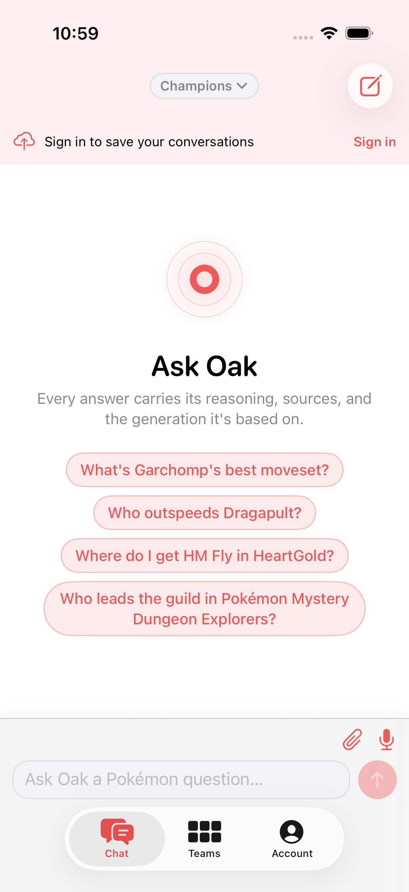 · dark: 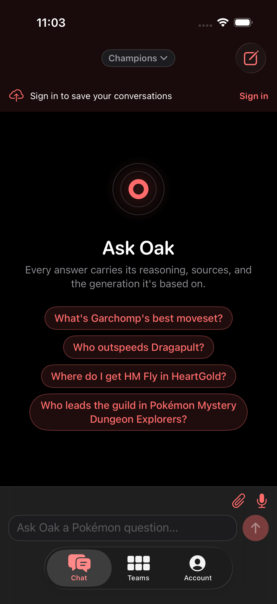

- **Current read:** Warm and friendly, but pink from top to bottom — wash band, banner, four ragged pink chips (the fourth wraps to two lines). The brand cluster is nice; nothing tells the eye what's *the* action.
- **Target:** A calm paper canvas where the question is the hero and red appears exactly once — on send.
- **Hero moment:** **the composer.** On empty state it deserves the stage: brand mark + "Ask Oak" + subtitle, then the example chips as quiet satellites, with the composer visually connected (the chips *fill* the composer on tap — causality, which already happens; make it read).
- **Concrete moves:**
  - Header zone: pink wash → `canvas` + hairline bottom `separator`. The scope chip and compose button stay; the red thread of the brand lives in the mark and the send button, not the chrome.
  - Sign-in banner → one-line quiet `surface` card with `accent` "Sign in" text only (or fold it into the empty-state cluster as a caption; it currently double-teams with the Account tab).
  - Example chips: neutral `surfaceSunken` capsules, `textPrimary` labels, equal max-width so nothing wraps ragged; an `TRY ASKING` instrument label above the set.
  - "Ask Oak" stays `display` — it's right.
- **Microinteractions & states:** keep the staggered chip cascade and press-scale (both exist); chip tap fills the composer with the question *and pulses the send button once* — the eye lands where the action is.

### 02 — Composer & user bubble

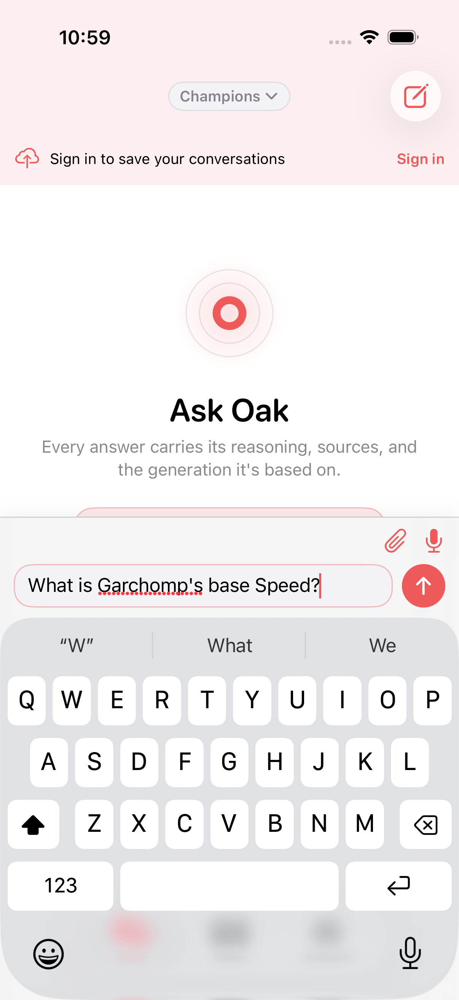 · dark: 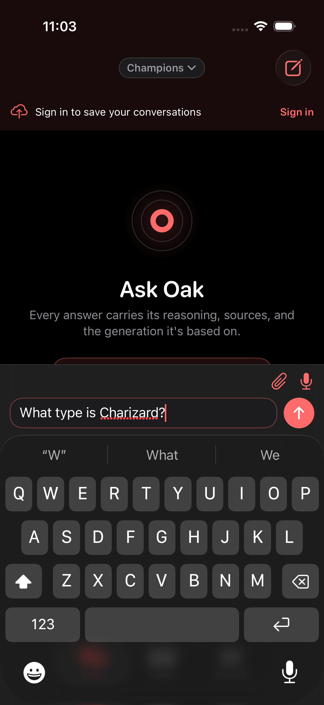

- **Current read:** Competent — focus border animates, send fills red when sendable, mic/paperclip tucked above. The user bubble (seen in `ios-04`) is a saturated gradient capsule with a glow shadow: the loudest element in any conversation.
- **Target:** Composer unchanged in structure; bubble keeps its red (yours = red is the iOS-native mapping) but loses the glow and the gradient — flat `accent`, `Radius.lg`, no shadow. It stays clearly *yours* without outshouting the answer.
- **Concrete moves:**
  - One send affordance app-wide: the 38pt filled circle. The teams-assistant sheet adopts it (today it's a different `arrow.up.circle.fill` glyph button).
  - One user-bubble style app-wide: the teams-assistant's flat tinted bubble and the chat bubble converge on the new flat-accent bubble.
  - Mic stays red only while *recording* (live); at rest it's `textSecondary` — red = live, not "audio exists."
- **Microinteractions & states:** keep the send↔stop `symbolEffect(.replace)` morph and the focus-border spring; keep the send haptic.

### 03 — Streaming: the field notes

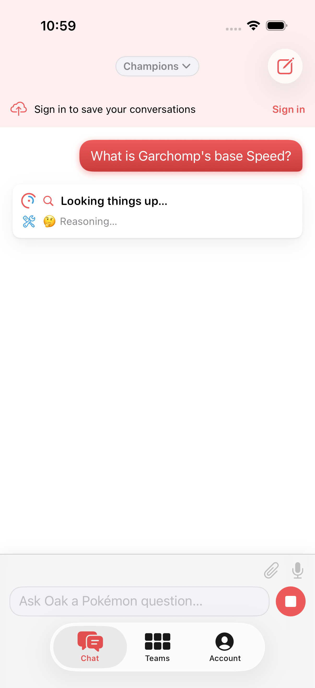 · 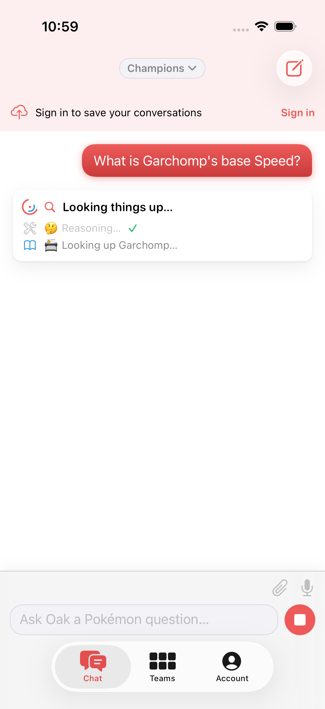 · dark: 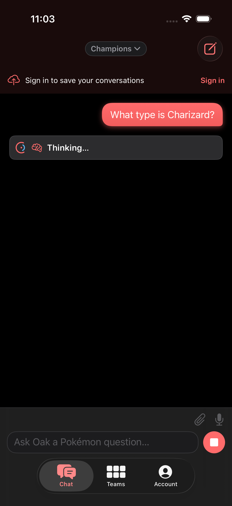

- **Current read:** The bones of the product's signature moment are already here — a card with a phase line and per-tool rows that slide in. But the rows render the server's web-oriented emoji strings verbatim next to SF symbols (`🤔 Reasoning…`), the labels are body-size gray text, and the card floats over a dead void with no hint of where the answer will land.
- **Target:** **The instrument trail** — the moment that makes someone show the app to a friend. Mono voice, machine tick-marks, and an answer skeleton growing beneath it.
- **Hero moment:** the cascading trail itself.
- **Concrete moves:**
  - Map `tool_activity` labels client-side: strip emoji, map tool names to SF symbols (one dictionary — `get_pokemon` → `magnifyingglass`, `run_sql` → `tablecells`, reasoning → `brain`), and set labels in `instrumentLabel` mono caps (`GET_POKEMON · GARCHOMP`). (Server label cleanup is a separate, optional backend nicety — the client mapping is the iOS fix.)
  - Completed rows: muted icon + tick (exists — keep); active row gets the shimmer the phase line already has.
  - Elapsed seconds in mono, right-aligned in the card header.
  - **Answer skeleton** below the trail from the moment of send: masthead bar + two prose lines, `SkeletonBlock` (exists), soft shimmer. No layout jump when prose starts streaming.
  - On `answer_start`: trail collapses to the summary chip (see Motion) docked atop the answer.
- **Microinteractions & states:** keep the row slide-in under `snappy`; the reconnecting phase keeps its distinct label; a transport error swaps the skeleton for the error banner in place.

### 04 — The answer card (the product)

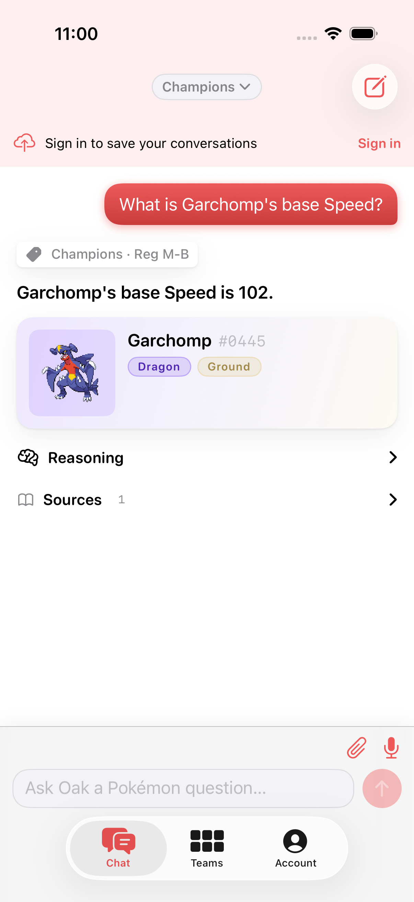 · reasoning open: 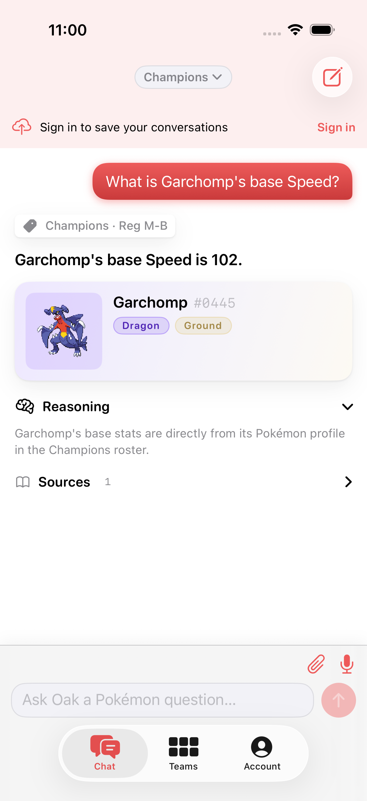 · dark: 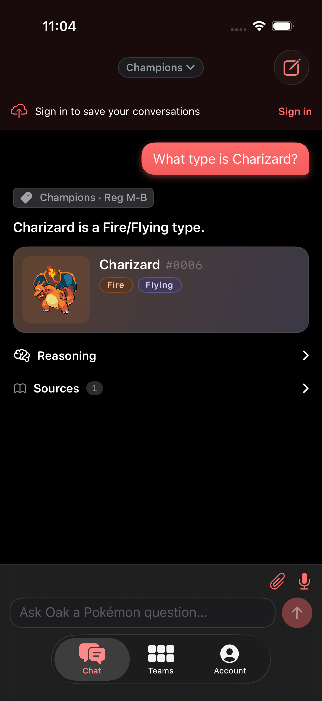

- **Current read:** The verdict is bold body text; the scope tag, subject card, and two gray disclosure rows carry near-equal weight; expanded reasoning is floating caption text; and the whole turn sits at the top of a void (top-anchored thread).
- **Target:** A typeset field-guide entry. One glance = the answer; one more = the receipts.
- **Hero moment:** **the verdict, set in `answerLead`** — "Garchomp's base Speed is **102**." at title3 semibold, the largest text in any conversation.
- **Concrete moves:**
  - **Masthead:** scope tag re-set in `instrumentLabel` mono (`CHAMPIONS · REG M-B`) as a quiet topper; verdict paragraph in `answerLead`; status (ok/partial/insufficient) surfaces as a small leading tick + color only when not-ok (today status is implicit).
  - SubjectCard: unchanged visually (it's the best block) — just ensure the dex number caption adopts the instrument voice.
  - **Credibility strip:** Reasoning · Sources become one horizontal strip of two quiet capsule chips with mono labels and counts (`REASONING`, `SOURCES · 1`) sitting directly under the prose; tapping expands inline into a `surfaceSunken` well (not floating caption text). The receipts read as *instrument output*, not as an afterthought.
  - **Bottom-anchor the thread** so the latest turn sits near the composer and the void disappears.
  - Tables/damage-calc blocks (source read): header rows adopt `instrumentLabel`; numerals go `.monospacedDigit()`; the count-up stays.
- **Microinteractions & states:** keep the block cascade; the credibility chips expand with `smooth` height animation; answer-arrival haptic stays.

### 05 — Auth

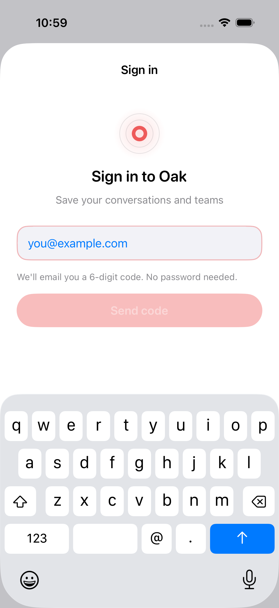 · dark: 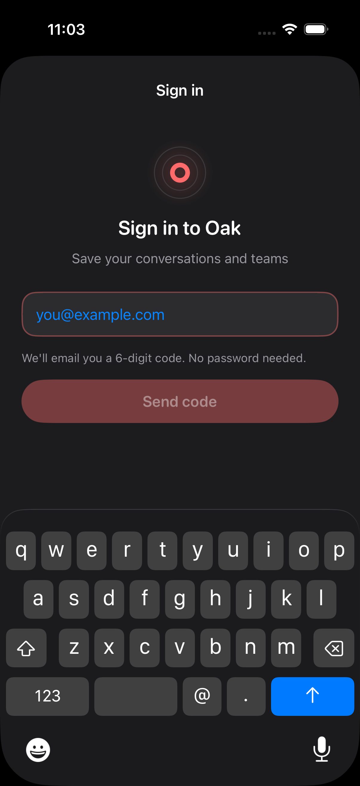

- **Current read:** The best flow in the app — OTP boxes, shake, drawn checkmark, countdown. Two blemishes: the email field renders system-blue text/placeholder against a red-accent app (both modes — verify on device; no explicit color in source), and the disabled "Send code" is a washed-pink slab whose label nearly vanishes.
- **Target:** Same flow, polished edges. Small entry: protect it.
- **Concrete moves:**
  - Force the field's text/tint: `foregroundStyle(Theme.textPrimary)` + `.tint(Theme.accent)`.
  - Disabled CTA: `surfaceSunken` fill + `textMuted` label (state = "not ready," not "faded brand").
  - Sheet background joins the warm `canvas`.
- **Microinteractions & states:** change nothing else — the OTP shake, digit pop, resend countdown, and checkmark are the app's high-water mark.

### 06 — Teams (gate seen live; list/editor from source)

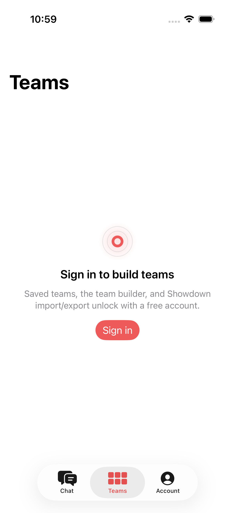 · dark: 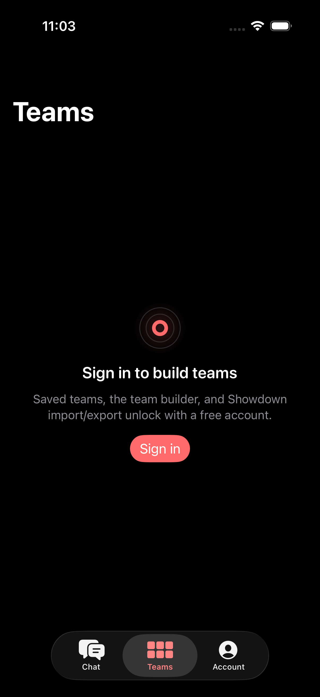

- **Current read:** The gate itself is a decent centered composition with clear copy and a proper red CTA (this is a *correct* red — primary action). Problems: large nav title floats disconnected above; in dark there are faint ghost pill shapes under the title (verify — likely a near-invisible filter row); from source, the list layer is where token discipline collapses (raw fonts in `TeamRow`, the off-theme error banner, a third bubble style in the assistant sheet).
- **Target:** Same structure, consistent voice.
- **Concrete moves:**
  - Nav titles: pick `.inline` everywhere (matches Chat, and the tab pill already labels the section).
  - `TeamRow`: adopt `Theme` fonts/colors; the six-slot sprite strip is a good idea — give it the instrument treatment (empty slots as quiet dashed circles, the one legitimate dashed border, meaning "not yet").
  - Team editor (source): the `oakCard`-per-member-in-Form hybrid is genuinely clever — keep; move EV/IV steppers' numerals to mono; unify the error banner; give the editor a skeleton/loading state (today the form renders empty while `load()` runs).
  - Assistant sheet: adopt the app bubble + send button (see 02); reuse `StreamingStatusView` for its thinking state instead of the bare spinner row.
- **Microinteractions & states:** keep the save-badge slide and warning transitions; investigate and fix the dark-mode ghost chips.

### 07 — Account

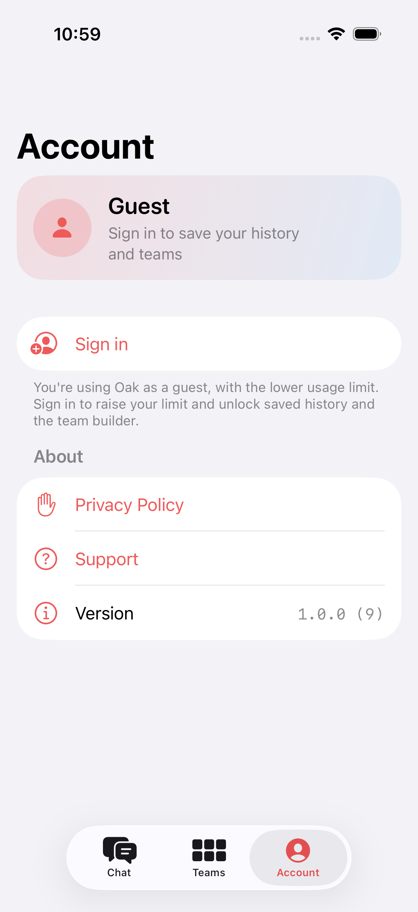 · dark: 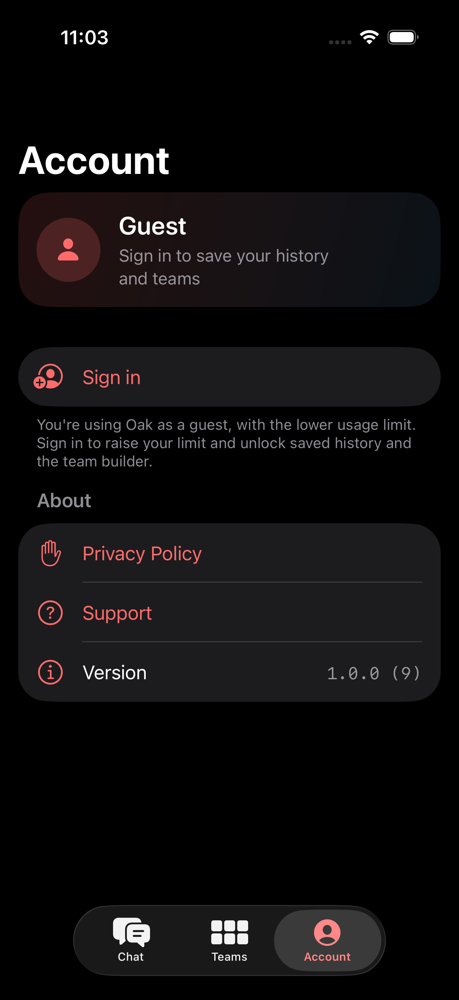

- **Current read:** The gradient guest card is pleasant. But every row is red icon + red text — Privacy Policy, Support, Sign in all wear the same alarm color as "Delete account" territory — and it's the only screen with a large title (source confirms: missing `.inline`, an omission).
- **Target:** A quiet native settings screen where red means destructive only.
- **Concrete moves:**
  - Rows: `textPrimary` labels, `accent` icons; destructive actions keep `danger`. Version stays mono (it already is — good instrument instinct).
  - `.navigationBarTitleDisplayMode(.inline)`.
  - `Form` background joins the warm canvas family.
- **Microinteractions & states:** the delete-account warning haptic + confirm flow is right; keep.

### 08 — History & conversation load (source only — signed-in)

- **Current read (source):** List with skeleton loading, designed empty state, pin/swipe/context actions — solid. Two gaps: the error banner is the off-theme copy-paste, and opening a conversation shows the app's only bare `ProgressView` (`ChatThreadScreen.swift:47`).
- **Concrete moves:** shared `ErrorBanner`; skeleton message rows (one trailing bubble + one leading block) for thread load; format-filter menu should list all six scopes (today: All/Gen 9/Champions only — a parity gap with the web scope model).

### 09 — Artifact sheet & entity detail (source only)

- **Current read (source):** Good structure — detented sheet, directional drill transitions, a designed unavailable state. But the loading state is `Color.clear` (blank flash), and the stat bars are hand-drawn rectangles with no value coloring.
- **Target:** The Pokédex readout — the screenshot screen.
- **Hero moment:** **the stat cluster** — six meters, mono numerals, value-colored fills (`danger` <60 / `warning` 60–89 / `success` 90–119 / `azure` ≥120 — same ramp as the web strategy), animating 0→value on open.
- **Concrete moves:** skeleton meters while loading; section heads in `instrumentLabel` (`BASE STATS`, `MATCHUPS`, `MOVEPOOL`); dex number mono; keep the type-gradient hero band.
- **Microinteractions & states:** meter fill is the delight moment; keep the drill slide.

### 10 — Voice overlay (source only)

- **Current read (source):** All six orb states designed, captions card, tool ticker, mono timer — this surface already speaks the instrument language. Smallest polish only: tool-ticker chips adopt `instrumentLabel`; End button is a correct red (live state).

### 11 — Dark mode (cross-cutting)

- **Current read:** Genuinely designed (hairline-for-shadow, adaptive brand colors, readable chips) but sits on pure black with a warm maroon header band — two temperatures on one screen.
- **Concrete moves:** the warm neutral ramp (Foundation) resolves it: `#171412` canvas, warm raised surfaces, header band gone entirely. The red-bubble glow removal matters most here (it blooms hardest on black).

---

## 5. Priority & sequencing

- **Phase 1 — foundation + the two signature moments (the 80/20):**
  1. **De-pink the chrome + warm the canvas:** header band → canvas + hairline; neutral chips + banner; warm neutral ramp into `Theme` (light paper, warm dark). Every screen changes at once.
  2. **Type roles:** `answerLead` + `instrumentLabel` in `Theme.swift`; apply to verdict, scope tag, tool trail, Reasoning/Sources.
  3. **Answer masthead + credibility strip + bottom-anchored thread.**
  4. **Field-notes trail:** client-side emoji→SF-symbol mapping, mono labels, answer skeleton, collapse-to-chip.
  *Result: the core loop — ask → watch Oak work → read the verdict — looks first-class, and the app stops being pink. This is the dramatic lift.*
- **Phase 2 — consistency & the de-red sweep:** flat user bubble (glow off) + one bubble/send style everywhere; shared `ErrorBanner`; `Theme.Spacing` adoption; nav titles `.inline`; Account de-red; Teams/History token cleanup; auth field tint + disabled CTA.
- **Phase 3 — polish & state coverage:** entity-detail stat meters + skeletons (artifact + thread load + team editor), six-scope history filter, teams-assistant adopts `StreamingStatusView`, dark ghost-chips fix, movepool/matchup instrument labels.

Ordered by impact; stopping after Phase 1 already changes what the app feels like. Nothing here adds a dependency, breaks Dynamic Type, or weakens the Reduce Motion discipline — it's deployment of a system the app already owns.
