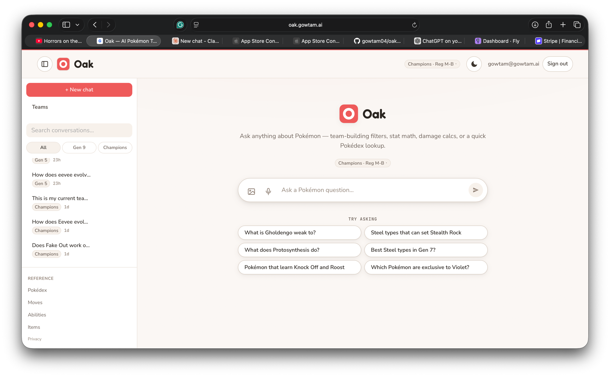
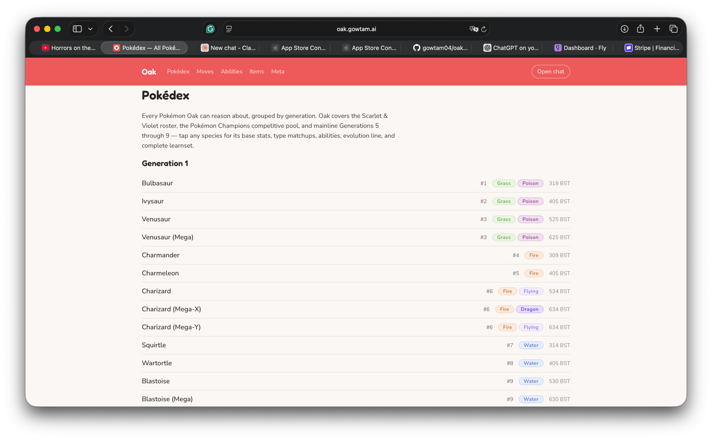

# UI Design Strategy — Oak reference pages (/pokedex, /moves, /abilities, /items, /meta) + sidebar cleanup

> Fable design pass · 2026-07-05 · branch `agent/ref-ui` (off `d25fd4d`)
> Seen via: user screenshots (chat home, /pokedex index) + frontend source (`reference.css`, page files) for the non-screenshotted pages — those were critiqued from code.
> Companion to `fable-ui-strategy.md` (2026-07-03, the chat-app pass). That doc's direction — **"Professor Oak's field instrument"** — was implemented on the chat side and is the law here too. This doc extends it to the reference section, which the first pass never covered.
> Status: strategy + approved implementation plan (`~/.claude/plans/here-remove-the-all-recursive-hopper.md`). Implementation is delegated to subagents; this doc is their design brief.

## TL;DR

- **Diagnosis in one line:** the reference pages import the app's tokens but deploy none of them — a full-bleed red header slab (the exact pattern the chat pass retired), sitemap-flat `<li><a>` lists with dead middle space, zero imagery on a Pokémon product (sprites are in the data, dropped before render), zero interactivity on 1000+-row lists.
- **Direction:** the reference section is literally the *field guide volume* of the field instrument — same paper, same engraved mono labels, same machined chips; sprites become the anchor imagery; red only as the record light (active nav, primary CTA).
- **Three highest-impact moves:** (1) retire the red header slab for the chat page's paper-with-red-thread chrome; (2) the Pokédex card grid — sprite-anchored cards in a responsive grid, the section's hero; (3) a sticky instrument toolbar on every index — search + machined filter chips + a live mono result count.

## 1. Diagnosis

Systemic (all five index pages + details, from `reference.css`):

- **Red-as-wallpaper header.** `.ref-header { background: var(--poke-red) }` — a full-bleed saturated band. The chat pass's core move was demoting exactly this ("red stops being wallpaper and becomes the record light"); the reference pages never got the memo. In dark mode the band would stay fully saturated. *(color, hierarchy)*
- **No surfaces.** Not one card, panel, or shadow on the index pages: bare `h1`, an intro paragraph, then `1px` row borders on the canvas. The elevation system (`--shadow-raised/-floating`) is never used. *(depth)*
- **Sitemap rows, dead middle.** `.ref-index__entry` puts the name left (`flex: 1`) and dex/types/BST far right — at 1000px that's ~600px of empty space per row, ~1100 times. *(space & rhythm, hierarchy)*
- **No imagery.** A Pokémon reference with zero Pokémon. `spriteUrl` is already fetched per row (`PokemonIndexRow`) and dropped in `toGroups`. *(hierarchy — the single cheapest personality win in the codebase)*
- **No interactivity.** No search, no filters, on the longest pages in the product. *(state)*
- **Instrument labels missing.** Group headings, dex numbers, BST, table heads are quiet gray Nunito — the chat pass set these in JetBrains Mono uppercase as the product's "engraved" voice. *(typography, consistency)*

Genuinely fine, protect: the detail pages' *structure* (hero → stats with magnitude-ramp bars → matchups → abilities → evolution → learnset → CTA) is right; the meta leaderboard's bar treatment and honest empty states are right; `TypeBadge` pastels are shared with chat and stay untouched. The overhaul is skin + interactivity, not information architecture.

Sidebar (chat page, separate small fix): the All/Gen 9/Champions chips no longer earn their row (user-confirmed removal), and the REFERENCE block spends ~5 stacked rows of padding on 5 links + Privacy.

## 2. Direction

**The field guide volume of Professor Oak's field instrument.** Same thesis as the chat pass, applied to browsing instead of conversing: *editorial calm for language* (page intros, ability/item effect text at comfortable measure) and *instrument precision for data* (mono dex numbers, BST readouts, machined filter chips, meter bars). The pages must feel like turning to the reference section of the same beautifully printed instrument manual — not like a crawler sitemap bolted onto the product. References: PokemonDB (data density done confidently), Linear (chrome discipline, machined controls), the implemented Oak chat page itself (the strongest reference — match it, don't reinvent it).

## 3. Foundation — reference-specific patterns (all existing `globals.css` tokens; token-only CSS so dark mode is free)

- **Chrome.** `.ref-header`: `background: var(--bg)`, `border-top: 2px solid var(--poke-red)` (the red thread), hairline `--border` bottom, sticky, backdrop-blur like the chat header. Fredoka wordmark + brand-mark chip mirroring `.chat-page__title`. Nav links = pills (`--radius-pill`, `--text-sm`); active page: `--poke-red` text on `--poke-red-soft` fill via `aria-current`; hover: `--surface-sunken`. "Open chat" = red pill (mirror `.app-nav__newchat`). Red's complete job list on these pages: the thread, the active nav pill, primary CTAs (Open chat, Ask Oak), link hover. Nothing else.
- **Surface-first cards.** Level 1 resting card: `--surface` + `--shadow-raised` + hairline `--border`, `--radius-lg`. Hover (linked cards only): `--shadow-floating` + `translateY(-2px)` + `border-color: var(--border-strong)`, `transition: var(--motion-fast)`. Level 0 stays paper.
- **Instrument labels.** JetBrains Mono (`--mono`) 600, `--text-2xs`, uppercase, `+0.08em` tracking, `--text-faint/muted`: group headings ("GENERATION 1 · 151"), result counts ("27 RESULTS"), dex numbers ("#0445"), BST readouts ("600 BST"), table heads, meta snapshot line. Numerals tabular.
- **Inputs.** Search fields mirror `.conv-list__search`: `--surface-sunken` fill, no border at rest, azure focus ring. `type="search"`.
- **Chips.** Filter chips = machined pills: `--text-xs` 600, `--radius-pill`, hairline border, `aria-pressed` → `--surface-sunken` fill + `--border-strong`; type chips carry an 8px swatch dot in the `--type-*` token. Chips never use red (selection ≠ record light here; pressed-fill is the selected state, consistent with `.conv-list__filter`).
- **Motion.** Card hover lift and chip fill at `--motion-fast`; detail-page meter fills 0→value 400ms ease-out (already spec'd in the chat doc); nothing decorative. Filtering itself does not animate (instant, `useDeferredValue` keeps typing responsive).

## 4. Screen-by-screen

### 01 — Index toolbar (shared: all five indexes)
- **Target:** a sticky toolbar directly under the header (coordinated `top` offsets): search input, chip groups, and a live `role="status"` mono count ("1,025 POKÉMON" → "27 RESULTS"). Mobile (≤640px): search full-width, chip rows become `overflow-x: auto` no-wrap strips.
- **States:** zero results → friendly empty card ("No Pokémon match" + a Clear-filters pill), never a blank void. Facet-filtering keeps group headings (empty groups dropped); a text query flattens to one "N results" grid.

### 02 — /pokedex (the hero screen)
- **Target:** generation-grouped **card grid**: `repeat(auto-fill, minmax(160px, 1fr))`, gap `--space-4`. Card: sprite (72px, lazy, on a `--surface-sunken` rounded well), name (Nunito 600 `--text-sm`), mono dex number, `TypeBadge`s, mono BST. Whole card is the `<a>`.
- **Hero moment:** the first paint of Generation 1 as a wall of sprites — the moment the section stops being a sitemap and becomes a field guide.
- Facets: type (18 swatch chips) + generation. "Other formats" extras: compact cards (name + scope chip, best-effort Showdown sprite hidden on error), excluded from facets, included in search.
- Perf: `content-visibility: auto` + `contain-intrinsic-size` on cards/sections; links stay plain `<a>` (SSR'd client component keeps the crawl path in initial HTML — this is a hard contract).

### 03 — /moves
- **Target:** dense instrument rows (not cards): name (600) · `TypeBadge` · category tag (mono 2xs: PHYSICAL/SPECIAL/STATUS) · right-aligned mono power ("—" for status). Letter groups when unfiltered. Facets: type + category.

### 04 — /abilities & /items
- **Target:** two-column (1 col mobile) link-card grid — name only, quiet cards, hover lift. Search only (data has no facets; don't fake any).

### 05 — /meta
- **Target:** leaderboard becomes a Level-1 card; **sprite cell per row** (server-joined `spriteUrl`, Showdown-guess fallback, neutral placeholder if null); rank + usage % in mono; azure bars stay (informational, per the color law); delta up/down keep `--success`/`--danger`. Format tabs = pill chips; month picker = sunken select; snapshot line = instrument label. Detail (`/meta/[format]/[slug]`): card-ified sections, mono stat lists, `CopyShowdownSet` button stays red-soft (primary-ish action).

### 06 — Detail pages (pokedex/moves/abilities/items `[slug]`)
- **Target:** hero becomes a Level-1 card: artwork (128px on a sunken well) + Fredoka name + mono dex + `TypeBadge`s, with a 3px top rule in the primary type's `--type-*` color (the one place type color escapes the badge). Every `.ref-section` becomes a Level-1 card with an instrument-label heading. Stats keep the magnitude ramp (already correct); learnset/fact tables: hairline separators + row hover tint, mono numerals, no internal column borders. `AskOakCta` → the red primary moment of the page. Breadcrumbs stay quiet.
- Structure/data assembly unchanged. Testids stable.

### 07 — Chat sidebar (separate task)
- Remove the All/Gen 9/Champions chip row entirely (state + plumbing; server API `format` param stays for mobile clients; row badges now always show).
- REFERENCE block compacts to a 2-column grid (heading + Privacy span both columns), `--space-2/--space-3` padding — roughly half the height, no JSX change.

## 5. Sequencing (= approved task DAG)

- **A — chrome + CSS foundation** (header/footer/layout + `reference.css` rewrite + 3 new empty CSS files) — unblocks everything; the single biggest lift.
- **E — sidebar cleanup** (independent, parallel with A).
- **B — index explorers** (toolbar, filter hook, card grid, moves/names explorers) — the hero.
- **C — detail-page card-ification.** **D — meta restyle + sprites.** (B/C/D parallel after A.)
