# UI Design Strategy — Oak (web app)

> Fable design pass · 2026-07-03 · commit 768461b
> Seen via: live screenshots — localhost:3000 as guest (13 captures) + production oak.gowtam.ai signed-in shots (chat with answer + artifact panel, empty chat with history sidebar, team builder)
> Status: **strategy only — no code changed.** Implementation is a separate pass.

## TL;DR

- **The diagnosis in one line:** Oak has a genuinely designed token foundation (warm paper palette, real motion grammar, zero stray hex) but spends it timidly — the loudest element on every screen is the red chrome band rather than the content, the answer itself has no typographic form, and the product's two defining moments (the agent reasoning live, the verdict with its evidence) are visually mute.
- **The direction:** *Professor Oak's field instrument* — editorial calm for language, instrument precision for data. Paper-warm surfaces and a big serene answer voice, with mono-set numerals, meter-like stat readouts, and red used like an instrument's record light: small, meaningful, and only where it means something. References: Linear (chrome discipline), Claude.ai (answer-first canvas), Teenage Engineering (instrument detailing).
- **The three highest-impact moves:** (1) demote the header from red slab to paper, letting red become the accent; (2) give the answer card a masthead — a 22px lead verdict, 68ch measure, and a designed credibility strip (reasoning/sources/inference); (3) make streaming visible — a cascading "field notes" trail of tool-call chips plus an answer skeleton, so Oak's reasoning-over-tools soul is something you *watch*.

---

## 1. Diagnosis — why it reads as generic today

First, what is **not** wrong: this is not a framework-default app. `globals.css` defines an 11-step warm neutral ramp (`#fbf7f4` paper, `#e9e0d8` borders), three-tier motion tokens with spring easing, warm-tinted layered shadows, a z-index scale, and reduced-motion handling. Fredoka/Nunito Sans/JetBrains Mono are loaded deliberately. There are no stray hex values outside the token block. The bones are better than most shipped products. The problem is deployment: the system's range is never used, so every screen sits in the same quiet 13–15px, 1px-bordered middle register — while the chrome shouts.

### Systemic tells (repeat on every screen — fixed once, in the Foundation)

- **The red band header is the loudest thing in the product.** A full-bleed `--poke-red` gradient slab (~100px with its shadow) tops all 16 screens. Content competes with chrome and loses; in dark mode (`12-dark-chat.png`) the band stays fully saturated over a near-black canvas and the mismatch is harsh. This single element is most of why the app reads "template" — it's the 2015-Material pattern of brand-as-banner. *(lens: hierarchy, color)*
- **The type scale is never deployed above body size.** The largest text on any working screen is the empty-state wordmark; everything else is 13–15px Nunito with bold for emphasis. The answer's lead sentence — the product's payoff — is `<strong>` body text (`04-chat-answer.png`). Fredoka, the display face, appears only in the logo and modal titles. Flat type = no anchor for the eye. *(lens: typography)*
- **Answer prose runs ~95–100 characters per line** inside the answer card (`05-chat-answer-detail.png`) — well past comfortable measure, so the payoff paragraph reads like documentation, not an answer. *(lens: typography)*
- **Everything is a 1px-bordered box.** Inputs, cards, chips, tables, team-builder fields — all `1px solid var(--border)` on white. The elevation system exists (`--shadow-raised/floating/overlay`) but borders do the work, so screens read flat and form-like; the team builder reads as admin CRUD. *(lens: depth)*
- **Two competing selection/accent languages.** Red selects the team-builder slot; azure selects the team card two inches away (`prod-03-team-builder.png`); azure also does focus rings, links, stat bars, "Ask about this in chat," and the inference callout. Neither color owns a meaning, so both read arbitrary. *(lens: color, consistency)*
- **The status/flag vocabulary is unstyled.** `[high]` renders as literal bracketed text in a green pill; the INFERENCE callout uses a *dashed* azure border (reads wireframe, not shipped); "incomplete" is bare orange text next to "CHAMPIONS · 6/6". Oak's whole thesis is calibrated, honest answers — and its calibration markers look like debug output. *(lens: state, typography)*
- **Vertical composition is undecided.** The empty-state cluster floats at ~35% height with a dead cream zone to the composer; the streaming state is one small line in an empty viewport; the teams gate card floats high in a void. Space isn't grouping anything — it's just left over. *(lens: space & rhythm)*

### Screen-specific problems (fixed per screen, in section 4)

- **Streaming (`03-chat-streaming.png`):** the agent's tool-loop — the differentiator — is a single 14px line ("Thinking through your question… (3s)"). Dead screen at the moment of highest anticipation. *(hierarchy, motion, state)*
- **Answer card (`04/05`):** no masthead or status signal; sprite tile floats left with a dead column to its right; Reasoning/Sources are plain collapsed `
` rows — the credibility features are buried. *(hierarchy)*
- **Artifact panel (`prod-01`):** stat bars are thin default-blue lines with one unexplained green bar (Attack 134); section labels are faint; movepool chips repeat a "Normal" pill on every entry — noise. *(hierarchy, color)*
- **Team builder (`prod-03`):** the six-Pokémon party row — the emotional core — is the smallest element on screen while the team-name input is the largest; the field grid is flat; the assistant panel is an unstyled void with a tiny input. *(hierarchy, space)*
- **History sidebar (`prod-02`):** every row shows three always-visible icon buttons (star/rename/delete) plus a repeated "Champions" chip — per-row clutter that outweighs the titles. *(consistency, space)*
- **Scope popover (`02-scope-chip-open.png`):** a generic dropdown — six plain rows, no descriptions, visually detached from the chip that opened it. For the feature that defines what an answer *means*, it's underweight. *(hierarchy)*
- **Mobile composer (`11-mobile-answer.png`):** focused textarea shows a blue outline rectangle *inside* the red-bordered pill — two focus indicators fighting. *(consistency)*
- **Genuinely fine, mostly leave alone:** the privacy page (clean doc typography), the auth modal (competent, just warm the scrim), the guest teams gate (fix one undersized button), mobile layout generally (chips stack well), the pokeball spinner, pastel type badges, and the empty-state copy (helpful, concrete). Also protect: **load/stream stability** — live driving found zero FOUC and zero layout shift on navigation, popovers, or answer arrival. That's rare and load-bearing; nothing below may regress it.

---

## 2. Direction — what this app should feel like

**Professor Oak's field instrument.** Oak is a reference tool you *converse* with — it reasons over hard data and shows its work. The design should express exactly that pairing: **editorial calm for language** (answers typeset like a beautifully printed field-guide entry — a big unhurried lead, comfortable measure, quiet chrome) and **instrument precision for data** (mono-set numerals, small-caps mono labels, meter-like stat bars, chips that feel machined). Keep the existing warmth — paper cream, soft radii, Fredoka's friendliness — that's Oak's charm and it's already distinctive. What changes is discipline: red stops being wallpaper and becomes the instrument's record light — the send button, the live turn, the selected slot — small, saturated, meaningful.

**Reference points:**
- **Linear** — chrome restraint and selection discipline: a near-invisible header, one selection color, motion at 150–250ms that you feel rather than see.
- **Claude.ai** — the answer-first canvas: conversation as a calm reading column with a measured line length, tool-use surfaced as compact expandable chips, artifact panel as a peer surface.
- **Teenage Engineering (OP-1 era)** — the instrument voice for data blocks: mono numerals, tiny engraved-feel caps labels, meters where color encodes value. This is what makes the Pokédex panels feel like *equipment*, not tables.

Every recommendation below serves this: quieter chrome, louder content; editorial for words, instrument for numbers; red as meaning.

---

## 3. Foundation — the cross-cutting system

The tokens mostly exist; this section is about extending range and assigning **roles**. Concrete values, keyed to `web/src/app/globals.css`.

### Typography

Keep all three families — they're right. Fix scale and deployment:

| Role | Spec | Where |
|---|---|---|
| Display | Fredoka 600, 28px/1.2 (`--text-2xl`, new) | Artifact title, teams page title, empty-state wordmark text |
| **Answer lead** | Nunito Sans 700, 22px/1.35 (`--text-xl` re-pointed) | First paragraph of every answer — the verdict line |
| Section head | Fredoka 500, 18px/1.3 (`--text-lg` re-pointed) | Reasoning/Sources heads, team section heads |
| Body | Nunito Sans 400, 15px/1.6, **max-width 68ch** | Answer prose, all reading text |
| UI label | Nunito Sans 600, 13px | Buttons, chips, nav |
| **Instrument label** | JetBrains Mono 600, 11px, uppercase, +0.08em tracking | ALL small-caps labels: `BASE STATS`, `SLOT 1`, `INFERENCE`, `27 RESULTS`, `TM/HM` |
| Instrument numeral | JetBrains Mono 500, 13–15px, tabular | Stats, dex numbers, counters, timings |

The instrument-label move is the signature: today those labels are quiet gray Nunito caps; set them all in mono and they become the "engraved" voice that ties chat, artifact, and builder together.

### Color

- **Retire the red band.** Header becomes paper (`--bg`) with a hairline `--border` bottom; optional 2–3px `--poke-red` top rule as the "red thread." Wordmark ring stays red. Red's jobs, exhaustively: primary action (send, save, New chat), live/recording states (streaming stop button, spinner), and **selection** (active slot, active team, active scope row). Nothing else.
- **One selection color: red.** The azure-selected team card and azure focus-follows-selection patterns switch to `--poke-red-soft` fill + `--poke-red` border, matching the slot tiles.
- **Azure's jobs, exhaustively:** focus rings (keep — transient, accessible), links in prose, and the *informational* semantic (inference callout, info banners). Azure never selects, never fills stat bars.
- **Stat bars get one value rule:** fill color encodes magnitude via the semantic ramp — `--danger` <60, `--warning` 60–89, `--success` 90–119, `--azure` ≥120 — with mono numerals. (This replaces today's all-azure-except-one-green mystery; players already think in these tiers.)
- Neutral ramp: unchanged, it's good. **Dark mode:** surfaces must come from the *warm* ramp (`#161311` base is already warm — use its neighbors for raised surfaces), and the header follows the paper rule (dark paper + hairline, red thread on top) instead of staying a saturated band.

### Space & rhythm

- Scale (4/8/12/16/24/32/48/64) exists — add **layout constants**: chat column `max-width: 760px`; answer prose `max-width: 68ch`; composer `max-width: 680px`; artifact panel `440–480px`; consistent `--space-6` (24px) card padding (today it varies).
- **Composition rule per canvas:** conversation gravity is *bottom-anchored* (thread grows up from the composer); the empty state is a *centered composition* (see screen 01); side panels are *top-anchored*. Decide it, apply it, and the dead zones disappear.

### Radius & elevation

Radii unchanged. Depth flips from border-first to **surface-first**:

- **Level 0 (canvas):** `--bg`. **Level 1 (resting card):** `--surface` + `--shadow-raised`, hairline border only when sitting on another `--surface`. **Level 2 (floating):** popovers/hover-lift, `--shadow-floating`. **Level 3 (overlay):** modals/drawers, `--shadow-overlay` + warm scrim `rgba(42,37,33,0.4)` (today's gray scrim kills the palette — see `06-auth.png`).
- **Inputs invert:** `--surface-sunken` fill, *no border* at rest, border+ring on focus only. This single change de-CRUDs the team builder and composer instantly.
- Tables: drop internal column borders; hairline row separators + row hover tint (`--surface-sunken`).

### Motion

Grammar (fast/base/spring + reduced-motion) exists. Add the missing choreography, all within existing tokens:

- **Streaming cascade:** each `tool_activity` chip enters with `turn-in` (220ms) at a 60ms stagger; answer skeleton fades in immediately on submit.
- **Answer arrival:** card sections (masthead → prose → evidence → credibility strip) stagger in at 60ms; streamed markdown keeps the caret.
- **Meter fill:** artifact stat bars animate width 0→value, 400ms ease-out on panel open; count-up numerals optional.
- **Rule unchanged:** motion expresses feedback, causality, or continuity — nothing decorative. Durations stay ≤260ms except meter fills.

---

## 4. Screen-by-screen strategy

### 01 — Chat, empty state

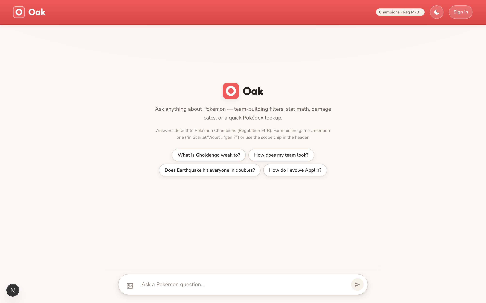 · signed-in: 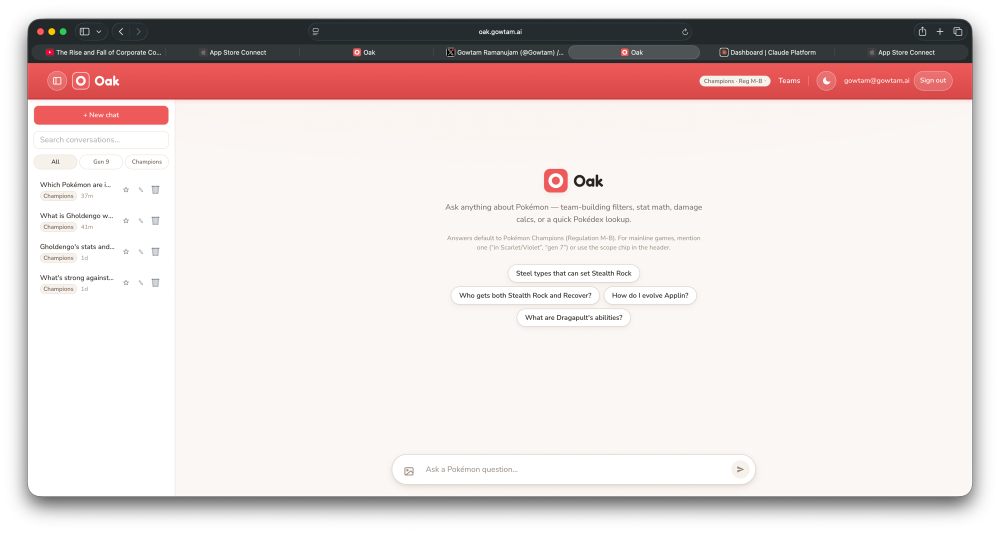

- **Current read:** Friendly cluster (wordmark, invite, scope hint, chips) floating at 35% height; composer alone at the bottom; a third of the viewport is dead cream between them. Chips wrap into a ragged 2-2/1-2-1 cloud.
- **Target:** One centered composition where the *question* is the hero — this is a "what do you want to know?" moment, not a waiting room.
- **Hero moment:** **The composer, promoted to center stage.** Wordmark + invite, then the input directly beneath (56–60px tall, `--surface`, `--shadow-floating`, red send), then chips as its satellites. On first submit it docks to the bottom (continuity animation, `--motion-base`) and stays docked for the conversation.
- **Concrete moves:**
  - Move composer into the hero cluster; kill the bottom dock on empty state (mobile keeps bottom dock — thumb reach).
  - Chips: one labeled row set (`TRY ASKING` instrument label above), max 2 per row, aligned grid instead of ragged centering.
  - Scope hint line gains the actual scope chip inline (tap target where the concept is explained).
  - Wordmark text in Fredoka display 28px; invite stays 17–18px `--text-muted`.
- **Microinteractions & states:** chips keep spring hover; composer focus ring azure; submit → composer docks while the first tool chip cascades in (causality: your question became work).

### 02 — Scope picker

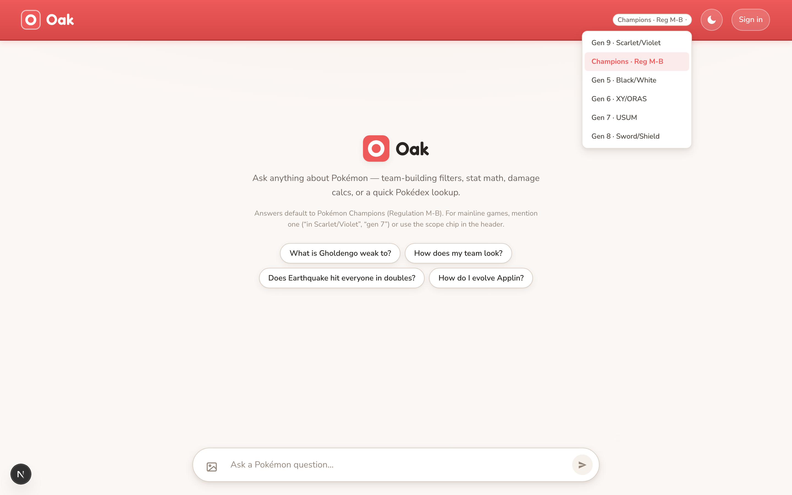

- **Current read:** Six plain text rows in a detached white dropdown; active row soft pink. Functional, generic, and underweight for the feature that decides what every answer means.
- **Target:** A small designed menu that teaches scope while switching it.
- **Hero moment:** the **active scope row** — red-selected with its regulation/generation detail visible.
- **Concrete moves:**
  - Two-line rows: name (UI label 13px) + one-line description in `--text-muted` 12px ("Champions · current regulation M-B", "Gen 7 · Ultra Sun/Ultra Moon").
  - Selection = `--poke-red-soft` fill + 3px red left rail (one selection language).
  - Anchor the popover to the chip (same corner radius, 4px gap) so it reads as the chip unfolding; `turn-in` entrance.
  - Instrument label header: `ANSWER SCOPE`.
- **Microinteractions & states:** row hover `--surface-sunken`; picking a scope pulses the header chip once (feedback) and the chip label crossfades.

### 03 — Streaming / thinking

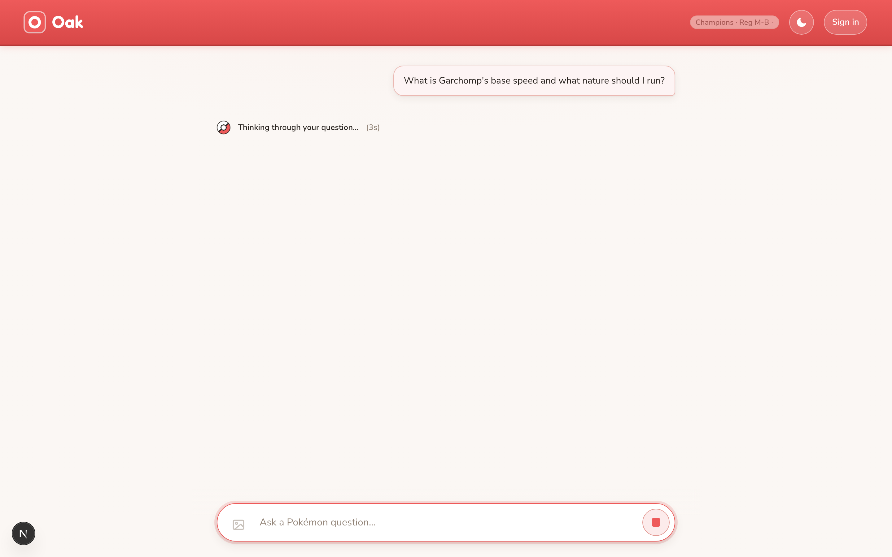

- **Current read:** The product's soul — an agent looping over 17 tools — renders as one small line with a spinner in an empty viewport. The most anticipatory moment in the app is its emptiest screen. Live driving confirmed the UI shows only the *latest/aggregate* activity line even though the SSE contract emits one `tool_activity` event per tool call — the data for a running trail already arrives on the wire and is discarded by the presentation.
- **Target:** **"Field notes" — a live trail of the agent's work.** This is the signature redesign moment; no competitor chat app can show this because their answers aren't tool-grounded.
- **Hero moment:** the cascading tool-activity trail where the answer will appear.
- **Concrete moves:**
  - Each `tool_activity` SSE event renders an instrument chip: mono label (`GET_POKEMON · garchomp`), pokeball micro-spinner while in flight, tick when done; chips stack vertically, cascading in with `turn-in` + 60ms stagger.
  - Behind/below the trail, the **answer card skeleton** appears immediately on submit (masthead bar + three prose lines, soft pulse) — the shape of what's coming holds the layout, no jump when the answer streams.
  - Keep elapsed-seconds counter, set in mono (instrument numeral).
  - On `answer_start`, the trail collapses into a single compact summary chip pinned atop the card ("6 lookups · 12s", expandable later from the credibility strip) — continuity, not deletion.
- **Microinteractions & states:** stop button stays red (live state = red's job); transport error replaces skeleton with the error strip + Retry in place (no layout jump).

### 04 — The answer card (the product)

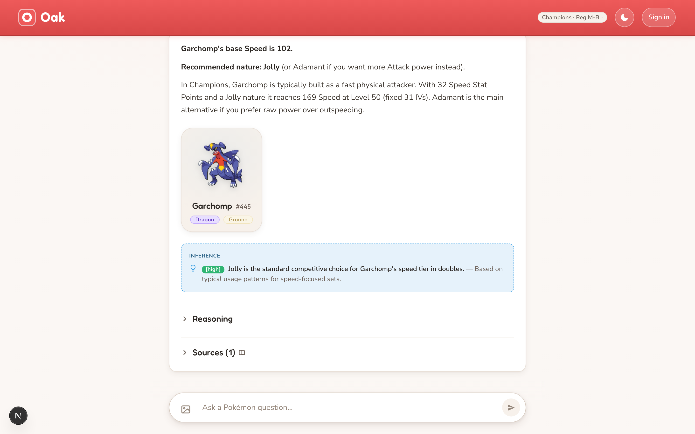 · detail: 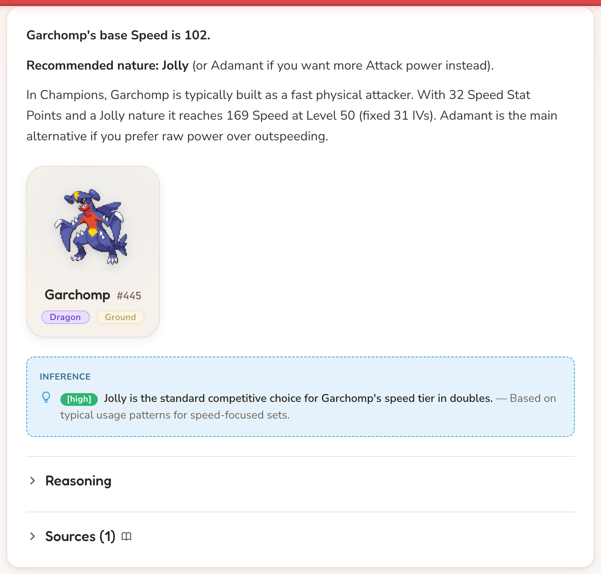 · with table: 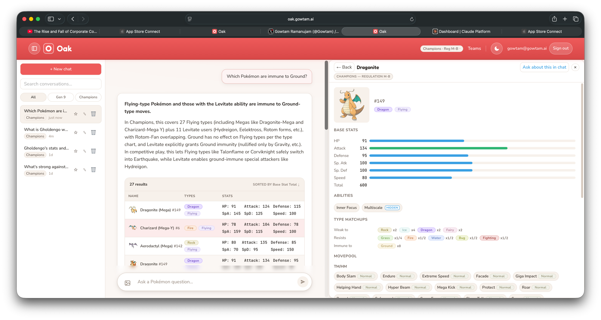

- **Current read:** A wide white slab. The verdict is bold body text at ~95ch measure; the sprite tile strands a dead column to its right; INFERENCE is a dashed-border box with a literal `[high]` badge; Reasoning and Sources — the credibility engine — are two plain gray `
` rows.
- **Target:** A typeset field-guide entry: masthead verdict, measured prose, evidence beside it, and a designed credibility strip.
- **Hero moment:** **the lead verdict, set at 22px** ("Garchomp's base Speed is **102**."). One glance = the answer.
- **Concrete moves:**
  - **Masthead:** first paragraph auto-styled as Answer lead (Nunito 700 22px/1.35); above it a slim status row — status tick (✓ ok / ⚠ partial / ∅ insufficient) + scope tag (`CHAMPIONS · REG M-B`, instrument label). Status becomes visible instead of implicit.
  - **Measure:** prose wrapped at 68ch; the card stays wide but text doesn't stretch to fill it.
  - **Evidence rail:** sprite tile + key facts float right of the prose (media object) instead of stranding whitespace; on mobile it stacks below the lead.
  - **Callouts:** inference/uncertainty become solid `--azure-soft` / `--warning-soft` panels, radius `--radius-md`, *solid* hairline border, instrument label header (`INFERENCE · HIGH CONFIDENCE`) — confidence set as a proper pill, never `[high]` brackets.
  - **Credibility strip:** Reasoning · Sources (n) · Tool trail as a footer row of quiet tabs with mono counts; expanding opens inline. This is Oak's receipts — visible, tidy, one tap away.
  - Results tables: header row in instrument labels, mono stat numerals, row hover tint, no cell borders.
- **Microinteractions & states:** sections stagger in on arrival; expanding Reasoning animates height (`--motion-base`); `exists_in_standard` miss renders as an info callout with a one-tap "Switch to Scarlet/Violet" chip.

### 05 — Conversation & history sidebar

- **Current read:** Solid structure (search, filter chips, list) but every row carries three always-visible icon buttons + a "Champions" chip + timestamp — the furniture outweighs the titles.
- **Target:** A quiet index: titles first, metadata whispered, actions on demand.
- **Hero moment:** the **active conversation row** (red left rail + `--poke-red-soft` fill).
- **Concrete moves:**
  - Icons appear on hover/focus-within only (desktop), overflow menu on mobile.
  - Scope chip only when it differs from the current filter; timestamp stays, 11px mono.
  - Row: title 13px/600, single line ellipsis; 8px vertical padding — denser, calmer.
  - "+ New chat" keeps red (primary action) but drops to 36px height; search input goes sunken-borderless per foundation.
- **Microinteractions & states:** row hover tint; empty history state gets one line + a "Start your first chat" chip (not a void).

### 06 — Artifact panel (Pokémon detail)

- **Current read:** Right concept, weak instrument. Thin azure stat bars with one unexplained green; faint section labels; movepool chips each dragging a "Normal" pill; the sprite sits in a plain beige tile.
- **Target:** The Pokédex readout Oak deserves — the panel that makes people screenshot the app.
- **Hero moment:** **the stat cluster** — six meters, mono numerals, value-colored fills, animated on open.
- **Concrete moves:**
  - Hero header: sprite at 96px in a type-tinted halo (radial `--type-*` at ~12% opacity), name in Fredoka display 28px, dex number mono, type badges beneath.
  - Stat meters: 8px tall, `--radius-pill`, fill by the value ramp (danger <60 / warning 60–89 / success 90–119 / azure ≥120), numerals right-aligned mono tabular; BST as a summary row; fills animate 400ms on open.
  - Section labels → instrument labels (`BASE STATS`, `TYPE MATCHUPS`, `MOVEPOOL`).
  - Movepool: group by damage class or type instead of per-chip "Normal" pills; chip = move name + tiny type dot; class/power revealed on hover or tap.
  - Type matchups: keep chips, add ×2/×4 as mono superscripts; group Weak/Resist/Immune with the labels in instrument voice.
- **Microinteractions & states:** panel slides in from the right (`--motion-base`, continuity with "Ask about this in chat"); meter fill is the delight moment; loading = skeleton meters, not a spinner.

### 07 — Team builder

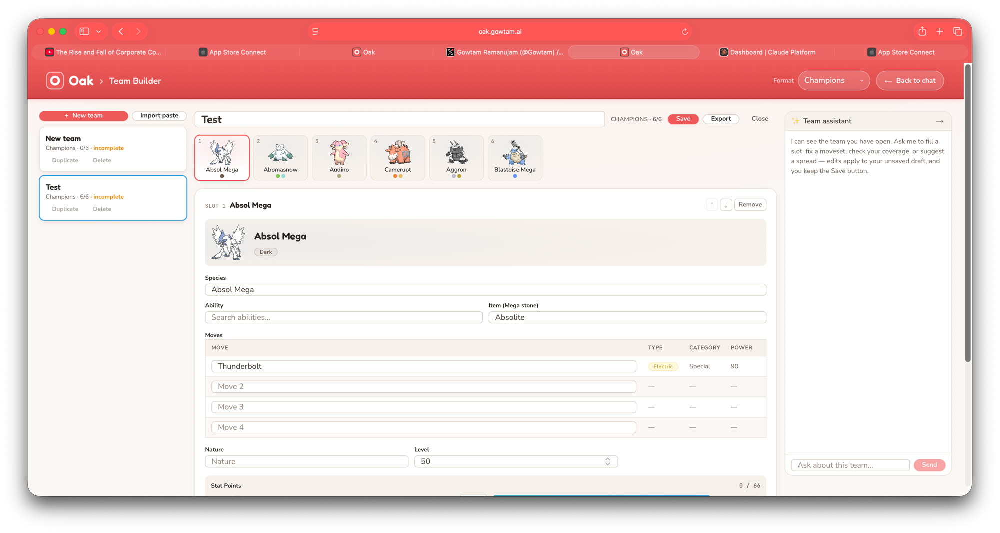

- **Current read:** Reads as an admin form: the six-slot party row (the emotional core) is the smallest element while the name input is the largest; flat 1px fields everywhere; red slot selection vs azure team-card selection; a bare assistant panel with a tiny input and a pink disabled Send.
- **Target:** The party front and center, the form receding into grouped surfaces, the assistant a real chat.
- **Hero moment:** **the party row** — six large slot cards (sprite ≥72px, name, type dots, item pip), the selected one red-railed and lifted.
- **Concrete moves:**
  - Party row 2× current size; empty slots get a dashed pokeball placeholder ("Add a Pokémon") — the one legitimate dashed border, meaning "not yet."
  - Team name becomes an editable title (Fredoka display, borderless until hover/focus) — not the page's biggest input.
  - Field grid: sunken-borderless inputs per foundation, grouped into surface sections with instrument labels (`MOVES`, `NATURE & LEVEL`, `STAT POINTS`); moves table drops column chrome, type shown as a colored dot + mono power.
  - Selection unified on red: team list card active = red rail (azure border retired).
  - Save bar: sticky footer strip — `CHAMPIONS · 6/6` in mono, legality state as a proper pill (✓ legal / ⚠ incomplete), red Save. Status stops being bare orange text.
  - Assistant panel: real message bubbles on `--surface-sunken`, composer matching the chat one (44px, red send), suggestion chips for first-use ("Check coverage", "Fill slot 3").
- **Microinteractions & states:** selecting a slot slides its detail in (`tm-panel-in` exists — use it); stat-point bars animate like artifact meters; save success pulses the legality pill to `--success`.

### 08 — Auth modal

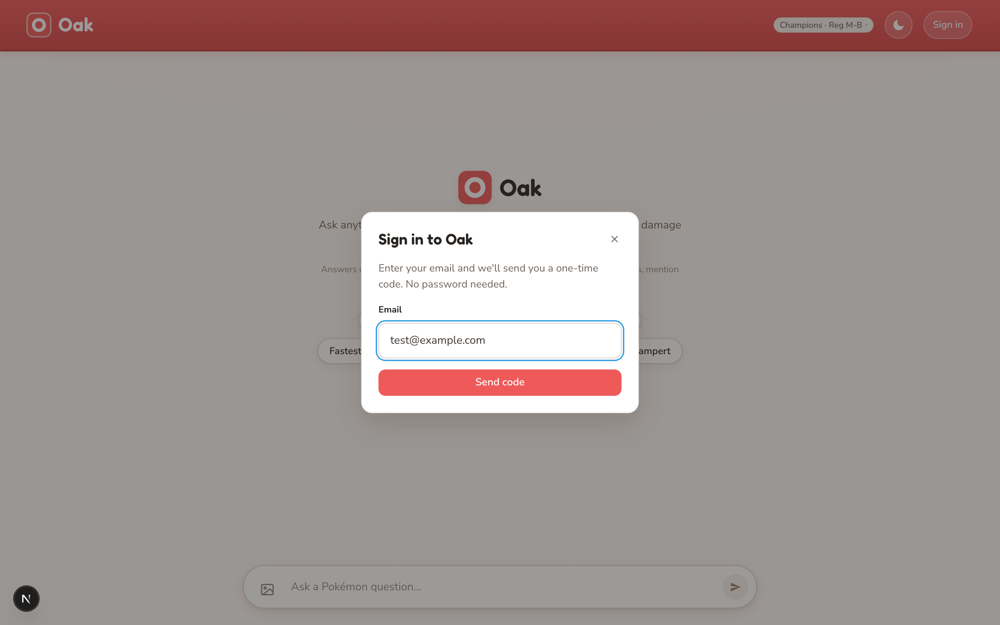

- **Current read:** Competent and clean; generic. Cold gray scrim washes the warmth out of the whole screen behind it.
- **Target:** Same modal, Oak-warm. Small entry: keep it.
- **Concrete moves:** warm scrim `rgba(42,37,33,0.4)`; pokeball mark atop the title (the teams gate already does this — consistency); sunken-borderless input; the OTP step should show six mono digit cells (instrument voice) rather than a plain text field.
- **Microinteractions & states:** modal enters with `turn-in`; "code sent" confirmation as an azure-soft callout; error as danger-soft — both already exist, keep.

### 09 — Teams gate (guest) & privacy

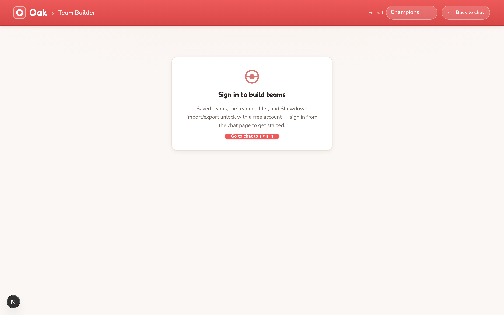 · 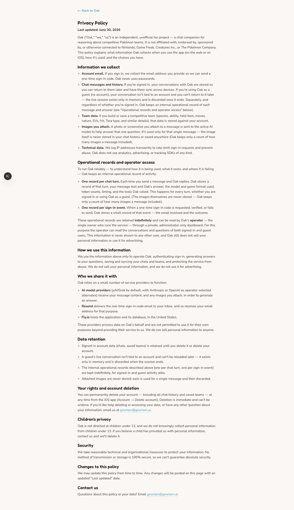

- **Current read:** Both fundamentally fine. Gate: nice pokeball mark, clear copy, but the CTA is a tiny 12px pill and the card floats high in a void. Privacy: clean doc typography, no changes needed beyond the global body measure.
- **Concrete moves:** gate CTA becomes a standard 44px red button; card vertically centered. Privacy: none. *(Protecting what works.)*

### 10 — Dark mode

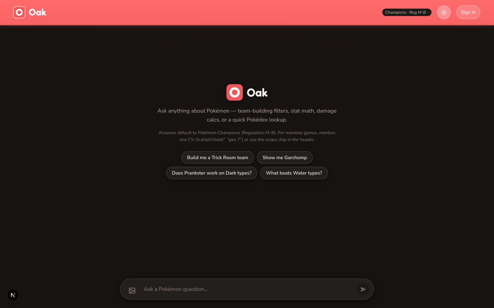

- **Current read:** Structure holds, but the header stays a fully saturated red band over near-black — the harshest contrast in the app — and surfaces read neutral-black, losing the warm identity. Separately, live driving found dark mode **never engages from the OS setting**: `prefers-color-scheme: dark` is ignored entirely (confirmed in `ThemeToggle.tsx` — light unconditional, dark opt-in via the moon toggle + localStorage). A dark-OS user's first impression is a bright light app.
- **Target:** Warm dark paper, same red-as-accent rule, and system-aware by default.
- **Concrete moves:** initial theme = `prefers-color-scheme` when the user hasn't chosen; the toggle's explicit choice (localStorage) wins thereafter. Header follows the paper rule (dark warm surface + hairline + red thread); surfaces drawn from the warm dark neighbors of `#161311` (e.g. raised ≈ `#211c19`, sunken ≈ `#12100e`); chips/cards pick up the warm tint; wordmark ring stays red (it's the record light).

### 11 — Mobile

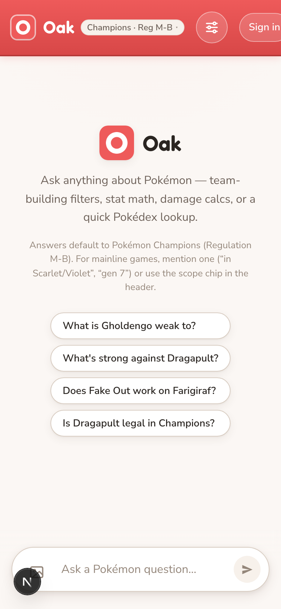 · 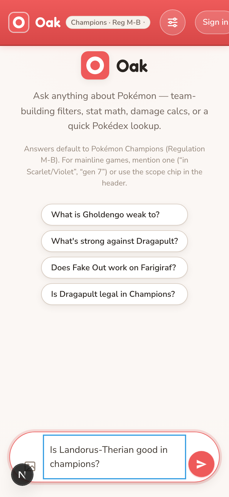

- **Current read:** Layout scales well — chips stack, header collapses to the gear popover, composer docks bottom (correct for thumbs). One defect: the focused textarea draws a blue outline rectangle *inside* the red-focused pill — two focus systems at once.
- **Concrete moves:** suppress the inner textarea outline; the pill owns focus (azure ring per foundation — and the pill border shouldn't turn red on focus; red = live/streaming only). Composer stays bottom-docked on mobile even in empty state. Everything else inherits from the foundation.

### 12 — Admin panel

Out of scope for this pass (operator-only, reached by direct URL). It inherits the foundation for free via tokens; no bespoke work warranted.

---

## 5. Priority & sequencing

- **Phase 1 — foundation + the two signature moments (the 80/20):**
  1. Header demotion to paper (+ dark-mode variant) — one component, every screen instantly quieter.
  2. Type roles: answer lead 22px, 68ch measure, instrument labels in mono, display sizes. Mostly `globals.css` + AnswerCard/Artifact label classes.
  3. Answer masthead + credibility strip + solid callouts (kill dashed border and `[high]`).
  4. Streaming "field notes" trail + answer skeleton.
  *Result: the product's core loop — ask → watch it work → read the verdict — looks first-class. Roughly a day or two of implementation.*
- **Phase 2 — the instrument surfaces:** artifact hero + stat meters (+ value ramp), team-builder party row + grouped sunken form + unified red selection, sidebar quieting.
- **Phase 3 — polish & state coverage:** scope picker upgrade, warm scrim + OTP digit cells, mobile focus fix, empty-history state, meter/section entrance choreography, dark-mode warm surfaces, movepool grouping.

Ordered by impact; stopping after Phase 1 already changes what the app feels like. Nothing here adds a dependency — it's all deployment of the system Oak already owns.
